# Tafel Admin – Benutzerhandbuch

Dieses Handbuch beschreibt alle Funktionen der Tafel-Admin-Anwendung aus Sicht der Anwenderinnen und Anwender. Es richtet sich an Mitarbeiterinnen und Mitarbeiter sowie ehrenamtliche Helfer, die mit dem System täglich arbeiten.

## Inhalt

| Kapitel | Beschreibung |
|---|---|
| [Anmeldung & Übersicht](anmeldung.md) | Login, Dashboard, Ausgabetag starten/beenden, Kunden-Annahme, Scanner, Ticket-Monitor |
| [Kunden](kunden.md) | Kunden suchen, anlegen, bearbeiten, Duplikate, Über-Limit-Kunden, Kunden-Übersicht, Kunden zusammenführen, Dokumente |
| [Logistik](logistik.md) | Routen-Navi auf der Route, Warenerfassung pro Route |
| [Benutzer](benutzer.md) | Benutzerverwaltung und Berechtigungen, Anmelde-Versuche |
| [Einstellungen](einstellungen.md) | E-Mail-Empfänger, Notschlafstellen, Grenzwerte, Warenkategorien, Fahrzeuge, Mitarbeiter |
| [Änderungsprotokoll](aenderungsprotokoll.md) | Wer hat wann was geändert, und wie war der Wert davor |
| [Statistiken](statistiken.md) | Allgemeine Statistik, Auswertung Kinder |

## Anmeldung

Der Login erfolgt über Benutzername und Passwort. Nach der Anmeldung gelangt man automatisch zur Übersicht (Dashboard).

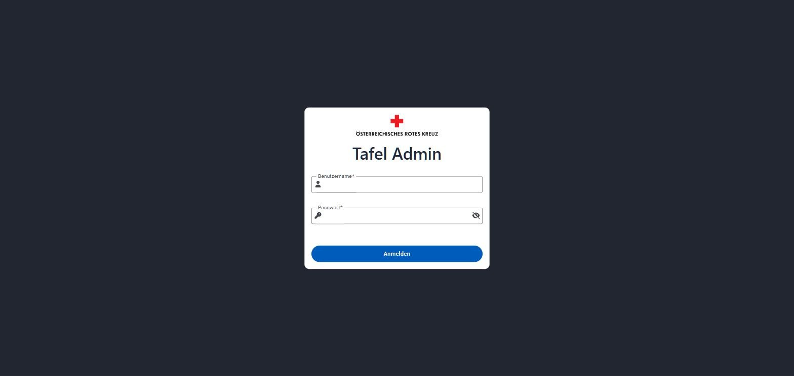

Auf Test- und Entwicklungsumgebungen wird unterhalb von "Tafel Admin" zusätzlich eine Umgebungskennzeichnung (z. B. "DEV" oder "TEST") angezeigt, damit diese optisch klar von der Produktivumgebung unterscheidbar sind. Auf der Produktivumgebung bleibt diese Kennzeichnung wie oben abgebildet ausgeblendet.

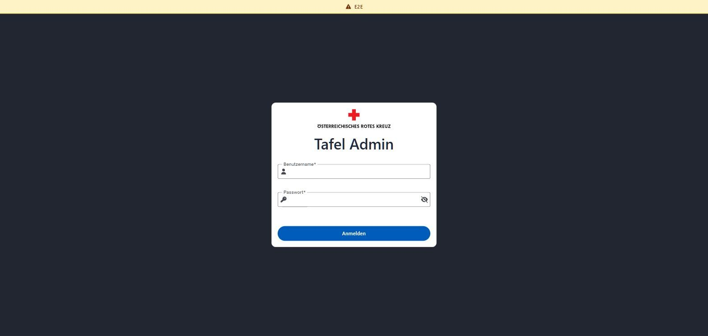

Über das Benutzer-Icon oben rechts kann das eigene Passwort geändert, die Push-Benachrichtigungen für das aktuelle Gerät verwaltet oder man kann sich abmelden.

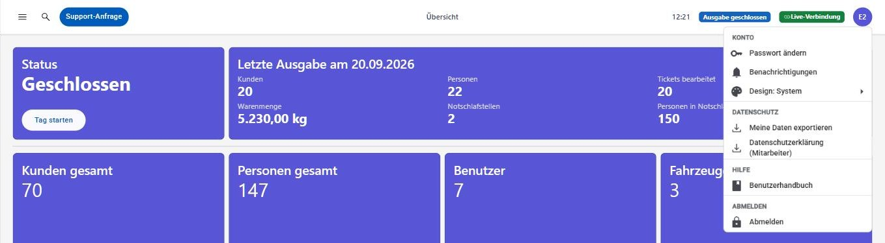

Über **Passwort ändern** gelangt man zu folgender Seite innerhalb der Anwendung:

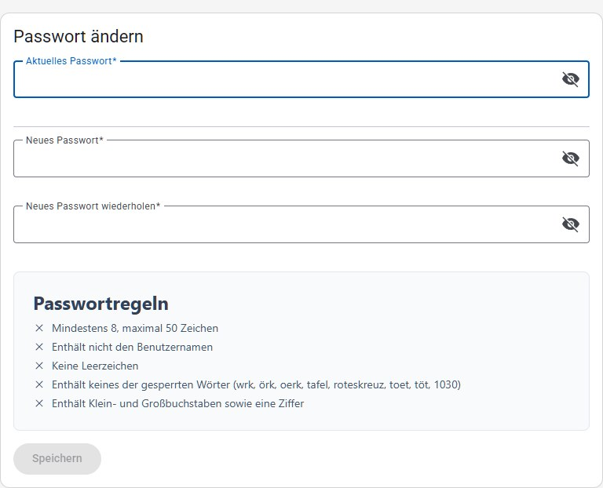

Nach dem Speichern bleibt man mit dem neuen Passwort angemeldet – ein neuerlicher Login ist nicht nötig. Die Anwendung kehrt dabei automatisch auf jene Seite zurück, von der aus das Benutzermenü geöffnet wurde, und bestätigt die Änderung mit einem kurzen Hinweis. Über **Abbrechen** kommt man ohne Änderung wieder auf dieselbe Seite zurück.

Über **Benachrichtigungen** kann man Push-Benachrichtigungen für den aktuell verwendeten Browser aktivieren, z. B. um automatisch informiert zu werden, sobald eine Ausgabe gestartet oder beendet wurde. Solche Benachrichtigungen erreichen das Gerät auch dann, wenn die Anwendung gerade nicht geöffnet ist. Da die Anmeldung pro Gerät/Browser erfolgt, muss dieser Schalter auf jedem Gerät einzeln aktiviert werden, auf dem Benachrichtigungen gewünscht sind. Unterstützt der aktuelle Browser keine Push-Benachrichtigungen, wird stattdessen ein entsprechender Hinweis angezeigt.

Wurden Benachrichtigungen im Browser selbst blockiert – etwa weil die Nachfrage des Browsers einmal mit "Blockieren" beantwortet wurde –, kann die Anwendung sie nicht aktivieren. In diesem Fall wird der Schalter deaktiviert dargestellt und darüber der Grund samt Lösungsweg angezeigt: Die Blockade lässt sich nur in den Seiteneinstellungen des Browsers selbst wieder aufheben.

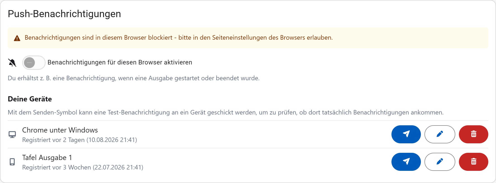

Tippt bzw. klickt man auf eine eingetroffene Benachrichtigung, öffnet sich direkt die passende Seite in der Anwendung – z. B. die Waren-Eingabe bei einer unvollständigen Warenerfassung. Ist die Anwendung bereits in einem Fenster geöffnet, wird dieses verwendet, statt ein weiteres zu öffnen.

Darunter listet **Deine Geräte** alle für den eigenen Account aktivierten Geräte, jeweils mit Browser-/Betriebssystem-Erkennung und dem Zeitpunkt der Registrierung. Ein Symbol vor dem Namen zeigt, ob es sich um ein Mobilgerät oder um einen Computer handelt, und die Registrierung wird zuerst als Zeitspanne angegeben ("Registriert vor 3 Wochen"), gefolgt vom genauen Zeitpunkt. Beides hilft dabei, ein altes, nicht mehr verwendetes Gerät in der Liste wiederzuerkennen. Über das Stift-Symbol kann jedem Gerät ein eigener, frei wählbarer Name gegeben werden (z. B. "Tafel Ausgabe 1"), um es in der Liste leichter wiederzuerkennen – dieser Name überschreibt dann die automatische Browser-/Betriebssystem-Anzeige.

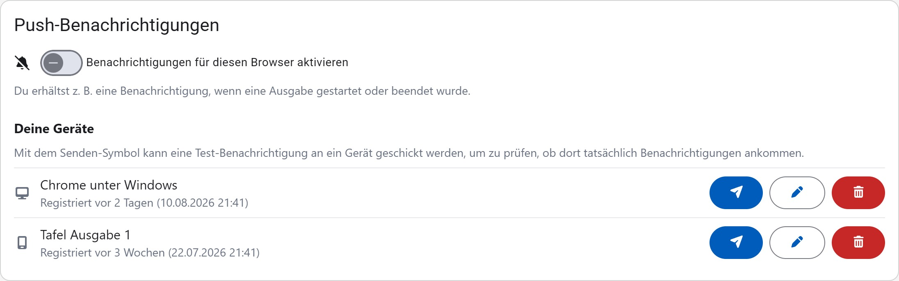

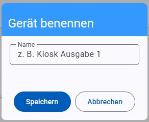

Über das Senden-Symbol (Papierflieger) kann jederzeit eine **Test-Benachrichtigung** an ein einzelnes Gerät geschickt werden. Damit lässt sich sofort überprüfen, ob auf diesem Gerät tatsächlich Benachrichtigungen ankommen, ohne auf die nächste Ausgabe warten zu müssen. Erscheint die Test-Benachrichtigung nicht, wird stattdessen der Grund gemeldet – etwa dass das Gerät beim Push-Dienst nicht mehr angemeldet ist (in diesem Fall wird es aus der Liste entfernt und muss auf dem betroffenen Gerät neu aktiviert werden) oder dass am Server keine Push-Benachrichtigungen eingerichtet sind. Das Ergebnis bleibt zusätzlich direkt beim jeweiligen Gerät stehen – während des Sendens "Test wird gesendet …", danach das Ergebnis –, sodass man es auch dann noch sieht, wenn man zwischenzeitlich am Gerät nachgesehen hat und die Einblendung längst wieder verschwunden ist. Die Test-Benachrichtigung wird unabhängig von den weiter unten beschriebenen Benachrichtigungsarten immer zugestellt.

Über das Mistkübel-Symbol kann ein Gerät entfernt werden – etwa wenn es nicht mehr verwendet wird oder verloren gegangen ist. Wird dabei das gerade selbst verwendete Gerät entfernt, wird der Schalter zum Aktivieren der Benachrichtigungen automatisch deaktiviert.

Im Bereich **Benachrichtigungsarten** darunter lässt sich feiner steuern, welche Benachrichtigungen man erhält. Der Schalter **Alle Benachrichtigungen erhalten** ist ein zentraler Hauptschalter für den eigenen Account: Ist er deaktiviert, erhält man auf keinem der eigenen Geräte mehr Benachrichtigungen, unabhängig von den einzelnen Einstellungen darunter – im Gegensatz zum Schalter weiter oben betrifft dies also nicht nur das aktuell verwendete Gerät, sondern alle. Ist der Hauptschalter aktiv, kann darunter für jede einzelne Benachrichtigungsart separat festgelegt werden, ob man sie erhalten möchte. Unter jedem Schalter steht, wann die jeweilige Benachrichtigung ausgelöst wird. Ist der Hauptschalter deaktiviert, bleibt die Liste sichtbar, ist aber nicht mehr bedienbar: Die einzelnen Einstellungen bleiben gespeichert und wirken wieder, sobald der Hauptschalter erneut aktiviert wird. Ein Hinweis über der Liste erklärt das.

Es werden nur jene Benachrichtigungsarten angezeigt, für die man auch berechtigt ist – wer z. B. keine Administrator-Berechtigung hat, sieht die Art "Benutzer gesperrt" gar nicht erst in der Liste.

Die Liste ist in drei Bereiche gegliedert: **Ablauf der Ausgabe**, **Erinnerungen** und **Technisches**. Bereiche, für die man keine der nötigen Berechtigungen hat, werden gar nicht erst angezeigt.

Der Bereich **Ablauf der Ausgabe** begleitet einen Ausgabetag von Anfang bis Ende – in genau der Reihenfolge, in der die Schritte tatsächlich passieren –, sodass man auch ohne geöffnete Anwendung mitbekommt, wie weit der Tag ist. Diese Arten stehen allen Benutzern zur Verfügung:

| Benachrichtigungsart | Wird ausgelöst, wenn … |
| --- | --- |
| Ausgabe gestartet | eine Ausgabe gestartet wurde |
| Anmeldung gestartet | der erste Kunde des Tages angemeldet wurde |
| Route beim letzten Stopp | eine Route im [Routen-Navi](logistik.md#routen-navi) bis auf den letzten Stopp abgehakt ist, das Fahrzeug also bald zurückkommt. Die Benachrichtigung nennt die Route und den Stopp, bei dem sie gerade steht |
| Warenerfassung abgeschlossen | für alle aktiven Routen die Waren vollständig erfasst wurden |
| Warenausgabe gestartet | das erste Ticket abgearbeitet wurde, die Warenausgabe also tatsächlich läuft |
| Alle Kunden abgearbeitet | alle angemeldeten Kunden abgearbeitet wurden |
| Ausgabe beendet | eine Ausgabe beendet wurde und die Statistiken bereitstehen |

Die Bereiche **Erinnerungen** und **Technisches** setzen eine Berechtigung voraus:

| Benachrichtigungsart | Wird ausgelöst, wenn … | Erforderliche Berechtigung |
| --- | --- | --- |
| Ausgabe noch offen | eine Ausgabe an einem früheren Tag gestartet und bis dahin nicht beendet wurde (Erinnerung jeweils in der Früh, bis die Ausgabe beendet ist) | Ausgabe-Ablauf oder Supervisor |
| E-Mail nicht versendet | eine E-Mail auch nach mehreren Versuchen nicht versendet werden konnte – etwa eine der E-Mails nach dem Ende einer Ausgabe (Tagesreport, Statistiken, Retourkisten) oder eine Support-Anfrage. Die Benachrichtigung nennt den Betreff der E-Mail | Administrator |
| Benutzer gesperrt | ein Benutzer nach zu vielen fehlgeschlagenen Anmeldeversuchen gesperrt wurde | Administrator |

Die beiden letzten sind technische Meldungen: sie richten sich an jene Personen, die die Anwendung selbst betreuen, und nicht an die Ausgabe-Leitung. Da die Berechtigung "Administrator" alle anderen Berechtigungen einschließt, sehen Administratoren sämtliche Benachrichtigungsarten.

Jede dieser Benachrichtigungen wird pro Ausgabe nur ein einziges Mal verschickt. Wird z. B. ein bereits abgearbeitetes Ticket noch einmal geöffnet und erneut abgeschlossen, kommt "Alle Kunden abgearbeitet" trotzdem kein zweites Mal. "Route beim letzten Stopp" gilt je Route und Tag: Jede Route meldet sich einmal, auch wenn unterwegs ein Stopp noch einmal zurückgenommen und erneut abgehakt wird.

Die "Startzeit", die auf dem Ticket-Monitor angezeigt werden kann, ist davon unabhängig: sie ist eine Ankündigung an die wartenden Kunden, während sich "Warenausgabe gestartet" nach dem tatsächlichen Beginn richtet.

Die Berechtigungen sind unter [Benutzer](benutzer.md) beschrieben.

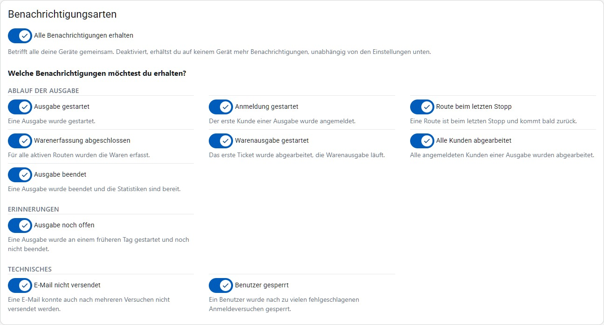

Bei deaktiviertem Hauptschalter sieht derselbe Bereich so aus:

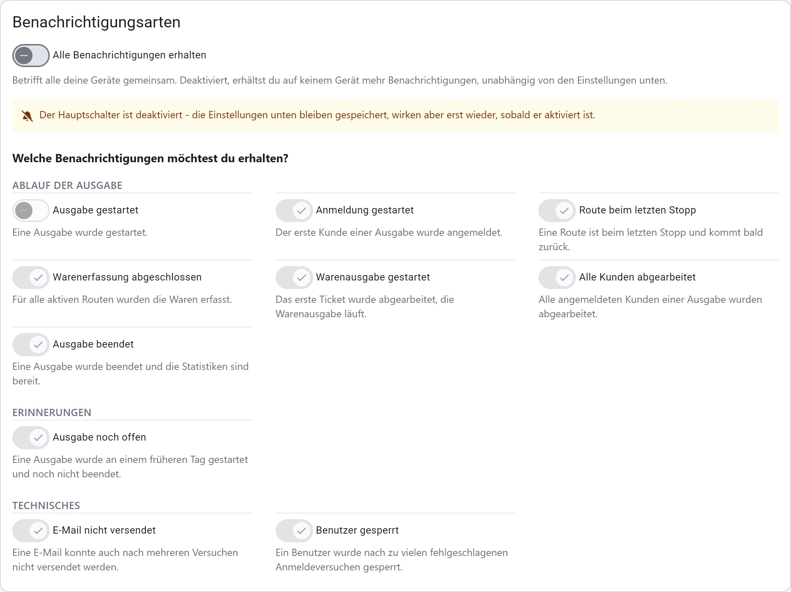

Ist beim Login eine Passwortänderung erforderlich (z. B. beim erstmaligen Login oder nach einem von der Verwaltung erzwungenen Passwortwechsel), zeigt das System stattdessen direkt nach der Anmeldung automatisch eine eigene, davon unabhängige Seite – noch bevor die eigentliche Anwendung geöffnet wird:

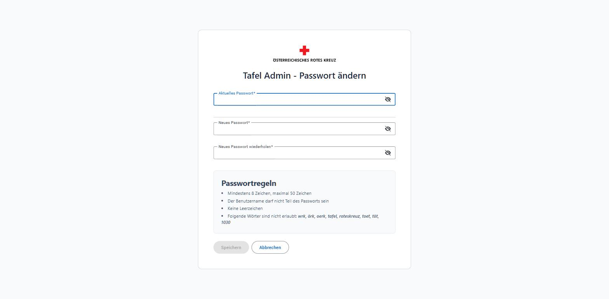

In beiden Fällen gelten dieselben Regeln: Das neue Passwort muss mindestens 8 und maximal 50 Zeichen lang sein, darf den Benutzernamen nicht enthalten, keine Leerzeichen haben und bestimmte Wörter (z. B. "wrk", "tafel", "roteskreuz") nicht enthalten.

Je nach Grund wird am Login unterschiedlich informiert: bei falschem Benutzername/Passwort "Anmeldung fehlgeschlagen!", nach zu vielen Fehlversuchen "Konto vorübergehend gesperrt! Bitte versuchen Sie es später erneut.", nach Ablauf der Sitzung während der Nutzung "Sitzung abgelaufen! Bitte erneut anmelden." und bei fehlender Berechtigung für eine aufgerufene Seite "Zugriff nicht erlaubt!".

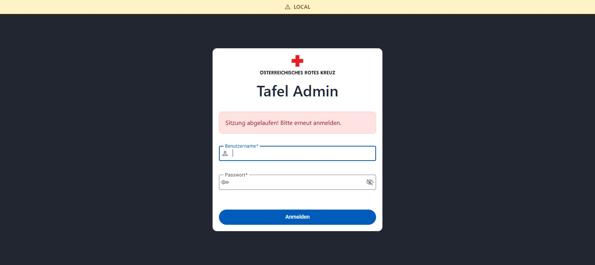

## Navigation

Die linke Seitenleiste zeigt alle Menüpunkte, für die der angemeldete Benutzer berechtigt ist. Menüpunkte, die eine aktive Ausgabe voraussetzen (z. B. "Annahme", "Waren-Eingabe"), sind mit **INAKTIV** gekennzeichnet, solange kein Ausgabetag gestartet wurde. Untergeordnete Bereiche wie "Benutzer", "Statistiken" und "Einstellungen" lassen sich auf- und zuklappen. Über den Pfeil-Button unten in der Seitenleiste kann diese auf reine Icons eingeklappt werden, um mehr Platz für den Inhalt zu schaffen; auf schmalen Bildschirmen wird sie stattdessen über ein Menü-Symbol ein-/ausgeblendet (siehe [Darstellung auf schmalen Bildschirmen](#darstellung-auf-schmalen-bildschirmen)).

Die Menüstruktur gliedert sich in folgende Bereiche:

- **Anmeldung**: Annahme, Scanner, Ticket-Monitor
- **Kunden**: Kunden suchen, Kunden anlegen, sowie unter der aufklappbaren Gruppe "Sonstige": Kunden-Duplikate, Kunden über Limit, Kunden-Übersicht
- **Logistik**: Routen-Navi, Waren-Eingabe
- **Sonstige**: Benutzer, Statistiken, Änderungsprotokoll, Einstellungen

Welche Menüpunkte sichtbar sind, hängt von den dem Benutzer zugewiesenen Berechtigungen ab (siehe [Benutzer](benutzer.md)).

Ist die Seitenleiste eingeklappt, sind nur noch die Icons sichtbar. Fährt man mit der Maus über ein Icon, wird der Name des Menüpunkts als Kurzhinweis (Tooltip) eingeblendet.

Oben rechts in der Kopfzeile zeigt ein Badge **Live-Verbindung**, ob die Anwendung aktuell aktiv mit dem Server verbunden ist (z. B. relevant für Live-Updates wie den Ticket-Monitor); ist die Verbindung unterbrochen, wechselt der Status entsprechend. Unten in der Seitenleiste werden zudem die aktuelle Version und der Build-Zeitpunkt der Anwendung angezeigt.

## Bedienung mit der Tastatur

Die Anwendung lässt sich vollständig ohne Maus bedienen. Mit der **Tabulator-Taste** wird von Bedienelement zu Bedienelement gesprungen, mit **Enter** bzw. **Leertaste** wird das gerade angesprungene Element ausgelöst.

- Der erste Tabulator-Schritt auf jeder Seite ist der Sprunglink **"Zum Hauptinhalt springen"**. Er ist nur sichtbar, solange er angesprungen ist, und überspringt die gesamte Seitenleiste – ohne ihn müsste man sich auf jeder Seite erneut durch das komplette Menü tabben.
- Die aufklappbaren Menügruppen ("Sonstige", "Benutzer", "Statistiken", "Einstellungen") lassen sich ebenso mit der Tastatur auf- und zuklappen.
- Menüpunkte, die eine aktive Ausgabe voraussetzen und mit **INAKTIV** gekennzeichnet sind, werden beim Tabben übersprungen.
- Das Augen-Symbol in Passwortfeldern, mit dem das eingegebene Passwort sichtbar gemacht wird, ist ebenfalls per Tastatur erreichbar.
- Sortierbare Listen in den [Einstellungen](einstellungen.md) werden nicht nur per Drag & Drop sortiert: Ist das Drag-Handle (⋮⋮) angesprungen, verschieben die Pfeiltasten den Eintrag um je eine Position, und die neue Position wird für Vorleseprogramme angesagt.

Der Titel im Browser-Tab nennt immer die gerade geöffnete Seite (z. B. "Kunden suchen – Tafel Admin"). Dadurch sind auch mehrere geöffnete Tabs und Einträge im Browser-Verlauf auseinanderzuhalten, und Vorleseprogramme geben beim Seitenwechsel den Namen der neuen Seite aus. Ebenso wird der Zustand der **Live-Verbindung** aus der Kopfzeile nicht nur farblich, sondern auch als Text ausgegeben, sodass ein Verbindungsabbruch auch mit einem Vorleseprogramm bemerkt wird.

## Darstellung auf schmalen Bildschirmen

Die Anwendung wird auch auf Handy und Tablet verwendet – etwa als Scanner bei der Kunden-Annahme (siehe [Anmeldung](anmeldung.md)) oder für Routen-Navi und Warenerfassung unterwegs im Fahrzeug (siehe [Logistik](logistik.md)). Dafür gibt es keine eigene App und keine eigene Adresse: Es ist dieselbe Anwendung im Browser, die sich lediglich automatisch an die verfügbare Bildschirmbreite anpasst. Wird am PC das Browserfenster schmal gezogen, passiert dasselbe.

Umgestellt wird in zwei Stufen:

- **Unter rund 1.000 Pixel Breite** (Tablets, schmale Fenster) wird die Seitenleiste ausgeblendet und stattdessen über das Menü-Symbol (☰) links oben als Überblendung geöffnet. Sie schließt sich wieder, sobald ein Menüpunkt gewählt oder daneben getippt wird. Die Schaltfläche zum Einklappen auf reine Icons entfällt in dieser Ansicht.
- **Unter rund 770 Pixel Breite** (Handys) werden zusätzlich alle Tabellen als **Kartenliste** dargestellt: eine Karte je Eintrag, in der die Tabellenspalten als Beschriftung und Wert untereinander stehen. Formulare werden einspaltig untereinander angeordnet statt in mehreren Spalten nebeneinander.

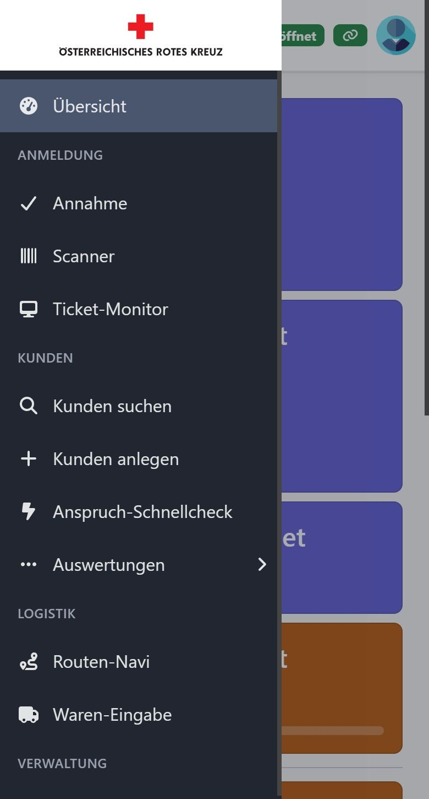

Inhaltlich ändert sich dadurch nichts: Es sind dieselben Daten, dieselben Aktionen (Lupe, Stift, Papierkorb usw.), dieselbe Seitennavigation und dieselben Berechtigungen wie in der Tabellenansicht. Als Kartenliste dargestellt werden das Suchergebnis der Kunden-Suche, die Listen "Kunden über Limit" und "Kunden-Übersicht" (siehe [Kunden](kunden.md)), das Suchergebnis der Benutzer-Suche und die Anmelde-Versuche (siehe [Benutzer](benutzer.md)), die Tabellen der [Einstellungen](einstellungen.md) sowie die Ergebnisliste der Auswertung Kinder (siehe [Statistiken](statistiken.md)). Filialen und Routen sind keine Tabellen, sondern aufklappbare Listen, und sehen daher auf jeder Bildschirmbreite gleich aus.

Eine Ausnahme ist die Warenerfassung: Sie wird auf schmalen Bildschirmen nicht als Kartenliste, sondern als eigener Ablauf Geschäft für Geschäft dargestellt (siehe [Logistik](logistik.md)).

## Kurzhinweise (Tooltips)

An zwei Stellen blendet die Anwendung zusätzliche Erklärungen ein, ohne dass die Oberfläche dadurch voller wird.

**Schaltflächen mit reinem Symbol** (Lupe, Stift, Mistkübel, Auge, Plus, Haken usw.) zeigen ihre Funktion als Kurzhinweis an, sobald man mit der Maus darauf stehen bleibt. Damit muss die Bedeutung eines Symbols nicht auswendig gewusst werden – im Beispiel die Lupe im Suchergebnis der Kunden-Suche:

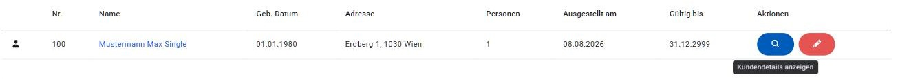

**Felder mit fachlicher Bedeutung** haben ein kleines Info-Symbol (ⓘ) neben der Beschriftung. Der Kurzhinweis dahinter erklärt, was das Feld bewirkt – etwa wie das eingetragene Einkommen in die Anspruchsprüfung einfließt oder dass "Alleinerzieher" ausschließlich in die Statistik einfließt und die Einkommensgrenze nicht verändert:

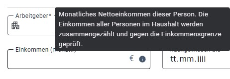

Auf Touch-Geräten erscheinen die Kurzhinweise, wenn man das Symbol kurz gedrückt hält. Mit der Tastatur werden sie eingeblendet, sobald die jeweilige Schaltfläche den Fokus erhält.

## Übersicht (Dashboard)

Die Übersicht ist die Startseite und zeigt den aktuellen Status des Ausgabetags sowie Kennzahlen des Tages.

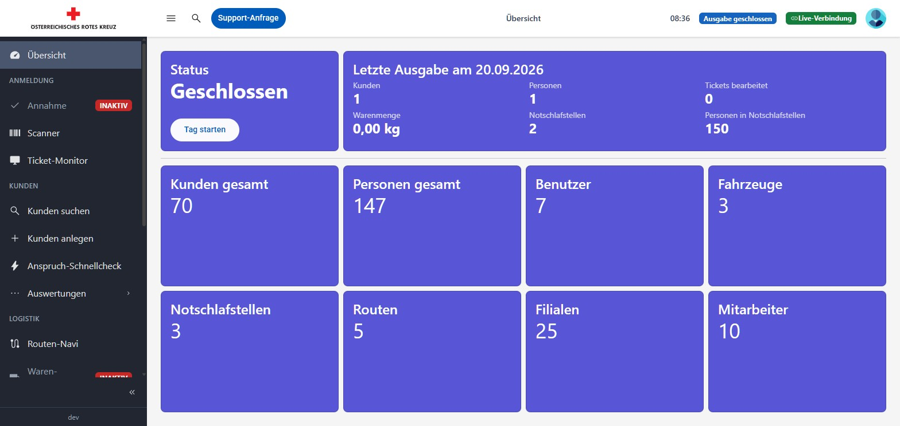

- **Status**: Zeigt an, ob der Ausgabetag "Geöffnet" oder "Geschlossen" ist. Mit **Tag starten** wird eine neue Ausgabe begonnen, mit **Tag beenden** wird sie abgeschlossen (dabei werden u. a. die Mitarbeiterzahl und die genutzten Notschlafstellen abgefragt).
- **Kunden angemeldet**: Anzahl der für den heutigen Tag angemeldeten Kunden. Über **Kundenliste** kann die Liste der angemeldeten Kunden heruntergeladen werden.
- **Tickets abgearbeitet**: Fortschritt der Ticket-Bearbeitung (verarbeitete / gesamt).
- **Erfasste Routen (Anzahl/Details)** und **Erfasste Warenmenge**: Fortschritt der Warenerfassung aus der Logistik (siehe [Logistik](logistik.md)).
- **Routen unterwegs**: Zeigt je Route, wie viele Stopps die Fahrer heute bereits abgehakt haben (z. B. "2 / 7"). Der Balken daneben besteht aus einem Abschnitt je Stopp, die erledigten sind grün — so ist auf einen Blick erkennbar, wie viele Stopps eine Route überhaupt hat und wie viele davon schon hinter ihr liegen. Grundlage ist das [Routen-Navi](logistik.md#routen-navi); die Anzeige aktualisiert sich automatisch, sobald unterwegs ein Stopp abgehakt wird — so ist in der Zentrale ohne Anruf ersichtlich, wo eine Route gerade steht. Der Bereich erscheint erst, sobald an diesem Tag der erste Stopp abgehakt wurde: Wird das Routen-Navi nicht verwendet, bleibt er ganz aus. Ab dann werden alle Routen angeführt, auch die noch bei "0 / 15" stehenden; Routen ohne hinterlegte Stopps werden nicht angeführt.
- **Statistik**: Eingabe der Mitarbeiteranzahl und der Personen in den ausgewählten Notschlafstellen für den Tagesreport. Die Anzahl der Personen in Notschlafstellen wird über den Rechner-Button neben dem Feld ermittelt, indem die genutzten Notschlafstellen ausgewählt werden.
- **Anmerkungen**: Freitext-Notizen zum aktuellen Ausgabetag, die z. B. im Tagesreport per E-Mail versendet werden.

Vor dem Beenden des Ausgabetags sollten Statistik und Anmerkungen vollständig ausgefüllt sein, da diese Angaben in den Tagesreport einfließen:

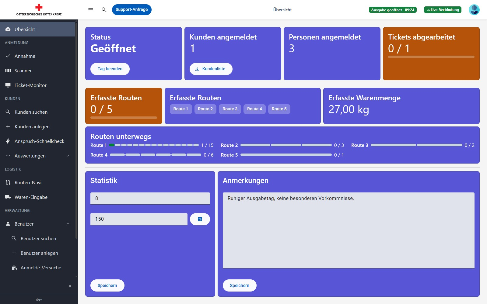

## Support-Anfrage

Über die Schaltfläche **Support-Anfrage** oben in der Kopfzeile kann jederzeit ein Anliegen (Fehler, Verbesserungsvorschlag) mit Titel und Beschreibung gemeldet werden. Die Anfrage wird per E-Mail versandt.

Damit ein Fehler nachvollzogen werden kann, werden automatisch technische Infos mitgeschickt: Benutzername, Zeitpunkt, aktuelle Seite, Version, Browser sowie die letzten Fehlermeldungen dieser Sitzung. Diese Angaben müssen nicht selbst eingetippt werden – im Text genügt eine Beschreibung dessen, was passiert ist.

Zusätzlich wird immer ein **Screenshot der Seite** angehängt, die beim Öffnen der Support-Anfrage zu sehen war (das Dialogfenster selbst ist darauf nicht zu sehen). Der Dialog weist darauf hin, was alles mitgeschickt wird.

> [!TIP]
> Sind auf dem Bildschirm gerade Kundendaten zu sehen, die nicht mitgeschickt werden sollen: zuerst die Seite verlassen (z. B. zurück auf die Übersicht) und die Support-Anfrage erst dort öffnen.

> [!IMPORTANT]
> Auch wenn die Anfrage nur intern per E-Mail verschickt wird: Titel und Beschreibung sollten keine personenbezogenen Daten enthalten – also keine Namen, Adressen, Geburtsdaten oder Einkommensangaben von Kundinnen und Kunden. Statt „Kunde Max Mustermann kann sich nicht anmelden“ besser die Kundennummer oder nur den Ablauf beschreiben.

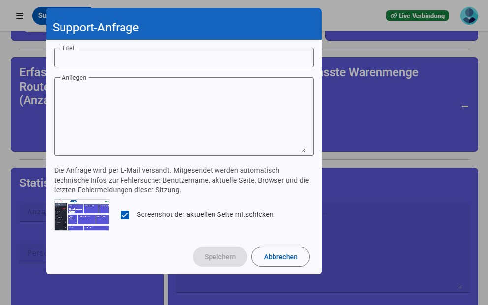

## Fehlerseiten

Ist eine aufgerufene Seite nicht vorhanden, zeigt die Anwendung eine 404-Fehlerseite:

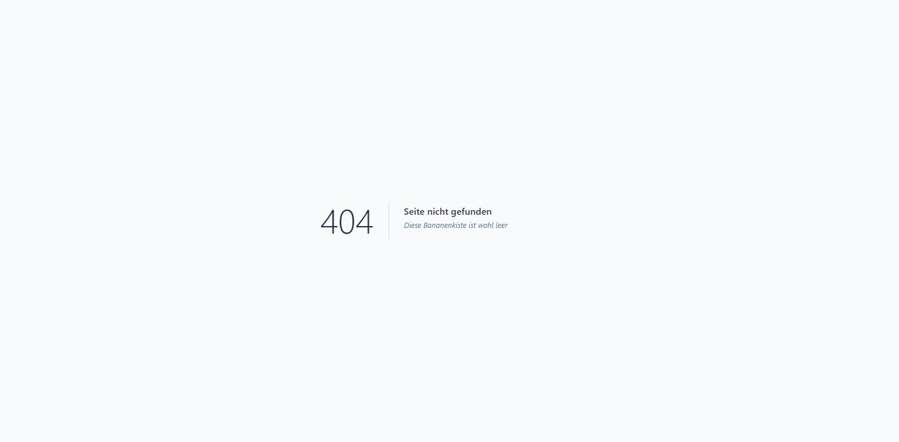

Tritt bei einer Anfrage ein unerwarteter Serverfehler auf, zeigt die Anwendung eine 500-Fehlerseite. In diesem Fall über **Support-Anfrage** (siehe oben) melden.

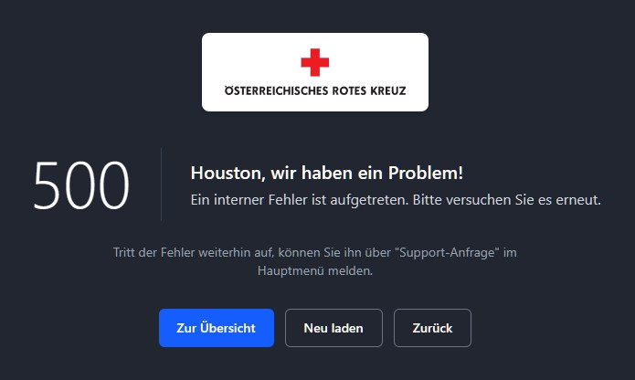

Diese beiden Fehlerseiten erscheinen nur, wenn die Anwendung direkt über einen Link, ein Lesezeichen oder ein Neuladen der Seite geöffnet wurde. Schlägt dagegen ein Seitenwechsel innerhalb der bereits geöffneten Anwendung fehl – etwa weil der Server für einen Moment nicht erreichbar ist –, bleibt die aktuelle Seite geöffnet und es erscheint nur eine Meldung. Der Menüpunkt kann dann einfach nochmal angeklickt werden. Verlangt die Meldung ein Neuladen der Anwendung, konnte ein Teil der Anwendung nicht nachgeladen werden – in diesem Fall die Seite im Browser neu laden (F5).
