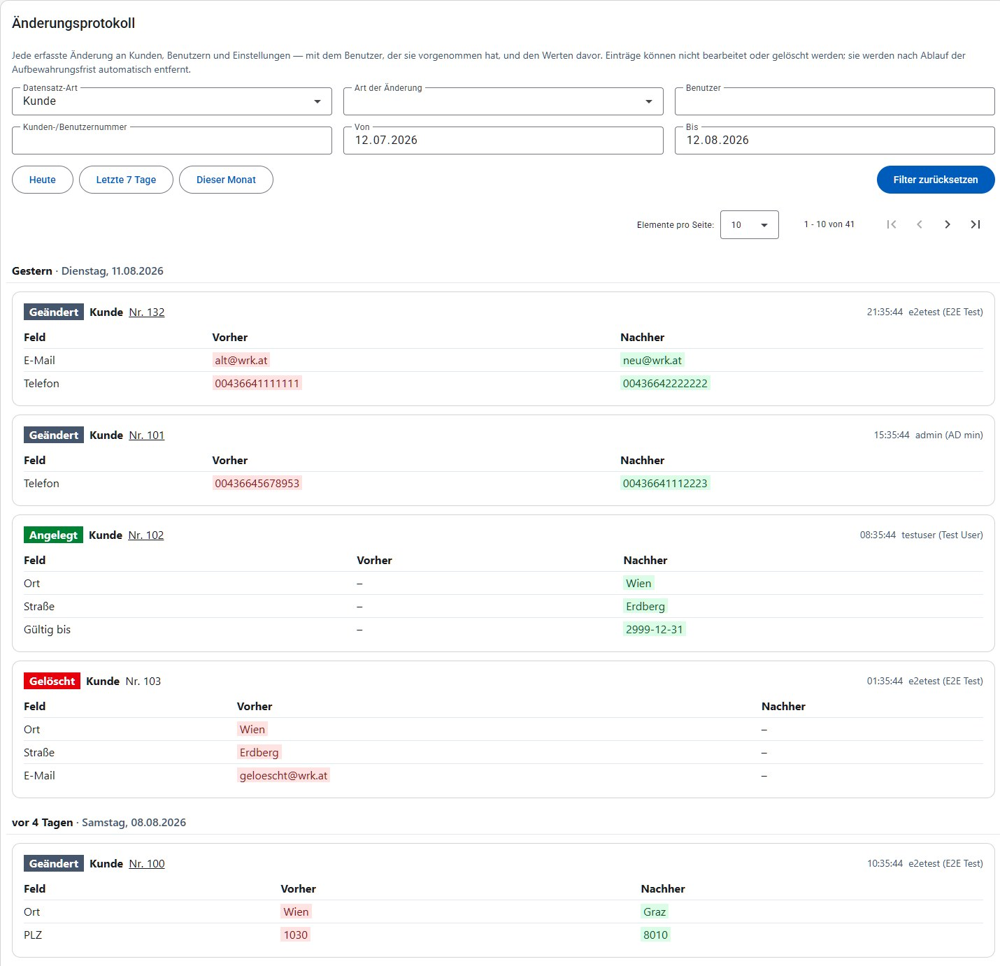

# Änderungsprotokoll

Das Änderungsprotokoll hält fest, **wer wann was geändert hat – und wie der Wert davor ausgesehen hat**. Es beantwortet damit Fragen, die sich aus den Daten selbst nicht mehr beantworten lassen: Wer hat die Adresse dieses Kunden korrigiert? Welches Einkommen war vorher eingetragen? Wer hat diesen Kunden gesperrt?

Erfasst werden Änderungen an Kunden (inklusive weiterer Personen, Notizen und Dokumenten), an Benutzern und deren Berechtigungen sowie an Einstellungen (Grenzwerte, E-Mail-Empfänger).

Bewusst **nicht** erfasst werden die Anmeldungen zu den einzelnen Ausgabetagen: diese sind ohnehin bereits ein Verlauf und stehen in den [Statistiken](statistiken.md) zur Verfügung. Auch die [Anmelde-Versuche](benutzer.md#anmelde-versuche) haben eine eigene Liste unter [Benutzer](benutzer.md).

Das Änderungsprotokoll ist ein reines Nachschlagewerk: Einträge können weder bearbeitet noch gelöscht werden. Sie entstehen automatisch mit der Änderung, die sie beschreiben, und werden nach Ablauf der Aufbewahrungsfrist (standardmäßig ein Jahr) automatisch entfernt.

> [!IMPORTANT]
> Für das Änderungsprotokoll ist die Berechtigung **Änderungsprotokoll** erforderlich (siehe [Benutzer](benutzer.md)). Sie ist absichtlich von der Kundenverwaltung getrennt: Die aktuellen Daten eines Kunden zu sehen und jede jemals daran vorgenommene Änderung samt Vorgängerwerten zu sehen, sind zwei unterschiedliche Zugriffsstufen.

## Gesamtes Protokoll

Der Menüpunkt **Änderungsprotokoll** zeigt die erfassten Änderungen, die neueste zuerst.

Beim Öffnen ist die Ansicht bereits auf die häufigste Frage eingestellt: **Datensatz-Art "Kunde"** und als Zeitraum **das letzte Monat bis heute**. Ohne diese Vorauswahl müsste man sich – sobald das Protokoll ein Jahr Verlauf enthält – erst durch Monate von Benutzer- und Einstellungs-Einträgen blättern. Beide Vorgaben sind nur ein Ausgangspunkt und lassen sich jederzeit ändern: Über "Alle" bei der Datensatz-Art bzw. durch Leeren der Datumsfelder sieht man wieder das gesamte Protokoll.

Jeder Eintrag besteht aus:

- **Art der Änderung**: *Angelegt* (grün), *Geändert* (grau) oder *Gelöscht* (rot)
- **Datensatz-Art**: Kunde, Person, Notiz, Dokument, Benutzer, Berechtigung, Grenzwert oder E-Mail-Empfänger
- **Nummer**: die Kunden- bzw. Benutzernummer, zu der der Datensatz gehört. Sie bleibt auch dann aussagekräftig, wenn der Datensatz selbst nicht mehr existiert – etwa nach einer Löschung oder einer Zusammenführung.
- **Zeitpunkt und Benutzer**: wann die Änderung passiert ist und wer sie vorgenommen hat. Steht dort *System*, war kein angemeldeter Benutzer beteiligt (z. B. bei automatischen Abläufen).
- **Feldänderungen**: eine Tabelle mit dem geänderten Feld sowie dem Wert davor und danach. Ein Strich (–) bedeutet, dass das Feld leer war.

Aus Sicherheitsgründen wird das Passwort eines Benutzers zwar als geändert protokolliert, jedoch niemals mit einem Wert – dort steht in beiden Spalten `***`.

## Filtern

Über die Filter oberhalb der Liste lässt sich das Protokoll eingrenzen. Alle Filter lassen sich beliebig kombinieren; mit **Suchen** wird die Liste aktualisiert, mit **Filter zurücksetzen** kehrt man zur oben beschriebenen Vorauswahl (Kunden, letztes Monat) zurück – nicht zu einem leeren Filter.

| Filter | Bedeutung |
| --- | --- |
| Datensatz-Art | Nur Änderungen an z. B. Kunden oder Benutzern |
| Art der Änderung | Nur angelegte, geänderte oder gelöschte Datensätze |
| Benutzer | Nur Änderungen eines bestimmten Benutzers (Benutzername) |
| Kunden-/Benutzernummer | Alle Änderungen rund um eine bestimmte Kunden- oder Benutzernummer |
| Von / Bis | Nur Änderungen in einem Zeitraum (der Bis-Tag ist eingeschlossen) |

Findet sich zu den gewählten Filtern nichts, wird "Keine Einträge gefunden." angezeigt.

## Verlauf eines Kunden

Für einen einzelnen Kunden gibt es denselben Verlauf direkt auf der Kunden-Detailseite im Reiter **Verlauf** (siehe [Kunden](kunden.md)). Dort erscheinen alle Änderungen an diesem Kunden, seinen weiteren Personen, seinen Notizen und seinen Dokumenten – ohne dass man vorher nach der Kundennummer filtern muss.

Der Reiter wird nur angezeigt, wenn die Berechtigung **Änderungsprotokoll** vorhanden ist.

## Zusammengeführte Kunden

Beim [Zusammenführen von Kunden](kunden.md) werden Personen, Notizen, Dokumente und Ausgabe-Teilnahmen auf den Ziel-Kunden umgehängt und die Quell-Kunden anschließend gelöscht. Damit dieser Vorgang nachvollziehbar bleibt, entstehen dabei mehrere Einträge:

- beim **Ziel-Kunden** ein Eintrag, der festhält, aus welchen Kundennummern zusammengeführt wurde und wie viele Personen, Notizen, Dokumente und Ausgaben übernommen wurden,
- je **verschobener Person** ein Eintrag, von welchem zum welchem Kunden sie gewechselt ist,
- bei jedem **Quell-Kunden** ein Eintrag, in welchen Kunden er zusammengeführt wurde – zusätzlich zu seinem Lösch-Eintrag, der seine letzten bekannten Werte enthält.

So lässt sich auch nach dem Zusammenführen noch feststellen, welche Daten ein gelöschter Kunde zuletzt hatte.
