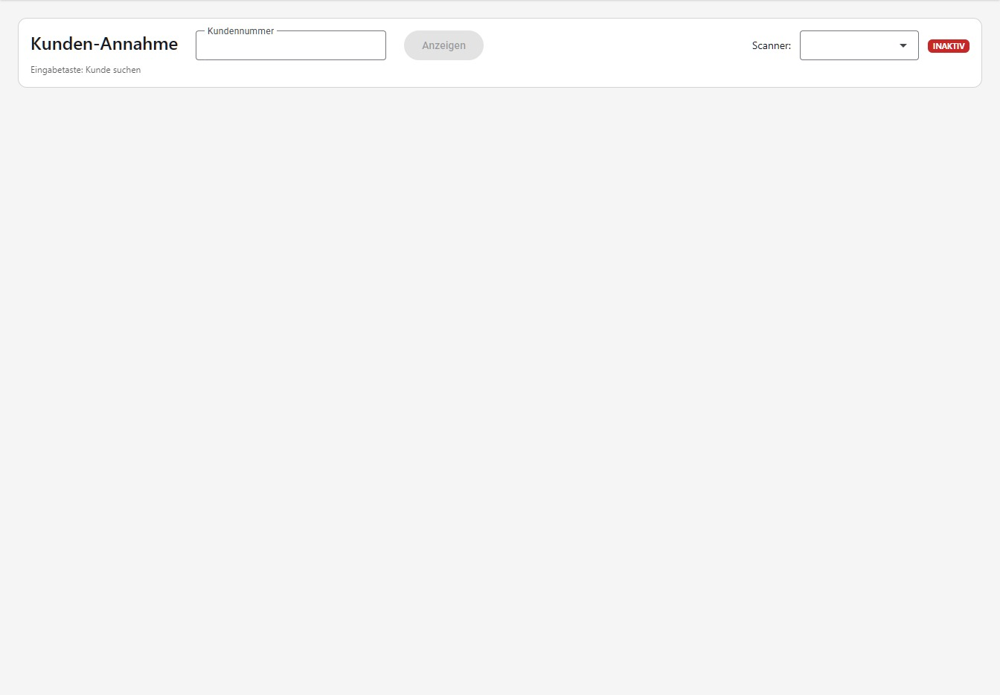
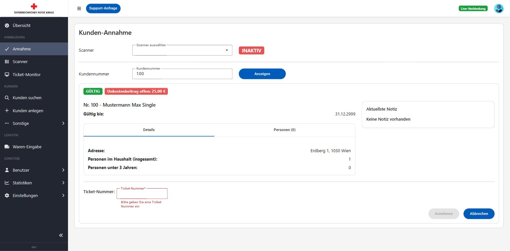
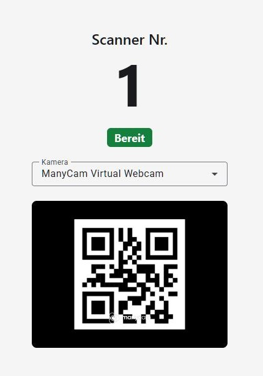
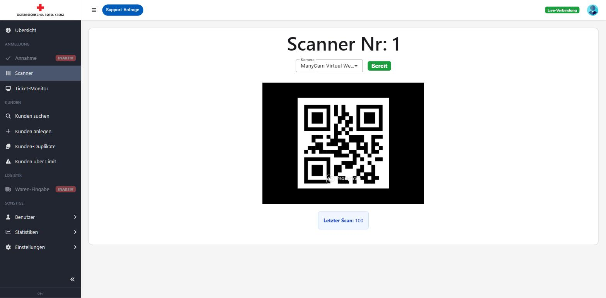
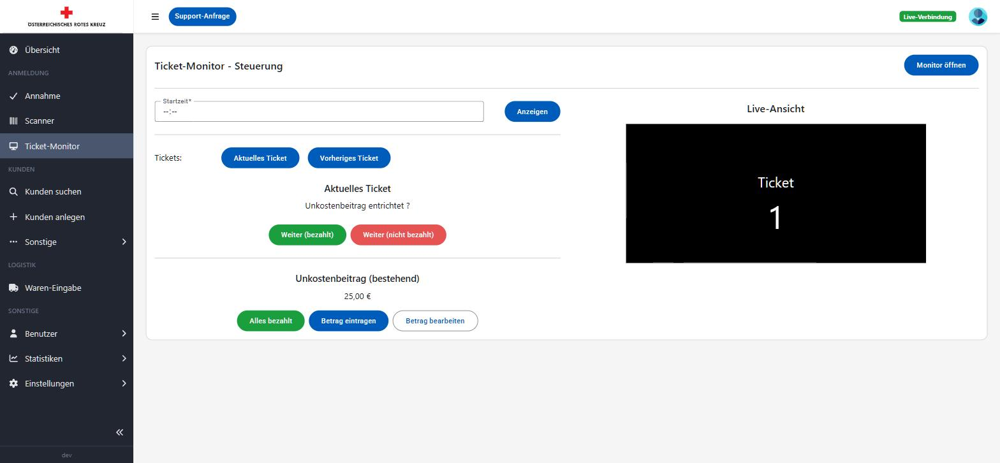

# Anmeldung (Check-in)

Der Bereich "Anmeldung" wird während eines laufenden Ausgabetags verwendet, um Kunden zu erfassen (per Ticket-Nummer oder Scanner) und den Ablauf mit dem Ticket-Monitor zu steuern.

Die Menüpunkte in diesem Bereich sind nur aktiv, solange ein Ausgabetag gestartet ist (siehe [Übersicht](README.md#übersicht-dashboard)).

## Kunden-Annahme

Unter **Anmeldung → Annahme** wird die Kundennummer eines Kunden eingegeben (oder per Scanner-Handy gescannt), um dessen Kundendaten während der Ausgabe direkt anzuzeigen.

- **Scanner**: Auswahl eines aktiven Scanners, falls mehrere Scanner-Handys im Einsatz sind (siehe [Scanner](#scanner) weiter unten). Der Status (Aktiv/Inaktiv) zeigt, ob eine Verbindung zum ausgewählten Scanner besteht.
- **Kundennummer**: Manuelle Eingabe der Kundennummer, falls kein Scanner verwendet wird. Mit **Anzeigen** wird der Kunde geöffnet.

Wurde ein Kunde angezeigt, erscheint darunter ein Panel mit farblich gekennzeichnetem Status (GÜLTIG, GÜLTIG – läuft bald ab [innerhalb der nächsten 8 Wochen], UNGÜLTIG oder GESPERRT) sowie ggf. einer separaten Kennzeichnung "Unkostenbeitrag offen", Adresse, Haushaltsgröße, einem Tab mit den weiteren Haushaltspersonen, der letzten Notiz sowie – bei aktivem Ausgabetag – der Eingabe einer Ticket-Nummer, um den Kunden mit **Annehmen** der laufenden Ausgabe zuzuweisen. Ist bereits ein Ticket zugewiesen, kann die Eingabe über **Abbrechen** verworfen bzw. das Ticket über den Papierkorb-Button wieder gelöscht werden.

## Scanner

**"Scanner" ist in der Regel kein eigenes Gerät, sondern ein normales Smartphone**: Unter **Anmeldung → Scanner** wird auf einem Mobiltelefon (oder Tablet/PC) im Browser dessen Kamera als Barcode-/QR-Code-Scanner für Kundenausweise verwendet. Jedes Gerät, auf dem diese Seite geöffnet wird, meldet sich als eigener Scanner an und kann anschließend unter **Kunden-Annahme** ausgewählt werden.

Über das Dropdown **Kamera** kann bei mehreren Kameras am Gerät (z. B. Front-/Rückkamera eines Handys) die gewünschte ausgewählt werden. Der Status rechts oben zeigt "Bereit" bzw. "Nicht bereit", je nachdem ob die Kamera aktiv ist und ein Ausweis-Code erkannt werden kann. Ist am Gerät keine Kamera verfügbar, erscheint stattdessen die Meldung "Keine Kamera gefunden".

## Ticket-Monitor – Steuerung

Unter **Anmeldung → Ticket-Monitor** wird der Ablauf der Ticket-Ausgabe gesteuert, die auf einem zweiten Bildschirm (Kundenanzeige) für die wartenden Kunden sichtbar ist. Der Bildschirm ist um die eine Aktion aufgebaut, die während einer Ausgabe hunderte Male wiederholt wird – das Aufrufen des nächsten Tickets – alles andere (Startzeit, Umschalten der Anzeige, Vorschau) ist daneben untergebracht.

- **Aktuelles Ticket**: Die gerade aufgerufene Ticket-Nummer wird sehr groß dargestellt, daneben die Warteschlangen-Info ("X / Y verarbeitet", "Z verbleibend"). Ist dem Ticket ein Kunde zugeordnet, werden Haushaltsnummer und Name direkt darunter angezeigt.
- **Weiter (bezahlt) / Weiter (nicht bezahlt)**: Schaltet zum nächsten Ticket weiter und vermerkt gleichzeitig, ob der Unkostenbeitrag beglichen wurde. **Weiter (bezahlt)** ist als primäre, gefüllte Aktion hervorgehoben, **Weiter (nicht bezahlt)** als davon klar unterscheidbare, umrandete Aktion – zusätzlich funktionieren die Tastenkürzel **Enter** (bezahlt) und **N** (nicht bezahlt), solange kein Eingabefeld oder Dialog aktiv ist.
- **Unkostenbeitrag (bestehend)**: Direkt am Ticket-Panel angehängt, da er sich immer auf den gerade aufgerufenen Haushalt bezieht. Zeigt einen noch offenen Unkostenbeitrag des aktuellen Kunden aus einer früheren Ausgabe. Mit **Alles bezahlt** wird der offene Betrag zur Gänze als bezahlt vermerkt, über **Betrag eintragen** ein Teilbetrag erfasst und über **Betrag bearbeiten** ein bereits eingetragener Betrag korrigiert – jede Aktion öffnet einen eigenen Dialog.
- **Monitor zeigt**: Ein Umschalter (Startzeit / Aktuelles / Vorheriges) zeigt auf einen Blick, was der Kundenmonitor gerade anzeigt, und ersetzt die früher verstreuten Einzel-Buttons. Bei **Startzeit** erscheint zusätzlich das Eingabefeld für die Uhrzeit, ab der die Ticket-Nummern hochgezählt werden sollen, mit **Anzeigen** zum Bestätigen. **Aktuelles** bzw. **Vorheriges** springt sofort zur laufenden Ticket-Nummer bzw. blättert zurück.
- **Live-Ansicht**: Maßstabsgetreue Vorschau (16:9) dessen, was auf dem Kundenmonitor angezeigt wird, mit einer Kennzeichnung, ob die Verbindung zum Monitor besteht. Über **Monitor öffnen** wird die Vollbildansicht (siehe unten) in einem neuen Fenster/Tab geöffnet, das z. B. auf einen zweiten Bildschirm gezogen werden kann.

## Ticket-Monitor – Vollbildansicht

Die Vollbildansicht (`/anmeldung/ticketmonitor`) zeigt ausschließlich die aktuelle Ticket-Nummer in großer Schrift und ist für die Anzeige auf einem separaten Kundenbildschirm gedacht.

