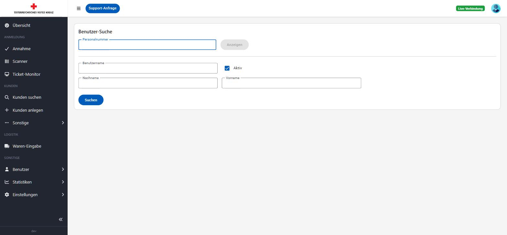
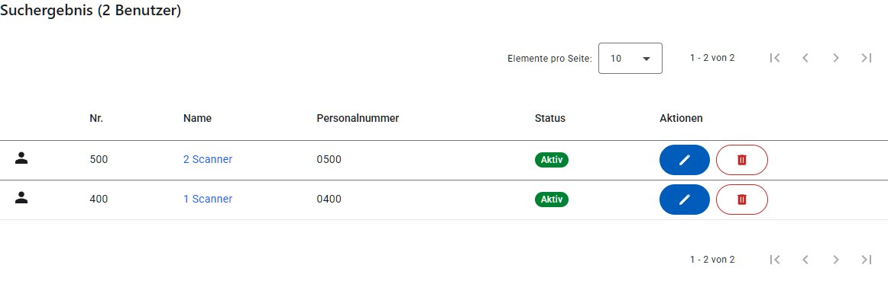
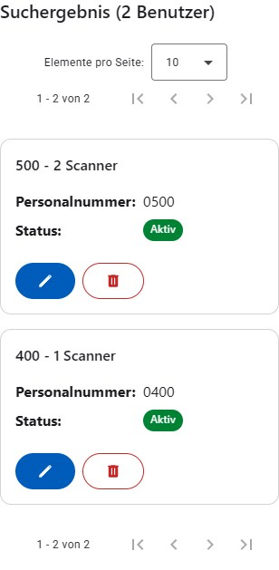
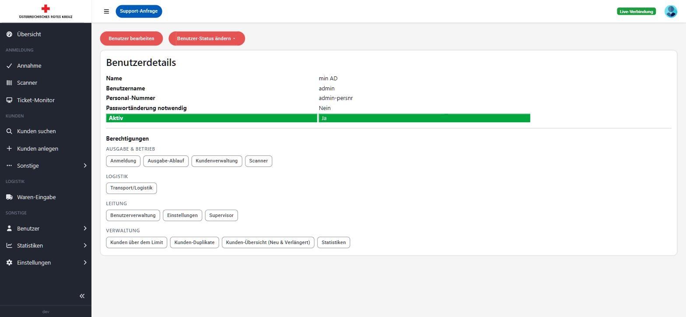
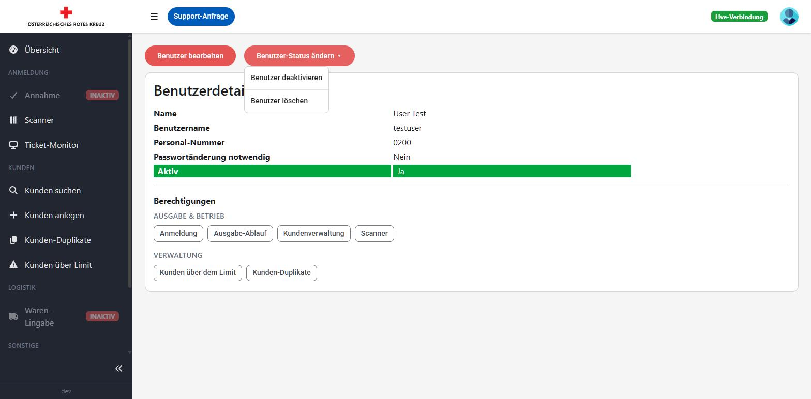
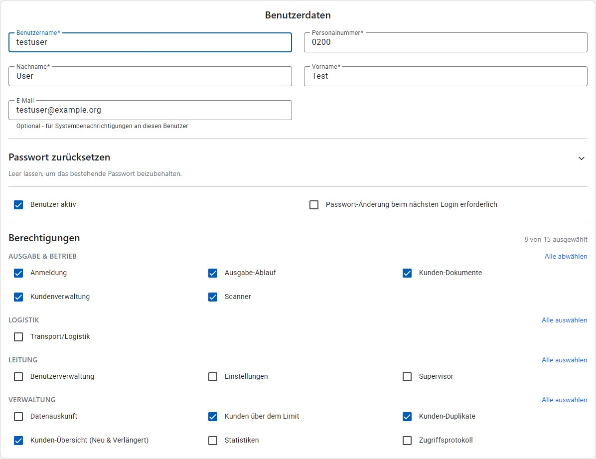
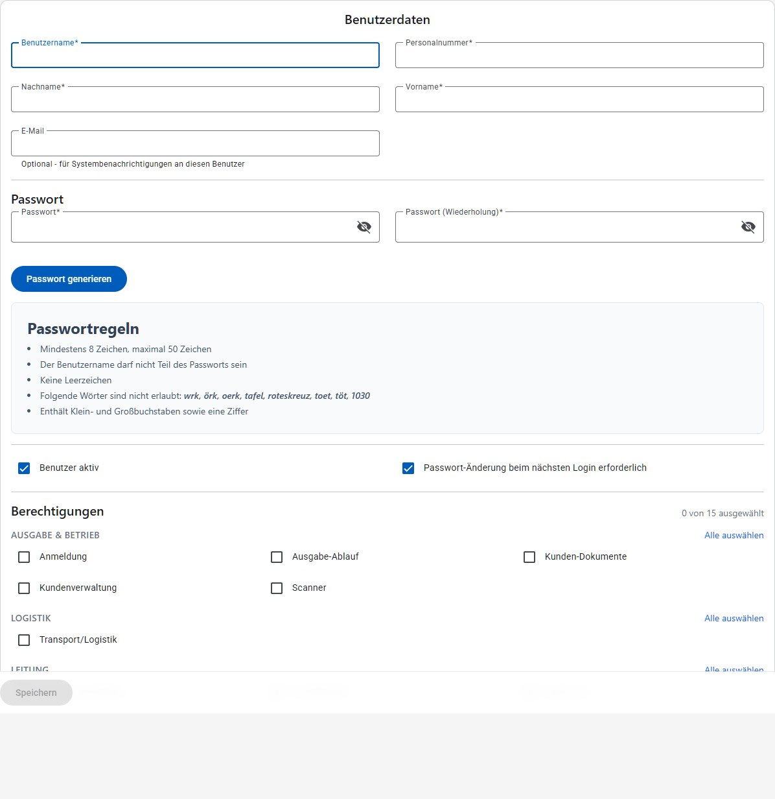
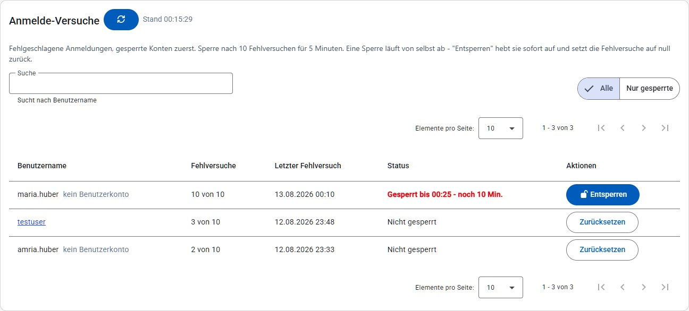

# Benutzer

Im Bereich "Benutzer" werden die Zugänge und Berechtigungen der Mitarbeiterinnen und Mitarbeiter verwaltet. Der Menüpunkt ist nur für Benutzer mit der Berechtigung "Benutzerverwaltung" sichtbar.

## Benutzer suchen

Unter **Benutzer → Suchen** gibt es ein einziges Suchfeld für beides: Eine reine Zahl, die genau einer Personalnummer entspricht, springt direkt zur Detailansicht (wie früher das Feld "Personalnummer" mit dem Button **Anzeigen**). Alles andere - auch eine Zahl, zu der es keinen Treffer gibt - löst die normale Suche aus. Die Suche startet automatisch schon während der Eingabe (nach kurzer Pause, ab zwei Zeichen); der Button **Suchen** funktioniert weiterhin zusätzlich, etwa bei einer nur einstelligen Eingabe.

Das Suchfeld durchsucht Benutzername, Personalnummer, Nachname und Vorname in einem. Es genügt ein Teil davon, und Tippfehler werden toleriert – genaue Treffer stehen im Ergebnis oben, ähnliche darunter. Das Info-Symbol (ⓘ) neben dem Suchfeld erklärt dasselbe direkt in der Anwendung.

Zusätzlich lässt sich über die Status-Chips "Alle", "Aktiv" und "Deaktiviert" einschränken - anders als eine Checkbox erlauben sie auch, gezielt nur deaktivierte Benutzer anzuzeigen. Standardmäßig ist "Aktiv" ausgewählt.

Beim Öffnen der Seite werden bereits die ersten (aktiven) Benutzer angezeigt – man muss also nicht erst suchen, um überhaupt etwas zu sehen. Ein Suchbegriff oder ein anderer Status-Filter grenzt diese Liste dann ein. Suchbegriff, Status-Filter und die aktuelle Seite bleiben in der Adresszeile erhalten: Wird ein Benutzer aus dem Ergebnis geöffnet und über "Zurück" wieder zur Suche zurückgekehrt, ist dasselbe Ergebnis sofort wieder da, ohne erneut suchen zu müssen.

Das Suchergebnis zeigt Nummer, Name, Personalnummer und Status als Chips: "Aktiv" (grün) oder "Deaktiviert" (grau), zusätzlich "Passwortänderung erforderlich" bzw. "Gesperrt bis <Datum>", falls zutreffend - letzteres macht auf einen Blick sichtbar, warum sich eine Person gerade nicht anmelden kann, ohne extra auf "Anmelde-Versuche" wechseln zu müssen. Die gesamte Zeile ist anklickbar und öffnet die Detailansicht; über den Stift in den Aktionen gelangt man direkt zum Bearbeiten. Liefert die Suche keine Treffer, erscheint statt des Ergebnisses der Hinweis "Keine Benutzer gefunden" mit einem Button **Benutzer anlegen**; bei vielen Treffern kann über die Seitennavigation geblättert werden.

Auf schmalen Bildschirmen wird das Ergebnis statt als Tabelle als Kartenliste dargestellt (siehe [Darstellung auf schmalen Bildschirmen](README.md#darstellung-auf-schmalen-bildschirmen)):

## Benutzerdetails

Die Detailansicht zeigt Name, Benutzername, Personalnummer, ob eine Passwortänderung erforderlich ist, den Aktiv-Status sowie alle zugewiesenen Berechtigungen, gruppiert nach Kategorie (Ausgabe & Betrieb, Logistik, Leitung, Verwaltung); eine Kategorie, in der der Benutzer keine einzige Berechtigung hat, wird gar nicht erst angezeigt.

Über **Alle anzeigen** oberhalb der Berechtigungen lässt sich zusätzlich einblenden, welche Berechtigungen einer Kategorie der Benutzer *nicht* hat (blass dargestellt) – so ist auf einen Blick erkennbar, was einem Benutzer noch fehlt, ohne die Bearbeitungsmaske zu öffnen. Kategorien, in denen der Benutzer gar keine Berechtigung hat, bleiben auch in dieser Ansicht ausgeblendet.

Über **Benutzer bearbeiten** gelangt man zur Bearbeitungsmaske. Über das Dropdown **Benutzer-Status ändern** kann der Benutzer aktiviert bzw. deaktiviert werden (je nach aktuellem Status wird nur die passende Option angezeigt); zusätzlich steht dort, getrennt durch eine Trennlinie, **Benutzer löschen** zur Verfügung, um den Benutzer unwiderruflich zu entfernen.

Über **Daten exportieren (PDF)** lässt sich eine DSGVO-Datenauskunft (Art. 15/20) zu diesem Benutzerkonto als PDF-Datei herunterladen – Stammdaten (Benutzername, Personalnummer, Name, Aktiv-Status, letzter Login) und alle zugewiesenen Berechtigungen. Nützlich, wenn eine Auskunftsanfrage im Namen einer anderen Person gestellt wird, etwa durch die Personalabteilung oder nach dem Ausscheiden aus dem Verein. Für die eigenen Daten steht derselbe Export auch über das Benutzermenü zur Verfügung (Benutzer-Icon oben rechts, **Meine Daten exportieren**).

## Benutzer anlegen / bearbeiten

Beim Anlegen bzw. Bearbeiten werden Benutzername, Personalnummer, Nachname und Vorname erfasst. Benutzername, Nach- und Vorname sind Pflichtfelder (max. 50 Zeichen). Der Speichern-Button ist erst aktiv, sobald alle Pflichtfelder gültig ausgefüllt sind, und bleibt am unteren Bildschirmrand sichtbar ("sticky"), auch wenn weiter oben in der (teils langen) Berechtigungsliste gescrollt wird.

Die Personalnummer wird nicht mehr frei eingetippt, sondern über die Mitarbeiter-Suche (Lupe neben dem Feld) mit einem echten Mitarbeiter verknüpft: liefert die Suche genau einen Treffer, wird dieser automatisch übernommen; bei mehreren Treffern erscheint eine Auswahl; findet sich keiner, kann direkt ein neuer Mitarbeiter angelegt werden. Der verknüpfte Mitarbeiter wird danach als Karte mit einem Entfernen-Button angezeigt; ohne verknüpften Mitarbeiter lässt sich das Formular nicht speichern.

Nachname und Vorname werden dabei automatisch aus dem verknüpften Mitarbeiter übernommen (das Info-Symbol (ⓘ) neben "Name des Mitarbeiters" weist darauf hin) und lassen sich dort weiterhin korrigieren – die Änderung wirkt sich dann auch auf den Mitarbeiter-Datensatz aus. Wird die Verknüpfung entfernt, werden beide Felder wieder geleert.

Beim Anlegen eines neuen Benutzers sind Passwort und Passwort-Wiederholung Pflichtfelder. Über **Passwort generieren** wird automatisch ein sicheres Passwort erzeugt, direkt lesbar angezeigt (nicht als Punkte) und in die Zwischenablage kopierbar (Button neben "Passwort generieren") – gedacht, um es unmittelbar an die neue Kollegin/den neuen Kollegen weiterzugeben. Dabei wird automatisch "Passwort-Änderung beim nächsten Login erforderlich" aktiviert, da ein weitergegebenes Passwort sinnvollerweise beim ersten Login ersetzt wird. Über das Augen-Symbol lässt sich ein eingegebenes Passwort ein-/ausblenden; werden Passwort und Passwort-Wiederholung befüllt, müssen beide übereinstimmen. Die geltenden Passwortregeln (Länge, verbotene Wörter etc.) werden direkt neben den Passwortfeldern angezeigt, nicht erst als Fehlermeldung nach dem Speichern.

Beim Bearbeiten eines bestehenden Benutzers sitzen die Passwortfelder hinter einem eingeklappten Bereich **Passwort zurücksetzen**, um ein versehentliches Zurücksetzen beim Speichern zu vermeiden. Bleibt dieser Bereich zugeklappt oder werden die Felder darin leer gelassen, bleibt das aktuelle Passwort unverändert. Zusätzlich kann festgelegt werden, ob der Benutzer aktiv ist und ob beim nächsten Login eine Passwort-Änderung erzwungen wird.

Verlässt man die Seite mit ungespeicherten Änderungen (z. B. über einen Klick im Menü), erscheint eine Sicherheitsabfrage, ob die Änderungen wirklich verworfen werden sollen.

Im unteren Bereich werden die **Berechtigungen** einzeln oder je Kategorie ("Alle auswählen"/"Alle abwählen") vergeben. Die verfügbaren Berechtigungen sind u. a.:

| Kategorie | Berechtigungen |
|---|---|
| Ausgabe & Betrieb | Anmeldung, Ausgabe-Ablauf, Kunden-Dokumente, Kundenverwaltung, Scanner |
| Logistik | Transport/Logistik |
| Leitung | Benutzerverwaltung, Einstellungen, Supervisor |
| Verwaltung | Änderungsprotokoll, Datenauskunft, Kunden über dem Limit, Kunden-Duplikate, Kunden-Übersicht (Neu & Verlängert), Statistiken, Administrator |

Die Berechtigung **Änderungsprotokoll** gibt Einsicht in den Verlauf aller Änderungen – sowohl in den gleichnamigen Menüpunkt als auch in den Reiter "Verlauf" auf der Kunden-Detailseite (siehe [Änderungsprotokoll](aenderungsprotokoll.md)). Sie ist bewusst von "Kundenverwaltung" getrennt, da sie auch Vorgängerwerte und Änderungen an Benutzern und Einstellungen sichtbar macht.

Die Berechtigung **Datenauskunft** gibt Zugriff auf die gleichnamige Seite (siehe [Datenauskunft](datenauskunft.md)), auf der sich Kunden, Benutzerkonten und Mitarbeiter ohne Benutzerkonto mit einem einzigen Suchfeld finden lassen. Sie kommt **zusätzlich** zur jeweiligen Fachbereichs-Berechtigung hinzu, ersetzt diese aber nicht: Wer dort einen Kunden-Treffer exportieren oder löschen möchte, braucht weiterhin "Kundenverwaltung", bei einem Benutzerkonto "Benutzerverwaltung" und bei einem Mitarbeiter ohne Konto "Einstellungen" – genau wie beim direkten Aufruf über die jeweilige Seite.

Die Berechtigung **Kunden-Dokumente** gibt Zugriff auf den Reiter "Dokumente" der Kunden-Detailseite (hochgeladene Ausweise, Einkommensnachweise und der Import aus dem Scanner-Ordner, siehe [Kunden](kunden.md)). Auch sie ist bewusst von "Kundenverwaltung" getrennt, da diese Dokumente zu den sensibelsten Daten im System gehören und nicht jede Person, die Kundendaten bearbeiten darf, sie auch einsehen muss. Ohne diese Berechtigung ist der Reiter auf der Kunden-Detailseite nicht sichtbar.

Die Berechtigung **Administrator** ist eine Sonderrolle für jene Personen, die die Anwendung technisch betreuen: sie schließt automatisch **alle anderen Berechtigungen** mit ein, unabhängig davon, was sonst noch angehakt ist. In der Berechtigungsliste des Benutzers bleibt trotzdem nur "Administrator" markiert – die übrigen Berechtigungen ergeben sich erst bei der Anmeldung.

Vergeben oder entziehen kann diese Berechtigung nur, wer selbst Administrator ist. Für alle anderen ist das Kästchen sichtbar, aber nicht änderbar – so lässt sich ein Administrator-Konto weiterhin bearbeiten (z. B. Name oder Personalnummer), ohne dass dabei versehentlich die Berechtigung verloren geht.

Zusätzlich erhalten Administratoren die technischen Push-Benachrichtigungen (siehe [Benachrichtigungen](README.md#benachrichtigungen)).

Beim Neuanlegen eines Benutzers ist standardmäßig keine Berechtigung ausgewählt und eine Passwort-Änderung beim ersten Login vorausgewählt.

## Anmelde-Versuche

Unter **Benutzer → Anmelde-Versuche** werden fehlgeschlagene Login-Versuche mit Benutzername, Anzahl der Fehlversuche, Zeitpunkt des letzten Fehlversuchs und Status angezeigt. Nach mehreren fehlgeschlagenen Anmeldeversuchen wird ein Benutzerkonto automatisch vorübergehend gesperrt; ab wie vielen Fehlversuchen und für wie lange, steht im Einleitungstext über der Liste, und die Fehlversuche werden gegen diese Grenze gezählt ("3 von 10"). *Erfolgreiche* Logins stehen nicht hier, sondern im [Änderungsprotokoll](aenderungsprotokoll.md).

Gesperrte Konten stehen immer an erster Stelle der Liste. Bei ihnen zeigt der Status nicht nur, bis wann die Sperre gilt, sondern auch, wie lange sie noch dauert ("Gesperrt bis 14:32 - noch 12 Min.") – damit ist entscheidbar, ob das Ablaufen abgewartet oder die Sperre aufgehoben wird. Über das Suchfeld kann nach einem Benutzernamen gesucht werden, mit dem Filter **Nur gesperrte** wird die Liste auf die aktuell gesperrten Konten eingeschränkt. Der Button neben der Überschrift lädt die Liste neu, daneben steht der Zeitpunkt des letzten Ladens ("Stand 14:20:05") – nützlich, während jemand gerade weitere Anmeldeversuche macht.

Existiert zum Benutzernamen ein Konto, ist der Name mit dessen Benutzer-Detailseite verlinkt. Wurde ein Benutzername verwendet, den es gar nicht gibt (z. B. ein Tippfehler), steht stattdessen "kein Benutzerkonto" dabei.

Für die Aktion gibt es je nach Zustand zwei Varianten:

* **Entsperren** bei einem aktuell gesperrten Konto: hebt die Sperre sofort auf und setzt die Fehlversuche zurück – ohne Sicherheitsabfrage, weil in diesem Fall genau das die Absicht ist.
* **Zurücksetzen** bei einem nicht gesperrten Eintrag: löscht die gezählten Fehlversuche, mit Sicherheitsabfrage. An der Anmeldung ändert sich dadurch nichts.

In beiden Fällen wird der Eintrag aus der Liste entfernt – die gezählten Fehlversuche *sind* der Eintrag. Sind keine Fehlversuche vorhanden, bleibt die Liste leer.

Auf schmalen Bildschirmen wird die Liste als Kartenliste dargestellt (siehe [Darstellung auf schmalen Bildschirmen](README.md#darstellung-auf-schmalen-bildschirmen)).
