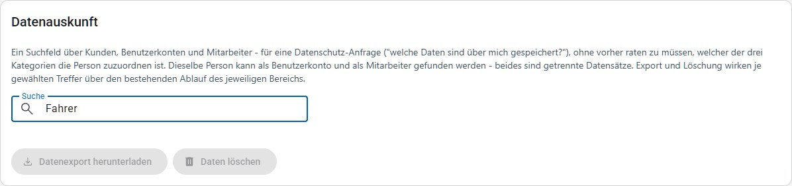
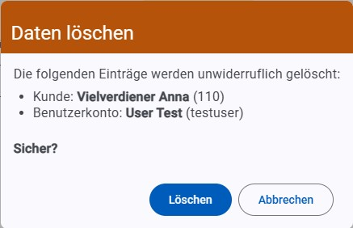

# Datenauskunft

Eine Datenschutz-Anfrage ("welche Daten sind über mich gespeichert?") kommt nicht vorab danach sortiert, ob die anfragende Person Kunde, Benutzerkonto-Inhaber:in oder Mitarbeiter:in (z. B. Fahrer:in) ist. Bisher musste dafür geraten und anschließend auf bis zu drei verschiedenen Seiten unter drei verschiedenen Berechtigungen gesucht werden – bei einer Person, die sowohl Kunde als auch ehrenamtliche Mitarbeiterin ist (z. B. eine Fahrerin, die auch selbst Lebensmittel bezieht), sogar zweimal.

**Datenauskunft** durchsucht Kunden, Benutzerkonten und Mitarbeiter mit einem einzigen Suchfeld und bietet für die gefundenen Treffer den Datenexport (DSGVO Art. 15/20) sowie die endgültige Löschung (DSGVO Art. 17) an – jeweils über denselben Ablauf, den die jeweilige Fachseite auch direkt anbietet.

> [!IMPORTANT]
> Für diese Seite ist die Berechtigung **Datenauskunft** erforderlich (siehe [Benutzer](benutzer.md)). Sie kommt **zusätzlich** zur Berechtigung des jeweiligen Bereichs hinzu: Um einen gefundenen Kunden-Treffer zu exportieren oder zu löschen, ist weiterhin "Kundenverwaltung" nötig, bei einem Benutzerkonto "Benutzerverwaltung" und bei einem Mitarbeiter "Einstellungen". Fehlt die Berechtigung für einen Bereich vollständig, erscheinen dessen Treffer in der Suche gar nicht erst; fehlt sie nur für einen einzelnen ausgewählten Treffer trotz sonst passender Bereichs-Berechtigung, lässt sich dieser Treffer nicht auswählen.

## Suchen und auswählen

Die Suche beginnt ab zwei eingegebenen Zeichen und wirkt sofort, ohne eigenen Suchen-Button. Gesucht wird nach Name, Kundennummer, Benutzername und Personalnummer, ebenso wie Adresse, Telefonnummer und E-Mail bei einem Kunden – auch bei Tippfehlern werden ähnlich geschriebene Treffer gefunden.

Die Treffer sind nach Bereich gruppiert – **Kunde**, **Benutzerkonto** und **Mitarbeiter** – damit eine Namensgleichheit zwischen einem Kunden und einer davon unabhängigen Mitarbeiterin nicht verwechselt werden kann. Benutzerkonten und Mitarbeiter sind getrennte Datensätze ohne Verbindung (siehe [Mitarbeiter](einstellungen.md#mitarbeiter)): Ist dieselbe Person sowohl Benutzer als auch Fahrer, erscheint sie unter beiden Gruppen, und beide Treffer lassen sich gemeinsam auswählen. Über die Kästchen lassen sich beliebig viele Treffer aus einer oder mehreren Gruppen gleichzeitig auswählen.

Pro Bereich werden höchstens 20 Treffer angezeigt – für eine gezielte Suche nach einer bestimmten Person ausreichend, aber kein vollständiger Bericht. Liefert ein Bereich mehr als 20 Treffer, erscheint ein Hinweis, dass nicht alle Treffer angezeigt werden; die Sucheingabe sollte dann weiter eingegrenzt werden, um die gesuchte Person sicher zu finden.

## Daten exportieren

**Datenexport herunterladen** lädt für alle ausgewählten Treffer eine gemeinsame ZIP-Datei herunter – auch wenn nur ein einzelner Treffer ausgewählt ist. Sind mehrere Treffer gemeinsam ausgewählt (etwa dieselbe Person als Kunde und als Benutzerkonto), enthält die ZIP-Datei beide vollständigen Auskünfte in getrennten Ordnern, statt zwei einzelne Downloads verlangen zu müssen. Inhaltlich entspricht jeder Ordner genau dem Export, den die jeweilige Fachseite auch einzeln anbietet – siehe [Kunden](kunden.md), [Benutzer](benutzer.md) bzw. [Mitarbeiter](einstellungen.md#mitarbeiter).

## Daten löschen

**Daten löschen** entfernt alle ausgewählten Treffer endgültig – über eine einzige Sicherheitsabfrage, die alle ausgewählten Einträge auflistet.

Anders als beim Export wirkt die Löschung auf jeden ausgewählten Treffer einzeln: Ist ein Kunde inzwischen bereits von jemand anderem gelöscht worden, hält das die Löschung der übrigen ausgewählten Treffer nicht auf. Jede Löschung läuft über denselben Ablauf wie auf der jeweiligen Fachseite, inklusive deren Einschränkungen – das letzte aktive Administrator-Benutzerkonto bleibt weiterhin geschützt (siehe [Benutzer](benutzer.md)). Die Löschung eines Benutzerkontos betrifft nur das Konto selbst; ein gleichnamiger Mitarbeiter ist ein eigener Treffer und wird nur gelöscht, wenn er ebenfalls ausgewählt ist. War ein ausgewählter Treffer bereits gelöscht, wird er namentlich in der Rückmeldung genannt, statt nur als Anzahl mitgezählt zu werden – für eine schriftliche Antwort auf eine Löschanfrage (Art. 17) ist relevant, welcher Treffer das genau war.

## Technische Spuren nach der Löschung

Nach einer endgültigen Löschung sind Haushalt bzw. Personen, Notizen und Dokumente sofort aus der Anwendung verschwunden. Ein paar technische Kopien bleiben im Hintergrund jedoch noch begrenzte Zeit bestehen, bis sie automatisch entfernt werden – für die meisten Fälle lässt sich eine Anfrage also mit "gelöscht, letzte technische Spuren spätestens nach 30 Tagen" beantworten, mit einer Ausnahme (siehe unten):

- **Zugriffsprotokoll** (siehe [Zugriffsprotokoll](zugriffsprotokoll.md)), inklusive des Lösch-Eintrags mit dem zuletzt bekannten Stand: bis zu 30 Tage.
- Noch nicht ausgelieferte Echtzeit-Benachrichtigungen: bis zu 14 Tage.
- Bereits versendete E-Mails (z. B. Tagesberichte), die den Datensatz betrafen: bis zu 14 Tage nach dem Versand.
- E-Mails, deren Zustellung nach mehreren Versuchen aufgegeben wurde: bis zu 30 Tage nach der Einreihung in die Warteschlange.

Eine Ausnahme läuft länger als 30 Tage:

- Ein Mitarbeiter (Personalnummer, Name) wird von der automatischen Bereinigung erst entfernt, wenn er 1 Jahr lang in keiner Warenerfassung mehr als Fahrer:in oder Beifahrer:in eingetragen wurde (siehe [Mitarbeiter](einstellungen.md#mitarbeiter)); die manuelle Löschung – auch hier über die Datenauskunft – wirkt sofort.

Bereits gedruckte oder per Post versendete Dokumente (z. B. Kundenliste, Stammdatenblatt) sowie Datensicherungen liegen außerhalb der Anwendung – für sie gilt diese Frist nicht.
