

# Einstellungen

Der Bereich "Einstellungen" bündelt die zentrale Konfiguration der Anwendung. Der Menüpunkt ist nur für Benutzer mit der Berechtigung "Einstellungen" sichtbar.

Die Tabellen dieses Bereichs werden auf schmalen Bildschirmen als Kartenliste dargestellt – eine Karte je Eintrag, mit denselben Angaben und denselben Aktionen wie in der Tabelle, inklusive Drag-Handle (⋮⋮) zum Sortieren (siehe [Darstellung auf schmalen Bildschirmen](README.md#darstellung-auf-schmalen-bildschirmen)). [Filialen](#filialen) und [Routen](#routen) sind keine Tabellen, sondern aufklappbare Listen und funktionieren daher auf jeder Bildschirmbreite gleich. Am Beispiel der Fahrzeuge:

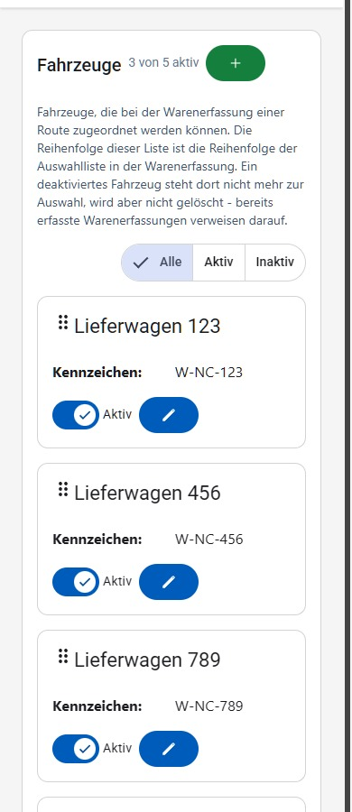

Das Drag-Handle (⋮⋮) lässt sich nicht nur mit der Maus ziehen: Wird es mit der Tabulator-Taste angesprungen, verschieben die Tasten **Pfeil nach oben** und **Pfeil nach unten** den Eintrag jeweils um eine Position. Das gilt für Fahrzeuge, Notschlafstellen, Waren-Kategorien und Retour-Kategorien gleichermaßen (siehe auch [Bedienung mit der Tastatur](README.md#bedienung-mit-der-tastatur)).

## E-Mail-Empfänger

Unter **Einstellungen → E-Mail** werden die Empfänger (An/CC/BCC) für automatisch versendete E-Mails gepflegt, getrennt nach den Reitern **Tagesreport**, **Statistiken** und **Retourkisten**. Über die grünen **+**-Buttons können weitere Empfänger hinzugefügt, über die roten Buttons einzelne Empfänger entfernt werden. Jede Adresse muss ein gültiges E-Mail-Format haben; ungültige Einträge werden rot markiert (auch der jeweilige Reiter), zusätzlich erscheint die Meldung "Ungültige E-Mail Adresse".

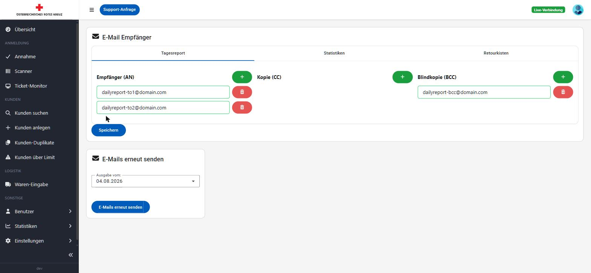

Auf schmalen Bildschirmen stehen An, CC und BCC nicht nebeneinander, sondern durch Trennlinien getrennt untereinander.

Im Abschnitt "E-Mails erneut senden" kann für eine ausgewählte Ausgabe (Dropdown, standardmäßig die aktuellste) der zugehörige Tagesreport erneut versendet werden.

## Notschlafstellen

Unter **Einstellungen → Notschlafstellen** werden die Notschlafstellen verwaltet, deren Personenzahl in die Tagesstatistik einfließt. Notschlafstellen können aktiviert/deaktiviert, angesehen, bearbeitet und per Drag-Handle (⋮⋮) in der Reihenfolge sortiert werden. Eine deaktivierte Notschlafstelle kann erst wieder bearbeitet werden, nachdem sie reaktiviert wurde (der Stift-Button ist so lange deaktiviert).

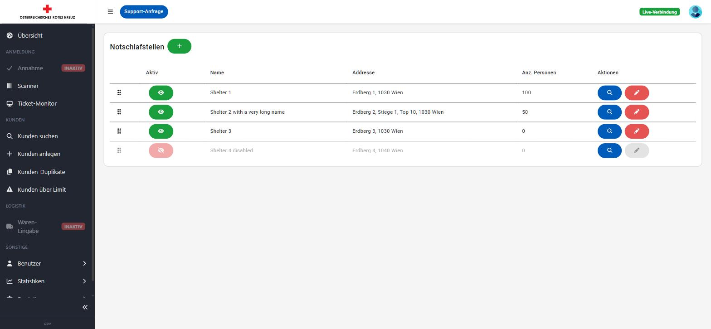

Neben Name und Adresse (inkl. optional Stiege/Tür) können ein freier **Hinweis**-Text sowie beliebig viele **Kontakte** (Vorname, Nachname, Telefonnummer als Pflichtfeld) über **Kontakt hinzufügen**/**Entfernen** erfasst werden. In der Ansehen-Ansicht werden alle Kontakte aufgelistet bzw. "Keine Kontakte vorhanden" angezeigt, falls keine erfasst sind.

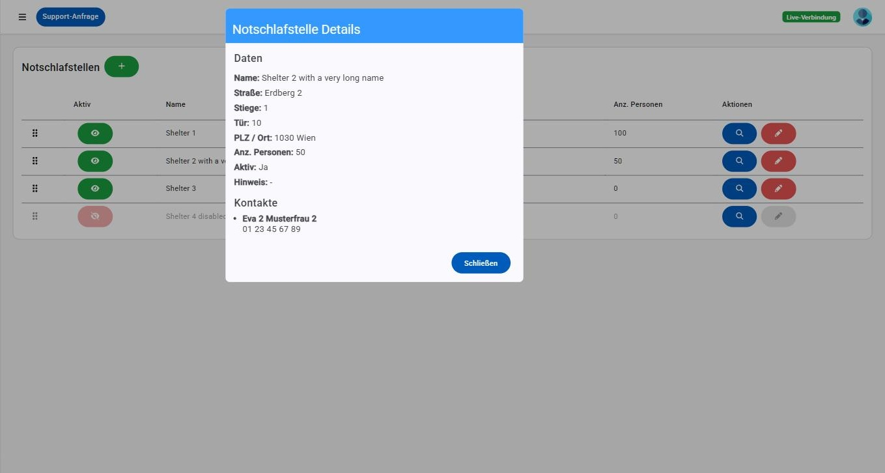

## Statische Werte (Grenzwerte)

Unter **Einstellungen → Statische Werte** werden die Beträge gepflegt, die darüber entscheiden, wer bezugsberechtigt ist. Es handelt sich um eine fest vorgegebene Liste von Werten (kein Hinzufügen/Entfernen einzelner Zeilen möglich) – bearbeitbar ist ausschließlich der jeweilige Betrag über Stift-/Häkchen-Symbol.

Die Werte sind in zwei Bereiche gegliedert, und zu jedem Wert steht direkt darüber, wofür er verwendet wird:

- **Einkommensgrenze** – die Einkommensgrenze selbst (je nach Anzahl Erwachsener und Kinder im Haushalt), die Zuschläge für zusätzliche Erwachsene bzw. Kinder, die Toleranz sowie die Beihilfen (Familienbeihilfe, Kinderabsetzbetrag, Geschwisterstaffel), die dem Einkommen hinzugerechnet werden.
- **Unkostenbeitrag** – der Betrag, den ein Haushalt pro Ausgabe beiträgt.

Bei der Familienbeihilfe ist das angegebene Alter jeweils die Altersuntergrenze: Der Satz gilt ab dem angegebenen Alter bis zum nächsthöheren Eintrag – für ein Kind wird also immer der Satz herangezogen, dessen Alter es bereits erreicht hat (z. B. der Satz "ab 10 Jahren" für ein zwölfjähriges Kind).

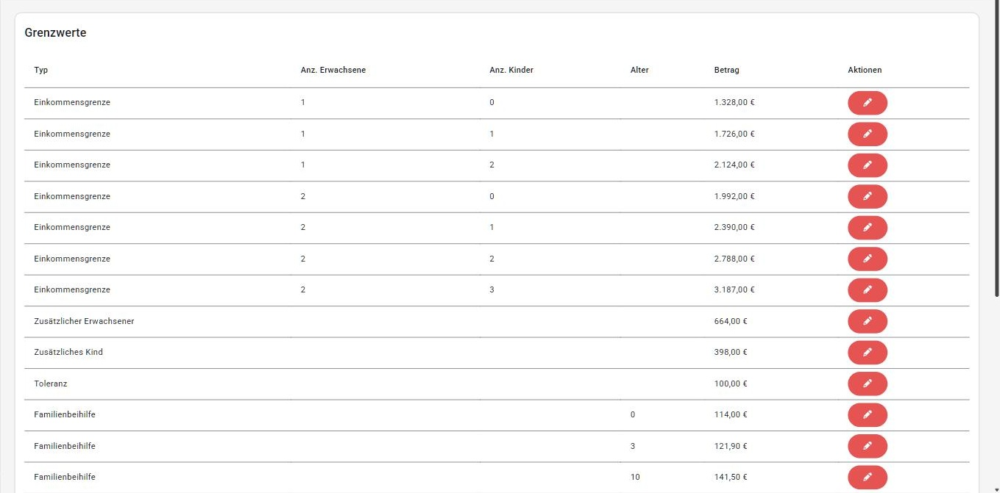

Beim Speichern wird die Änderung zunächst mit altem und neuem Betrag zur Bestätigung angezeigt. Das ist bewusst so: Die Änderung gilt sofort – jede weitere Anspruchsprüfung rechnet ab dem Speichern mit dem neuen Betrag.

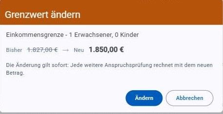

Über **Kunden über Limit ansehen** gelangt man direkt zu [Kunden über Limit](kunden.md#kunden-über-limit), also zu jenen Kunden, die mit diesen Werten aktuell über dem Limit liegen. **Wer hat zuletzt geändert?** öffnet das [Änderungsprotokoll](aenderungsprotokoll.md), gefiltert auf die Änderungen an diesen Werten. Beide Links sind nur mit der jeweiligen Berechtigung sichtbar.

## Lebensmittelkategorien

Unter **Einstellungen → Lebensmittelkategorien** werden die Warenkategorien für die [Warenerfassung](logistik.md) gepflegt, inklusive des durchschnittlichen Gewichts pro Einheit (kg), das für die Hochrechnung der Gesamtwarenmenge verwendet wird. Kategorien können aktiviert/deaktiviert, bearbeitet und sortiert werden.

Ein Hinweis über der Tabelle grenzt den Bildschirm gegen die [Retour-Kategorien](#retourkategorien) ab, die auf den ersten Blick gleich aussehen: Hier werden die abgeholten Waren samt Gewicht gepflegt, dort nur die leeren Kisten, die an die Filiale zurückgehen. Der Link im Hinweis führt direkt auf den jeweils anderen Bildschirm.

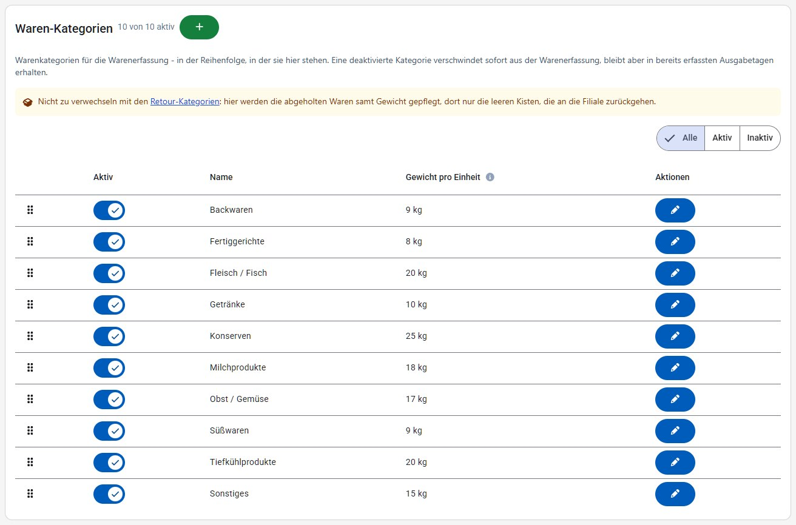

## Retour-Kategorien

Unter **Einstellungen → Retour-Kategorien** werden die geläufigen Kistenarten gepflegt, die im Abschnitt [Retourware](logistik.md#retourware) der Warenerfassung als Zähler vorgegeben werden. Sie haben — anders als Lebensmittelkategorien — kein Gewicht: Retourkisten werden nur gezählt, nie gewogen, und fließen daher auch nicht in die Warenmengen-Statistik ein. Kategorien können aktiviert/deaktiviert, bearbeitet und sortiert werden; die Reihenfolge bestimmt sowohl die Reihenfolge der Zähler in der Warenerfassung als auch die Reihenfolge in der Retourkisten-E-Mail.

Die Kategorien wirken auf zwei Bildschirme: Sie bestimmen die Zähler im Abschnitt [Retourware](logistik.md#retourware) der Warenerfassung, und ihre Namen erscheinen im [Routen-Navi](logistik.md#routen-navi) in den Hinweisen "Retourware mitnehmen" bzw. "Retourware abgeben". Eine Änderung hier ist also an beiden Stellen zu sehen. Ein Hinweis über der Tabelle grenzt den Bildschirm außerdem gegen die [Lebensmittelkategorien](#lebensmittelkategorien) ab und verlinkt dorthin.

Kisten, die hier nicht gelistet sind, müssen nicht angelegt werden — sie können in der Warenerfassung jederzeit als "Sonstige Retourware" mit freier Beschreibung erfasst werden.

Neben der Überschrift steht, wie viele der angelegten Kategorien aktiv sind ("3 von 4 aktiv"). Da eine Kategorie nie gelöscht, sondern nur deaktiviert wird, wächst die Liste mit der Zeit: Über die Umschalter **Alle / Aktiv / Inaktiv** wird sie auf die gerade interessanten Einträge eingeschränkt. Die Sortierung bleibt dabei möglich — verschobene Einträge springen über die ausgeblendeten hinweg, deren Position unverändert bleibt. Beim Bearbeiten eines Namens weist ein Hinweis unter dem Eingabefeld darauf hin, dass **Enter** speichert und **Esc** abbricht.

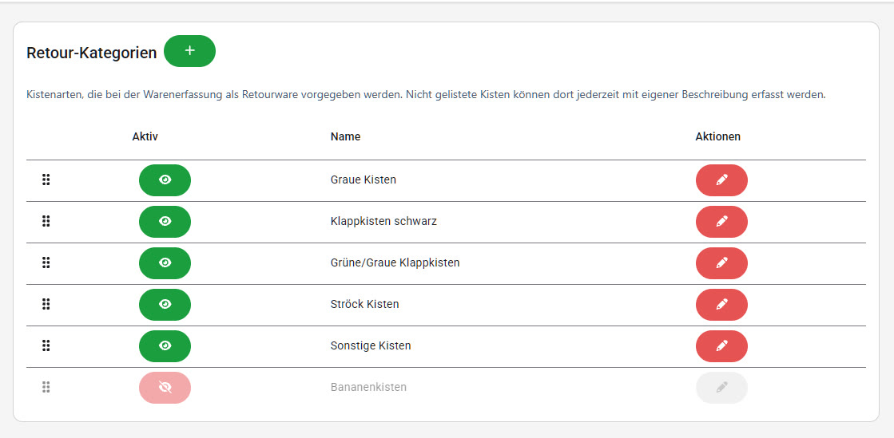

## Fahrzeuge

Unter **Einstellungen → Fahrzeuge** werden die für die Warenerfassung verfügbaren Fahrzeuge (Kennzeichen, Name) verwaltet. Fahrzeuge können aktiviert/deaktiviert, bearbeitet und sortiert werden.

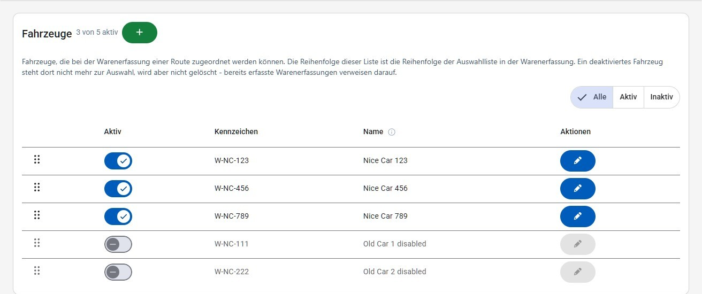

## Filialen

Unter **Einstellungen → Filialen** werden die Geschäfte gepflegt, bei denen Ware abgeholt wird. Neben Nummer, Name und Adresse werden Telefonnummer, Ansprechperson und ein freier **Hinweis**-Text erfasst.

Jede Filiale ist eine eigene Zeile, die sich aufklappen lässt: zugeklappt zeigt sie Nummer, Name, Adresse und Einheit, aufgeklappt die vollständigen Angaben inklusive Telefonnummer (als Link direkt wählbar), Ansprechperson und Hinweis. Über der Liste stehen ein **Suchfeld** (durchsucht Nummer, Name, Adresse, Ansprechperson und Hinweis) sowie der Filter **Alle / Aktiv / Inaktiv**; die Überschrift zeigt, wie viele der Filialen aktiv sind.

Die **Einheit** legt fest, wie die Menge dieser Filiale in der [Warenerfassung](logistik.md) gezählt wird: bei "Kisten" wird die eingegebene Anzahl mit dem Gewicht pro Einheit der jeweiligen [Lebensmittelkategorie](#lebensmittelkategorien) multipliziert, bei "Kilogramm" ist die Eingabe bereits das Gewicht. Eine falsche Einheit verfälscht daher alle Warenmengen-Statistiken dieser Filiale. Filialen, die in Kilogramm zählen, sind in der Liste farbig hervorgehoben.

Die **Nummer** muss eindeutig sein; ist sie bereits vergeben, erscheint beim Speichern die Meldung "Filialnummer ... ist bereits vergeben!".

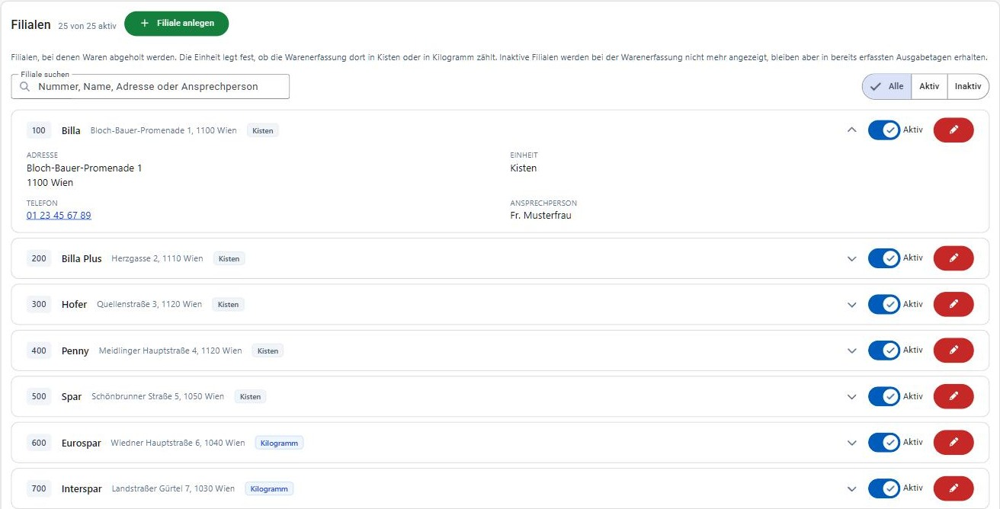

Rechts in jeder Zeile stehen der Schalter **Aktiv** zum Aktivieren/Deaktivieren und der **Stift-Button**, der den Bearbeiten-Dialog öffnet — dafür muss die Filiale nicht aufgeklappt werden. Eine deaktivierte Filiale steht in der Warenerfassung nicht mehr zur Auswahl, bleibt aber in bereits erfassten Ausgabetagen erhalten — deshalb gibt es bewusst keine Löschfunktion. Sie ist in der Liste als "Inaktiv" gekennzeichnet und kann erst wieder bearbeitet werden, nachdem sie reaktiviert wurde (der Bearbeiten-Button ist so lange deaktiviert).

## Routen

Unter **Einstellungen → Routen** werden die Routen samt ihren Stopps gepflegt. Eine Route hat eine Nummer (Zwischennummern wie 2.1 sind möglich), einen Namen und einen freien **Hinweis**-Text.

Jede Route ist eine eigene Zeile, die sich aufklappen lässt: zugeklappt zeigt sie Nummer, Name sowie die Anzahl der Stopps und die Uhrzeit des ersten und letzten Stopps ("3 Stopps · 12:00 – 13:00"), aufgeklappt den Hinweis und den gesamten Tagesablauf der Route — je Stopp Uhrzeit, Filiale samt Adresse und Beschreibung. Über der Liste stehen ein **Suchfeld** (durchsucht Nummer, Name, Hinweis sowie die Filialen und Beschreibungen der Stopps) sowie der Filter **Alle / Aktiv / Inaktiv**.

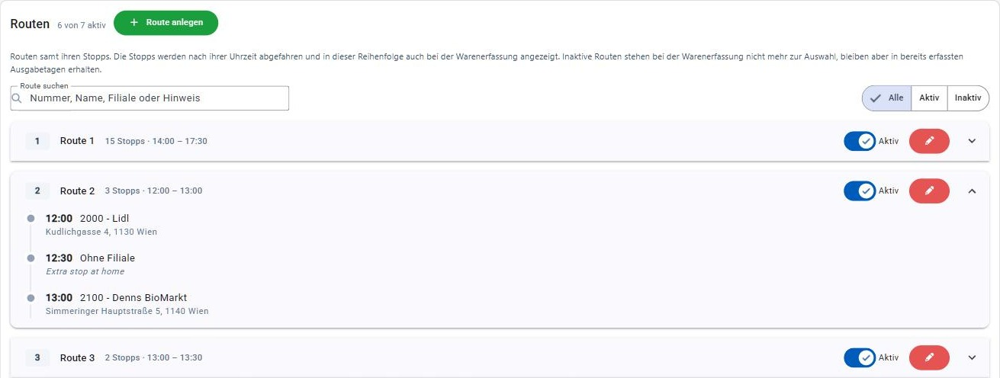

Rechts in jeder Zeile stehen — wie bei den [Filialen](#filialen) — der Schalter **Aktiv** und der **Stift-Button**, der den Bearbeiten-Dialog öffnet; dafür muss die Route nicht aufgeklappt werden. Im Bearbeiten-Dialog wird über **Stopp hinzufügen** je Stopp eine **Uhrzeit**, eine **Filiale** und eine **Beschreibung** erfasst; das Papierkorb-Symbol entfernt einen Stopp wieder. Die Uhrzeit bestimmt die Reihenfolge der Stopps — sowohl in der Routenliste als auch in der [Warenerfassung](logistik.md); eine eigene Sortierung per Drag & Drop gibt es hier daher nicht. Zur Auswahl stehen alle aktiven [Filialen](#filialen); mit "Keine Filiale" lässt sich auch ein Stopp ohne Warenabholung (z. B. eine Pause) eintragen — bei einem solchen Stopp steht in der Liste die Beschreibung anstelle der Filiale.

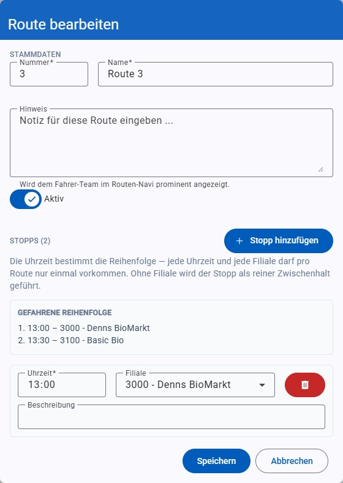

Pro Route darf jede Filiale nur einmal vorkommen und jede Uhrzeit nur einmal vergeben sein; andernfalls erscheint beim Speichern eine entsprechende Meldung. Wie bei den Filialen können Routen deaktiviert statt gelöscht werden: eine deaktivierte Route steht in der Warenerfassung nicht mehr zur Auswahl, bereits erfasste Ausgabetage bleiben aber unverändert.

## Mitarbeiter

Unter **Einstellungen → Mitarbeiter** werden die Mitarbeiterstammdaten (Personalnummer, Vorname, Nachname) verwaltet, auf denen die [Benutzerkonten](benutzer.md) sowie die Fahrer/Beifahrer-Zuordnung in der [Warenerfassung](logistik.md) basieren. Die Liste filtert sich beim Tippen im Suchfeld — es gibt keinen eigenen Such-Button —, gesucht wird nach Personalnummer, Vor- und Nachname. Anders als bei Notschlafstellen, Fahrzeugen und Lebensmittelkategorien gibt es hier keine Aktiv/Inaktiv-Kennzeichnung oder Löschfunktion, nur Anlegen und Bearbeiten: Personalnummern bleiben in bereits erfassten Ausgabetagen und Kundendaten referenziert, nicht mehr aktive Mitarbeiter bleiben daher in der Liste stehen. Dieser Hinweis steht auch über der Liste.

Die Spalte **Benutzerkonto** zeigt, ob ein [Benutzerkonto](benutzer.md) auf die Personalnummer verweist. Mit der Berechtigung "Benutzerverwaltung" ist der Kontoname ein Link direkt auf die Benutzer-Details; ohne diese Berechtigung steht dort nur "Benutzerkonto vorhanden". Mitarbeiter ohne Konto sind als "Kein Benutzerkonto" gekennzeichnet.

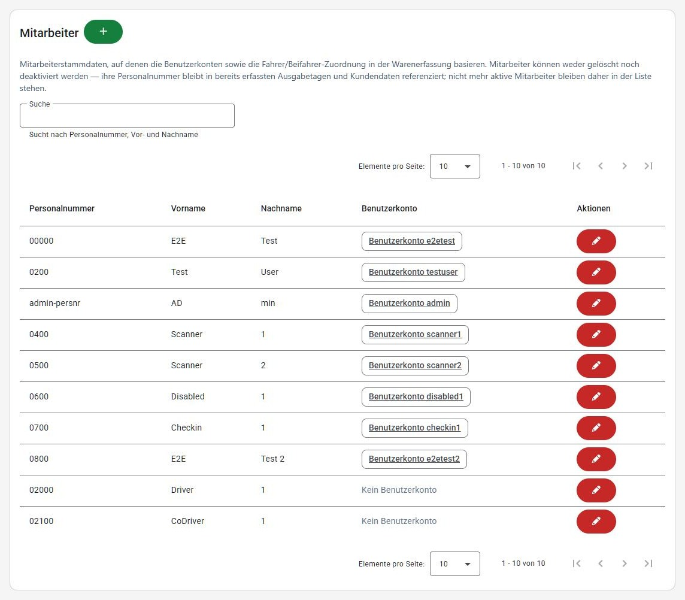

Beim Anlegen sind Personalnummer, Vorname und Nachname Pflichtfelder (max. 50 Zeichen). Ist die eingegebene Personalnummer bereits vergeben, wird das noch während der Eingabe gemeldet ("Personalnummer bereits vergeben") — samt Namen des bestehenden Mitarbeiters und dem Button **Mitarbeiter öffnen**, der den Dialog schließt, die Liste auf diesen Mitarbeiter filtert und ihn zum Bearbeiten öffnet. Dieselbe Prüfung läuft beim Bearbeiten einer Zeile; solange die Nummer vergeben ist, lässt sich nicht speichern. Fahrer und Beifahrer können auch direkt in der [Warenerfassung](logistik.md) angelegt werden — mit denselben Feldern und Regeln, es entsteht derselbe Mitarbeiter-Datensatz.

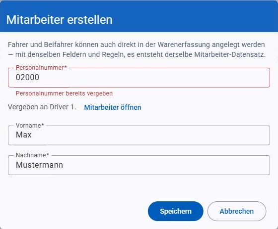
