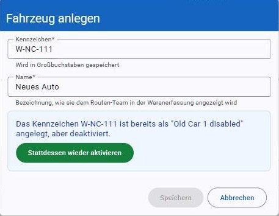
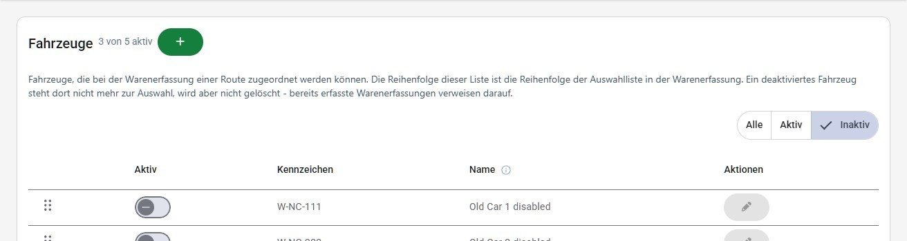

# Einstellungen

Der Bereich "Einstellungen" bündelt die zentrale Konfiguration der Anwendung. Der Menüpunkt ist nur für Benutzer mit der Berechtigung "Einstellungen" sichtbar.

Die Tabellen dieses Bereichs werden auf schmalen Bildschirmen als Kartenliste dargestellt – eine Karte je Eintrag, mit denselben Angaben und denselben Aktionen wie in der Tabelle, inklusive Drag-Handle (⋮⋮) zum Sortieren (siehe [Darstellung auf schmalen Bildschirmen](README.md#darstellung-auf-schmalen-bildschirmen)). [Notschlafstellen](#notschlafstellen), [Filialen](#filialen) und [Routen](#routen) sind keine Tabellen, sondern aufklappbare Listen und funktionieren daher auf jeder Bildschirmbreite gleich. Am Beispiel der Fahrzeuge:

Das Drag-Handle (⋮⋮) lässt sich nicht nur mit der Maus ziehen: Wird es mit der Tabulator-Taste angesprungen, verschieben die Tasten **Pfeil nach oben** und **Pfeil nach unten** den Eintrag jeweils um eine Position. Das gilt für Fahrzeuge, Notschlafstellen, Waren-Kategorien und Retour-Kategorien gleichermaßen (siehe auch [Bedienung mit der Tastatur](README.md#bedienung-mit-der-tastatur)).

## Aktiv und inaktiv

Gelöscht wird in diesem Bereich nichts: [Notschlafstellen](#notschlafstellen), [Waren-Kategorien](#lebensmittelkategorien), [Retour-Kategorien](#retourkategorien), [Fahrzeuge](#fahrzeuge), [Filialen](#filialen) und [Routen](#routen) werden nur deaktiviert, weil bereits erfasste Ausgabetage und Warenerfassungen darauf verweisen. Alle sechs Listen zeigen und schalten diesen Zustand gleich:

- In jeder Zeile steht der Schalter **Aktiv**. Er zeigt den Zustand und ändert ihn — eine eigene Kennzeichnung daneben gibt es nicht.
- Ein deaktivierter Eintrag bleibt in der Liste stehen, wird aber grau dargestellt, und sein **Bearbeiten**-Button ist gesperrt: Er muss zuerst wieder aktiviert werden.
- Über der Liste schränkt der Filter **Alle / Aktiv / Inaktiv** die Anzeige ein. Sortieren bleibt dabei möglich — verschobene Einträge springen über die ausgeblendeten hinweg, deren Position unverändert bleibt.
- Neben der Überschrift steht, wie viele der angelegten Einträge aktiv sind ("3 von 4 aktiv").

Was ein deaktivierter Eintrag konkret bedeutet — wo er nicht mehr zur Auswahl steht und was von ihm erhalten bleibt — steht im Text über der jeweiligen Liste.

## E-Mail-Empfänger

Unter **Einstellungen → E-Mail** werden die Empfänger (An/CC/BCC) für automatisch versendete E-Mails gepflegt, getrennt nach den Reitern **Tagesreport**, **Statistiken** und **Retourkisten**. Über die grünen **+**-Buttons können weitere Empfänger hinzugefügt, über die roten Buttons einzelne Empfänger entfernt werden. Jede Adresse muss ein gültiges E-Mail-Format haben; ungültige Einträge werden rot markiert (auch der jeweilige Reiter), zusätzlich erscheint die Meldung "Ungültige E-Mail Adresse".

Auf schmalen Bildschirmen stehen An, CC und BCC nicht nebeneinander, sondern durch Trennlinien getrennt untereinander.

Im Abschnitt "E-Mails erneut senden" kann für eine ausgewählte Ausgabe (Dropdown, standardmäßig die aktuellste) der zugehörige Tagesreport erneut versendet werden.

## Notschlafstellen

Unter **Einstellungen → Notschlafstellen** werden die Notschlafstellen verwaltet, deren Personenzahl in die Tagesstatistik einfließt.

Jede Notschlafstelle ist eine eigene Zeile, die sich aufklappen lässt: zugeklappt zeigt sie Name, Adresse und Personenanzahl, aufgeklappt die vollständige Adresse (inkl. Stiege/Tür), die Personenanzahl, alle **Kontakte** und den **Hinweis**-Text. Die Telefonnummer eines Kontakts ist ein Link und lässt sich direkt wählen; sind keine Kontakte erfasst, steht dort "Keine Kontakte vorhanden".

Rechts in jeder Zeile stehen der Schalter **Aktiv** und der **Stift-Button**, der den Bearbeiten-Dialog öffnet — dafür muss die Notschlafstelle nicht aufgeklappt werden. Eine deaktivierte Notschlafstelle steht bei der Statistik nicht mehr zur Auswahl; im Übrigen gilt [Aktiv und inaktiv](#aktiv-inaktiv).

Links in jeder Zeile sortiert das Drag-Handle (⋮⋮) die Liste. Diese Reihenfolge gilt nicht nur hier: Sie bestimmt auch die Reihenfolge der Notschlafstellen in der [Übersicht](README.md#übersicht-dashboard) und im Tagesbericht — deshalb steht dieser Hinweis auch über der Liste.

Im Bearbeiten-Dialog werden neben Name und Adresse (inkl. optional Stiege/Tür) ein freier **Hinweis**-Text sowie beliebig viele **Kontakte** (Vorname, Nachname, Telefonnummer als Pflichtfeld) über **Kontakt hinzufügen**/**Entfernen** erfasst.

## Statische Werte (Grenzwerte)

Unter **Einstellungen → Statische Werte** werden die Beträge gepflegt, die darüber entscheiden, wer bezugsberechtigt ist. Es handelt sich um eine fest vorgegebene Liste von Werten (kein Hinzufügen/Entfernen einzelner Zeilen möglich) – bearbeitbar ist ausschließlich der jeweilige Betrag über Stift-/Häkchen-Symbol.

Die Werte sind in zwei Bereiche gegliedert, und zu jedem Wert steht direkt darüber, wofür er verwendet wird:

- **Einkommensgrenze** – die Einkommensgrenze selbst (je nach Anzahl Erwachsener und Kinder im Haushalt), die Zuschläge für zusätzliche Erwachsene bzw. Kinder, die Toleranz sowie die Beihilfen (Familienbeihilfe, Kinderabsetzbetrag, Geschwisterstaffel), die dem Einkommen hinzugerechnet werden.
- **Unkostenbeitrag** – der Betrag, den ein Haushalt pro Ausgabe beiträgt.

Bei der Familienbeihilfe ist das angegebene Alter jeweils die Altersuntergrenze: Der Satz gilt ab dem angegebenen Alter bis zum nächsthöheren Eintrag – für ein Kind wird also immer der Satz herangezogen, dessen Alter es bereits erreicht hat (z. B. der Satz "ab 10 Jahren" für ein zwölfjähriges Kind).

Beim Speichern wird die Änderung zunächst mit altem und neuem Betrag zur Bestätigung angezeigt. Das ist bewusst so: Die Änderung gilt sofort – jede weitere Anspruchsprüfung rechnet ab dem Speichern mit dem neuen Betrag.

Über **Kunden über Limit ansehen** gelangt man direkt zu [Kunden über Limit](kunden.md#kunden-über-limit), also zu jenen Kunden, die mit diesen Werten aktuell über dem Limit liegen. **Wer hat zuletzt geändert?** öffnet das [Änderungsprotokoll](aenderungsprotokoll.md), gefiltert auf die Änderungen an diesen Werten. Beide Links sind nur mit der jeweiligen Berechtigung sichtbar.

## Lebensmittelkategorien

Unter **Einstellungen → Lebensmittelkategorien** werden die Warenkategorien für die [Warenerfassung](logistik.md) gepflegt. Die Reihenfolge in dieser Liste ist die Reihenfolge, in der die Kategorien dort erscheinen; eine deaktivierte Kategorie verschwindet sofort aus der Warenerfassung, bleibt aber in bereits erfassten Ausgabetagen erhalten (siehe [Aktiv und inaktiv](#aktiv-inaktiv)).

Das **Gewicht pro Einheit** rechnet die erfassten Einheiten (z. B. Kisten) in Kilogramm um und bestimmt damit die Warenmenge in allen Statistiken. Es steht in der Liste immer mit seiner Einheit ("9 kg"), und bei der Eingabe hängt "kg" am Eingabefeld — eine Kategorie ohne Gewicht wird eigens als "kein Gewicht - zählt mit 0 kg" ausgewiesen. Das **i**-Symbol neben der Spaltenüberschrift erklärt, was der Wert bewirkt: Eine Änderung wirkt ab der nächsten Erfassung, bereits erfasste Mengen behalten das Gewicht, mit dem sie erfasst wurden — abgeschlossene Ausgabetage und deren Statistiken bleiben also unverändert.

Ein Hinweis über der Tabelle grenzt den Bildschirm gegen die [Retour-Kategorien](#retourkategorien) ab, die auf den ersten Blick gleich aussehen: Hier werden die abgeholten Waren samt Gewicht gepflegt, dort nur die leeren Kisten, die an die Filiale zurückgehen. Der Link im Hinweis führt direkt auf den jeweils anderen Bildschirm.

Beim Bearbeiten weist ein Hinweis unter dem Namensfeld darauf hin, dass **Enter** speichert und **Esc** abbricht; dasselbe steht in den Tooltips der beiden Buttons.

## Retour-Kategorien

Unter **Einstellungen → Retour-Kategorien** werden die geläufigen Kistenarten gepflegt, die im Abschnitt [Retourware](logistik.md#retourware) der Warenerfassung als Zähler vorgegeben werden. Sie haben — anders als Lebensmittelkategorien — kein Gewicht: Retourkisten werden nur gezählt, nie gewogen, und fließen daher auch nicht in die Warenmengen-Statistik ein. Kategorien können bearbeitet und sortiert werden (zum Deaktivieren siehe [Aktiv und inaktiv](#aktiv-inaktiv)); die Reihenfolge bestimmt sowohl die Reihenfolge der Zähler in der Warenerfassung als auch die Reihenfolge in der Retourkisten-E-Mail.

Die Kategorien wirken auf zwei Bildschirme: Sie bestimmen die Zähler im Abschnitt [Retourware](logistik.md#retourware) der Warenerfassung, und ihre Namen erscheinen im [Routen-Navi](logistik.md#routen-navi) in den Hinweisen "Retourware mitnehmen" bzw. "Retourware abgeben". Eine Änderung hier ist also an beiden Stellen zu sehen. Ein Hinweis über der Tabelle grenzt den Bildschirm außerdem gegen die [Lebensmittelkategorien](#lebensmittelkategorien) ab und verlinkt dorthin.

Kisten, die hier nicht gelistet sind, müssen nicht angelegt werden — sie können in der Warenerfassung jederzeit als "Sonstige Retourware" mit freier Beschreibung erfasst werden.

Beim Bearbeiten eines Namens weist ein Hinweis unter dem Eingabefeld darauf hin, dass **Enter** speichert und **Esc** abbricht.

## Fahrzeuge

Unter **Einstellungen → Fahrzeuge** werden die für die [Warenerfassung](logistik.md) verfügbaren Fahrzeuge (Kennzeichen, Name) verwaltet. Fahrzeuge können bearbeitet und sortiert werden; die Reihenfolge dieser Liste ist die Reihenfolge der Fahrzeug-Auswahl in der Warenerfassung. Der **Name** ist die Bezeichnung, die dem Routen-Team dort hinter dem Kennzeichen angezeigt wird (z. B. "W-NC-123 (Kleinbus)").

Das **Kennzeichen** wird immer in Großbuchstaben gespeichert, damit dasselbe Fahrzeug nicht in mehreren Schreibweisen in der Auswahl landet.

Wird beim Anlegen ein bereits vorhandenes Kennzeichen eingegeben, weist das Fenster darauf hin und lässt sich nicht speichern — ist das vorhandene Fahrzeug deaktiviert, kann es direkt über **Stattdessen wieder aktivieren** reaktiviert werden, statt es ein zweites Mal anzulegen.

Deaktivierte Fahrzeuge stehen in der Warenerfassung nicht mehr zur Auswahl. Sie werden nicht gelöscht (bereits erfasste Warenerfassungen verweisen darauf), sondern bleiben ausgegraut in der Liste stehen und können dort jederzeit wieder aktiviert werden — mit dem Filter **Inaktiv** zeigt die Liste genau diese Fahrzeuge (siehe [Aktiv und inaktiv](#aktiv-inaktiv)).

## Filialen

Unter **Einstellungen → Filialen** werden die Geschäfte gepflegt, bei denen Ware abgeholt wird. Neben Nummer, Name und Adresse werden Telefonnummer, Ansprechperson und ein freier **Hinweis**-Text erfasst.

Jede Filiale ist eine eigene Zeile, die sich aufklappen lässt: zugeklappt zeigt sie Nummer, Name, Adresse und Einheit, aufgeklappt die vollständigen Angaben inklusive Telefonnummer (als Link direkt wählbar), Ansprechperson und Hinweis. Über der Liste steht neben dem Filter **Alle / Aktiv / Inaktiv** zusätzlich ein **Suchfeld**, das Nummer, Name, Adresse, Ansprechperson und Hinweis durchsucht.

Die **Einheit** legt fest, wie die Menge dieser Filiale in der [Warenerfassung](logistik.md) gezählt wird: bei "Kisten" wird die eingegebene Anzahl mit dem Gewicht pro Einheit der jeweiligen [Lebensmittelkategorie](#lebensmittelkategorien) multipliziert, bei "Kilogramm" ist die Eingabe bereits das Gewicht. Eine falsche Einheit verfälscht daher alle Warenmengen-Statistiken dieser Filiale. Filialen, die in Kilogramm zählen, sind in der Liste farbig hervorgehoben.

Die **Nummer** muss eindeutig sein; ist sie bereits vergeben, erscheint beim Speichern die Meldung "Filialnummer ... ist bereits vergeben!".

Rechts in jeder Zeile stehen der Schalter **Aktiv** und der **Stift-Button**, der den Bearbeiten-Dialog öffnet — dafür muss die Filiale nicht aufgeklappt werden. Eine deaktivierte Filiale steht in der Warenerfassung nicht mehr zur Auswahl, bleibt aber in bereits erfassten Ausgabetagen erhalten — deshalb gibt es bewusst keine Löschfunktion (siehe [Aktiv und inaktiv](#aktiv-inaktiv)).

## Routen

Unter **Einstellungen → Routen** werden die Routen samt ihren Stopps gepflegt. Eine Route hat eine Nummer (Zwischennummern wie 2.1 sind möglich), einen Namen und einen freien **Hinweis**-Text, der dem Fahrer-Team im [Routen-Navi](logistik.md#routen-navi) prominent angezeigt wird.

Jede Route ist eine eigene Zeile, die sich aufklappen lässt: zugeklappt zeigt sie Nummer, Name sowie die Anzahl der Stopps und die Uhrzeit des ersten und letzten Stopps ("3 Stopps · 12:00 – 13:00"), aufgeklappt den Hinweis, einen Link **Route in Karte öffnen** sowie den gesamten Tagesablauf der Route — je Stopp Uhrzeit, Filiale samt Adresse und Beschreibung. Zeigt ein Stopp auf eine mittlerweile deaktivierte Filiale, steht direkt daneben die Kennzeichnung "Filiale inaktiv" — dieselbe, die dem Fahrer-Team im Routen-Navi angezeigt wird.

Über der Liste stehen ein **Suchfeld** (durchsucht Nummer, Name, Hinweis sowie die Filialen und Beschreibungen der Stopps), die Sortierung **Nummer / Name** und der Filter **Alle / Aktiv / Inaktiv**. Nach einer Suche steht unter diesen Feldern, wie viele Routen gefunden wurden ("2 von 5 Routen gefunden").

Der Link **Route in Karte öffnen** setzt dieselbe Kartenroute wie das Routen-Navi zusammen — alle Stopps mit Filiale, in der gefahrenen Reihenfolge — und öffnet sie in einem neuen Tab; er ist der schnellste Weg, eine Stopp-Reihenfolge auf Plausibilität zu prüfen. Bei mehr als 10 Stopps mit Filiale deckt die Karte nur die ersten 10 ab; ein Hinweistext darunter nennt, wie viele danach einzeln zu navigieren sind (dieselbe Grenze wie beim Routen-Navi selbst).

Rechts in jeder Zeile stehen — wie bei den [Filialen](#filialen) — der Schalter **Aktiv** und der **Stift-Button**, der den Bearbeiten-Dialog öffnet; dafür muss die Route nicht aufgeklappt werden. Im Bearbeiten-Dialog wird über **Stopp hinzufügen** je Stopp eine **Uhrzeit**, eine **Filiale** und eine **Beschreibung** erfasst; das Papierkorb-Symbol entfernt einen Stopp wieder. Die Uhrzeit bestimmt die Reihenfolge der Stopps — sowohl in der Routenliste als auch in der [Warenerfassung](logistik.md); eine eigene Sortierung per Drag & Drop gibt es hier daher nicht. Zur Auswahl stehen alle aktiven [Filialen](#filialen); mit "Keine Filiale" lässt sich auch ein Stopp ohne Warenabholung (z. B. eine Pause) eintragen — bei einem solchen Stopp steht in der Liste die Beschreibung anstelle der Filiale.

Da Stopps in beliebiger Reihenfolge eingegeben und erst beim Speichern nach Uhrzeit sortiert werden, zeigt der Dialog unterhalb der Stopp-Liste live die **gefahrene Reihenfolge** — so, wie sie das Fahrer-Team später sieht, auch bevor gespeichert wird. Direkt darüber weist ein gelber Hinweis auf auffällige Eingaben hin: eine Filiale, die mehrfach als Stopp eingetragen ist, ein Stopp ohne Uhrzeit oder ein ungewöhnlich kurzer (wenige Minuten) oder ungewöhnlich langer (mehrere Stunden) Zeitabstand zwischen zwei benachbarten Stopps — typische Tippfehler. Dieser Hinweis blockiert das Speichern nicht, sondern macht nur vorab auf eine mögliche Ursache aufmerksam.

Pro Route darf jede Filiale nur einmal vorkommen und jede Uhrzeit nur einmal vergeben sein; andernfalls erscheint beim Speichern eine entsprechende Meldung. Wie bei den Filialen können Routen deaktiviert statt gelöscht werden: eine deaktivierte Route steht im Routen-Navi und in der Warenerfassung nicht mehr zur Auswahl, bereits erfasste Ausgabetage bleiben aber unverändert.

## Mitarbeiter

Unter **Einstellungen → Mitarbeiter** werden die Mitarbeiterstammdaten (Personalnummer, Vorname, Nachname) verwaltet, auf denen die [Benutzerkonten](benutzer.md) sowie die Fahrer/Beifahrer-Zuordnung in der [Warenerfassung](logistik.md) basieren. Die Liste filtert sich beim Tippen im Suchfeld — es gibt keinen eigenen Such-Button —, gesucht wird nach Personalnummer, Vor- und Nachname. Anders als bei Notschlafstellen, Fahrzeugen und Lebensmittelkategorien gibt es hier keine Aktiv/Inaktiv-Kennzeichnung oder Löschfunktion, nur Anlegen und Bearbeiten: Personalnummern bleiben in bereits erfassten Ausgabetagen und Kundendaten referenziert, nicht mehr aktive Mitarbeiter bleiben daher in der Liste stehen. Dieser Hinweis steht auch über der Liste.

Die Spalte **Benutzerkonto** zeigt, ob ein [Benutzerkonto](benutzer.md) auf die Personalnummer verweist. Mit der Berechtigung "Benutzerverwaltung" ist der Kontoname ein Link direkt auf die Benutzer-Details; ohne diese Berechtigung steht dort nur "Benutzerkonto vorhanden". Mitarbeiter ohne Konto sind als "Kein Benutzerkonto" gekennzeichnet.

Beim Anlegen sind Personalnummer, Vorname und Nachname Pflichtfelder (max. 50 Zeichen). Ist die eingegebene Personalnummer bereits vergeben, wird das noch während der Eingabe gemeldet ("Personalnummer bereits vergeben") — samt Namen des bestehenden Mitarbeiters und dem Button **Mitarbeiter öffnen**, der den Dialog schließt, die Liste auf diesen Mitarbeiter filtert und ihn zum Bearbeiten öffnet. Dieselbe Prüfung läuft beim Bearbeiten einer Zeile; solange die Nummer vergeben ist, lässt sich nicht speichern. Fahrer und Beifahrer können auch direkt in der [Warenerfassung](logistik.md) angelegt werden — mit denselben Feldern und Regeln, es entsteht derselbe Mitarbeiter-Datensatz.

