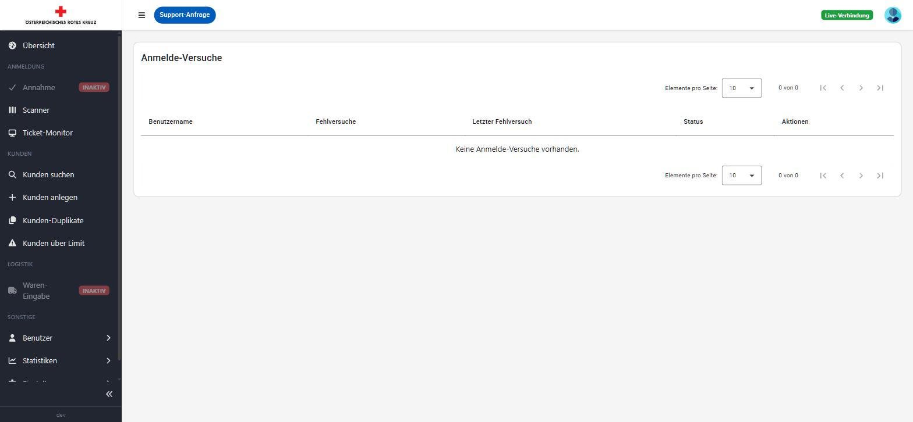

# Einstellungen

Der Bereich "Einstellungen" bündelt die zentrale Konfiguration der Anwendung. Der Menüpunkt ist nur für Benutzer mit der Berechtigung "Einstellungen" sichtbar.

## E-Mail-Empfänger

Unter **Einstellungen → E-Mail** werden die Empfänger (An/CC/BCC) für automatisch versendete E-Mails gepflegt, getrennt nach den Reitern **Tagesreport**, **Statistiken** und **Retourkisten**. Über die grünen **+**-Buttons können weitere Empfänger hinzugefügt, über die roten Buttons einzelne Empfänger entfernt werden.

Im Abschnitt "E-Mails erneut senden" kann der Tagesreport für ein bestimmtes Ausgabedatum manuell erneut versendet werden.

## Notschlafstellen

Unter **Einstellungen → Notschlafstellen** werden die Notschlafstellen verwaltet, deren Personenzahl in die Tagesstatistik einfließt. Notschlafstellen können aktiviert/deaktiviert, angesehen, bearbeitet und per Drag-Handle (⋮⋮) in der Reihenfolge sortiert werden.

## Statische Werte (Grenzwerte)

Unter **Einstellungen → Statische Werte** werden die Einkommensgrenzen gepflegt, die bestimmen, ab welchem Einkommen ein Haushalt (abhängig von Anzahl Erwachsener und Kinder) nicht mehr bezugsberechtigt ist. Zusätzlich werden hier Zuschläge für zusätzliche Erwachsene/Kinder, eine Toleranz-Grenze sowie die altersabhängigen Sätze der Familienbeihilfe gepflegt.

Diese Werte sind die Grundlage für die Berechnung in [Kunden über Limit](kunden.md#kunden-über-limit).

## Lebensmittelkategorien

Unter **Einstellungen → Lebensmittelkategorien** werden die Warenkategorien für die [Warenerfassung](logistik.md) gepflegt, inklusive des durchschnittlichen Gewichts pro Einheit (kg), das für die Hochrechnung der Gesamtwarenmenge verwendet wird. Kategorien können aktiviert/deaktiviert, bearbeitet und sortiert werden.

## Fahrzeuge

Unter **Einstellungen → Fahrzeuge** werden die für die Warenerfassung verfügbaren Fahrzeuge (Kennzeichen, Name) verwaltet. Fahrzeuge können aktiviert/deaktiviert, bearbeitet und sortiert werden.

## Mitarbeiter

Unter **Einstellungen → Mitarbeiter** werden die Mitarbeiterstammdaten (Personalnummer, Vorname, Nachname) verwaltet, auf denen die [Benutzerkonten](benutzer.md) sowie die Fahrer/Beifahrer-Zuordnung in der [Warenerfassung](logistik.md) basieren. Über die Suche kann gezielt nach Mitarbeitern gefiltert werden.

## Anmelde-Versuche

Unter **Einstellungen → Anmelde-Versuche** werden fehlgeschlagene Login-Versuche mit Benutzername, Anzahl der Fehlversuche, Zeitpunkt des letzten Fehlversuchs und Status (z. B. gesperrt bis) angezeigt. Nach mehreren fehlgeschlagenen Anmeldeversuchen wird ein Benutzerkonto automatisch vorübergehend gesperrt; über diese Ansicht kann eine Sperre vorzeitig aufgehoben werden. Sind keine (aktuell gesperrten) Fehlversuche vorhanden, bleibt die Liste leer.

