

# Kunden

Der Bereich "Kunden" verwaltet die Haushalte (Kunden) der Tafel: Stammdaten, Familienmitglieder, Notizen, Dokumente sowie Sonderfälle wie Duplikate oder Kunden über dem Einkommenslimit.

## Kunden suchen

Unter **Kunden → Kunden suchen** kann entweder direkt über die **Kundennummer** (Feld oben, Button **Anzeigen**) zur Detailansicht gesprungen werden, oder über Nachname und/oder Vorname gesucht werden. Zusätzlich lässt sich nach "Daten unvollständig", "Unkostenbeitrag offen" und "Derzeit bezugsberechtigt" filtern. Das Info-Symbol (ⓘ) neben jedem Filter erklärt, wonach genau gesucht wird – "Daten unvollständig" findet z. B. Kunden, bei denen bei einer Person Pflichtangaben fehlen. Ist zur eingegebenen Kundennummer kein Kunde vorhanden, erscheint die Meldung "Kunde nicht gefunden!".

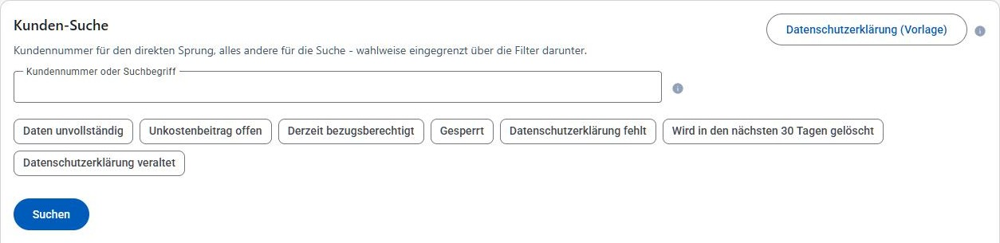

Das Suchergebnis zeigt eine Tabelle mit Kundennummer, Name, Geburtsdatum, Adresse, Personenanzahl, Ausstellungs- und Gültigkeitsdatum. Über die Aktionen kann der Kunde angesehen (Lupe) oder bearbeitet (Stift) werden. Bei vielen Treffern kann über die Seitennavigation unterhalb der Ergebnisliste geblättert und die Anzahl der Elemente pro Seite angepasst werden.

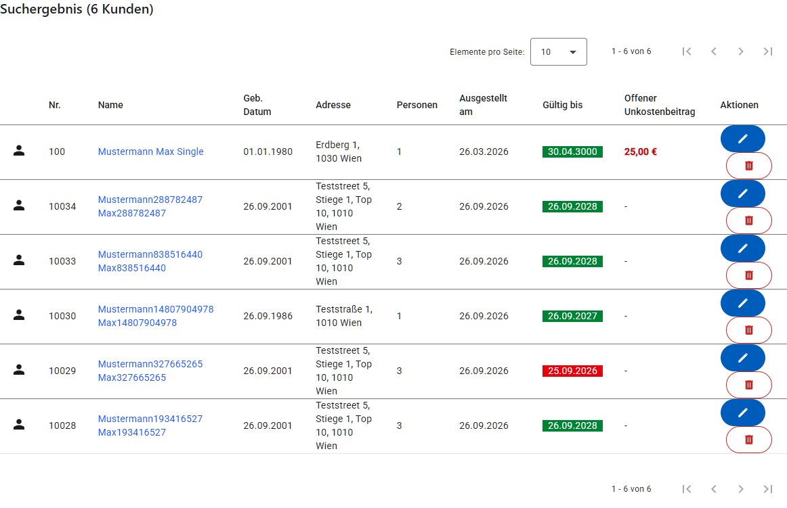

Auf schmalen Bildschirmen wird das Suchergebnis statt als Tabelle als Kartenliste dargestellt – eine Karte je Kunde mit denselben Angaben und denselben Aktionen (siehe [Darstellung auf schmalen Bildschirmen](README.md#darstellung-auf-schmalen-bildschirmen)):

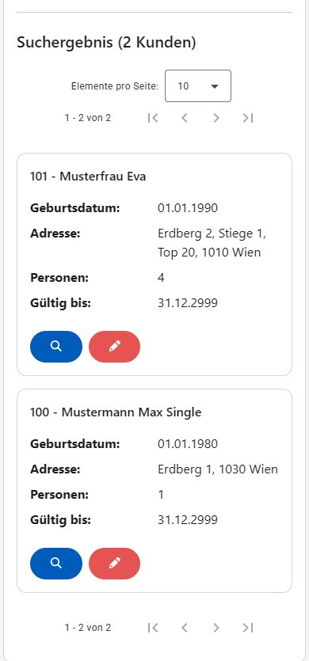

## Kunden-Detail

Die Detailansicht eines Kunden zeigt alle Stammdaten des Hauptbeziehers sowie die zuletzt erfasste Notiz.

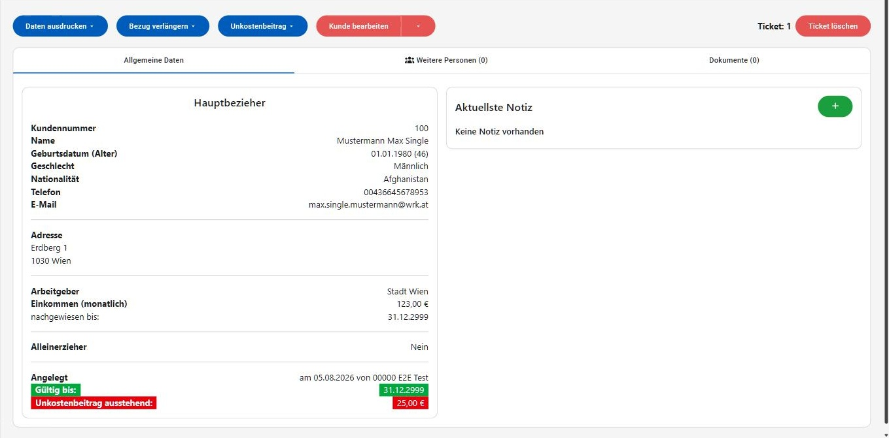

Am oberen Rand stehen folgende Aktionen zur Verfügung:

- **Daten ausdrucken**: Druck der Stammdaten oder nur des Kundenausweises.
- **Bezug verlängern**: Verlängert die Gültigkeit des Kunden um 1, 2, 3, 6 oder 12 Monate.
- **Unkostenbeitrag**: Ist noch ein Betrag offen, stehen "Alles bezahlt" und "Betrag eintragen" zur Verfügung; unabhängig davon kann über "Betrag bearbeiten" (unterhalb einer Trennlinie) der Betrag jederzeit manuell korrigiert werden.
- **Kunde bearbeiten**: Öffnet die Bearbeitung der Stammdaten (siehe unten). Über den Pfeil daneben stehen zusätzlich **Kunde deaktivieren**, **Kunde sperren**/**entsperren** und **Kunde löschen** zur Verfügung (jeweils mit Sicherheitsabfrage).
- Ist gerade ein Ausgabetag aktiv, kann dem Kunden rechts oben eine **Ticketnummer** zugewiesen werden; ist bereits ein Ticket zugewiesen, wird es stattdessen angezeigt und kann über den Papierkorb-Button wieder entfernt werden.
- Über den grünen **+**-Button bei "Aktuellste Notiz" kann eine neue Notiz erfasst werden; bei mehreren Notizen können über **Alle Notizen anzeigen** alle bisherigen Notizen eingesehen werden.

Beim **Sperren** eines Kunden muss ein **Sperrgrund** angegeben werden. Ein gesperrter Kunde wird danach mit einem roten Hinweisbanner ("Kunde ist gesperrt!", Zeitpunkt und Benutzer der Sperrung sowie der Sperrgrund) angezeigt, und die meisten Aktionen sind deaktiviert.

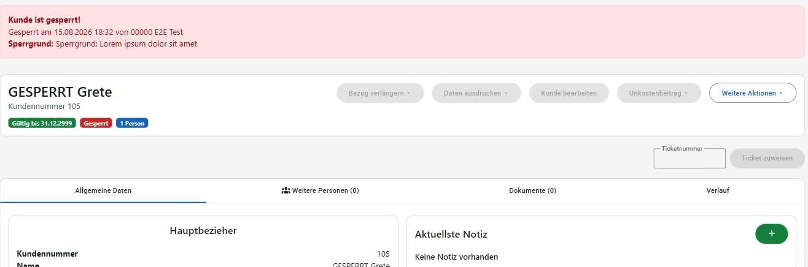

Wurde bei einem Kunden zwischenzeitlich von anderer Stelle etwas geändert (z. B. gleichzeitige Bearbeitung durch eine zweite Person), zeigt die Anwendung vor dem Speichern eine Bestätigungsabfrage mit der Konflikt-Meldung an, bevor die eigene Änderung trotzdem übernommen wird.

### Weitere Personen

Der Tab "Weitere Personen" listet alle zusätzlichen Haushaltsmitglieder (z. B. Kinder) mit Geburtsdatum, Nationalität, Arbeitgeber, Einkommen sowie den Angaben "Bezieht Familienbeihilfe" und "Im selben Haushalt". Personen, die als "Nicht im selben Haushalt" markiert sind, fließen nicht in die Berechnung von Haushaltsgröße und Einkommenslimit ein.

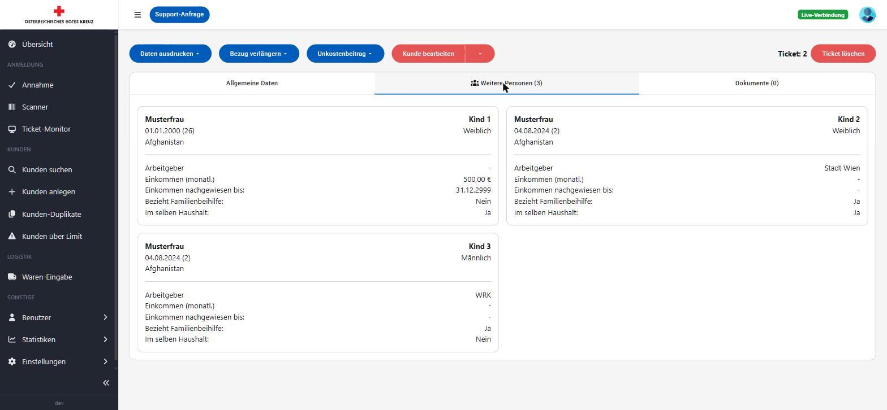

### Dokumente

Der Tab "Dokumente" zeigt alle zum Kunden hochgeladenen Dokumente (z. B. Einkommensnachweise, Ausweiskopien) mit Dateiname, Dokumenttyp, Datum und Ersteller. Dokumente können heruntergeladen oder gelöscht werden (jeweils mit Sicherheitsabfrage).

Neue Dokumente können über die Quelle-Auswahl auf zwei Arten hochgeladen werden:

- **Datei hochladen**: Datei per Drag & Drop ablegen oder über **Datei auswählen** vom Gerät hochladen.
- **Scanner**: Auswahl einer bereits im Scanner-Ordner abgelegten Datei (z. B. von einem Netzwerkscanner/Multifunktionsgerät). Die Liste der verfügbaren Dateien aktualisiert sich automatisch, sobald neue Dateien im Scanner-Ordner abgelegt werden; über das Vorschau-Symbol (Auge) kann eine Datei vor dem Hochladen angesehen werden.

Der Scanner-Ordner ist optional: Ist er für die aktuelle Installation nicht eingerichtet oder deaktiviert, wird die Quelle-Auswahl gar nicht angezeigt und Dokumente werden ausschließlich vom Gerät hochgeladen. Die Administration kann den Scanner-Ordner auch im laufenden Betrieb ein- oder ausschalten: Die Quelle-Auswahl erscheint bzw. verschwindet dann von selbst, ohne dass die Seite neu geladen werden muss. War gerade **Scanner** ausgewählt, wird automatisch auf **Datei hochladen** zurückgeschaltet.

Vor dem Hochladen muss der **Dokumenttyp** ausgewählt werden.

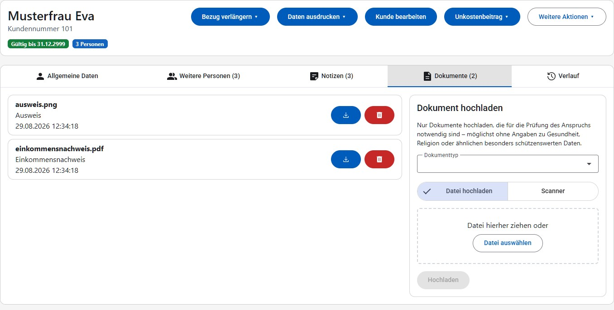

## Kunden anlegen / bearbeiten

Beim Anlegen eines neuen Kunden werden die Daten des Hauptbeziehers (Name, Geburtsdatum, Geschlecht, Nationalität, Kontakt, Adresse, Arbeitgeber, Einkommen) sowie optional weitere Personen im Haushalt erfasst. Nachname, Vorname, Telefonnummer, Adresse und Arbeitgeber sind Pflichtfelder; die PLZ muss eine 4-stellige Zahl sein, die Telefonnummer darf nur Ziffern enthalten. Wird beim Einkommen ein Datum "nachgewiesen bis" eingetragen, schlägt das Formular "Gültig bis" automatisch mit diesem Datum zzgl. 2 Monaten vor.

Die fachlich weniger selbsterklärenden Felder tragen ein Info-Symbol (ⓘ), das ihre Wirkung erklärt (siehe [Kurzhinweise](README.md#tooltips-und-erklaerungen)):

- **Einkommen (monatl.)**: Die Einkommen aller Personen im Haushalt werden zusammengezählt und gegen die Einkommensgrenze geprüft.
- **nachgewiesen bis**: Datum, bis zu dem der vorgelegte Einkommensnachweis gültig ist.
- **Alleinerzieher**: Wird nur für die Statistik erfasst und beeinflusst die Einkommensgrenze nicht.
- **Gültig bis**: Ende der Bezugsberechtigung; danach wird der Kunde bei der Annahme als ungültig angezeigt.
- **Bezieht Familienbeihilfe** (bei weiteren Personen): Familienbeihilfe, Kinderabsetzbetrag und Geschwisterstaffel werden automatisch zum Haushaltseinkommen dazugerechnet.
- **Nicht im selben Haushalt (keine Berechnung)**: Die Person bleibt beim Kunden erfasst, ihr Einkommen wird aber weder mitgezählt noch erhöht sie die Einkommensgrenze.

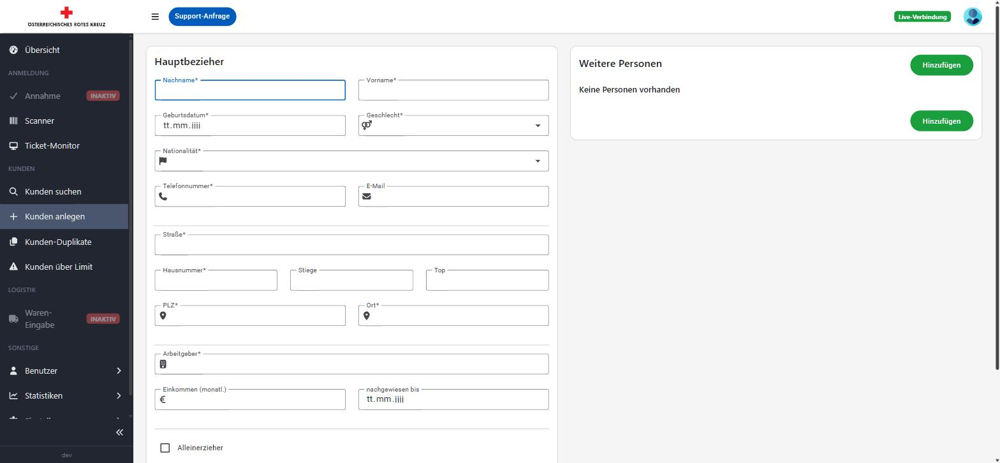

Die Bearbeitungsmaske eines bestehenden Kunden zeigt zusätzlich die bereits erfassten weiteren Personen inklusive der Möglichkeit, einzelne Personen zu entfernen (**Löschen**) oder neue hinzuzufügen (**Hinzufügen**).

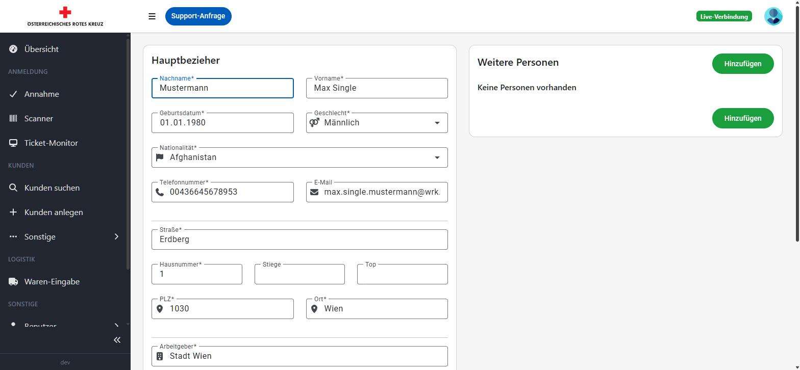

Über den Button **Anspruch prüfen** kann jederzeit, auch ohne zu speichern, geprüft werden, ob der Haushalt mit den aktuell eingegebenen Daten bezugsberechtigt ist. Das Ergebnis ("Anspruch vorhanden" bzw. "Kein Anspruch vorhanden") wird zusammen mit dem geltenden Limit (inkl. Toleranz), dem Gesamteinkommen des Haushalts und ggf. der Differenz zum Limit angezeigt.

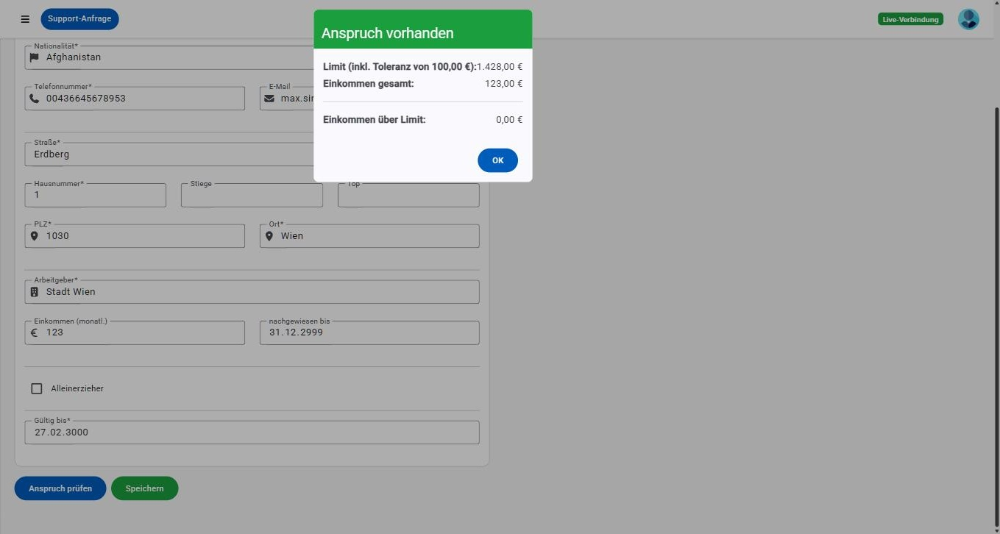

## Kunden-Duplikate

Unter **Kunden → Kunden-Duplikate** erkennt das System potenzielle doppelt angelegte Kunden (z. B. durch ähnliche Adressen oder Namen) und zeigt sie paarweise gegenüber.

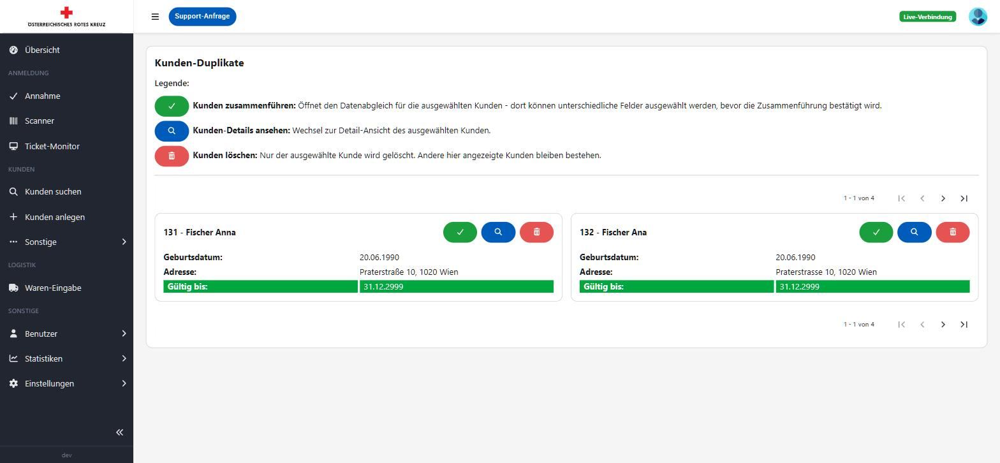

Eine Legende auf der Seite erklärt die Bedeutung der einzelnen Icons. Wurden keine Duplikate gefunden, erscheint die Meldung "Keine Duplikate gefunden!". Für jedes gefundene Duplikat-Paar stehen folgende Aktionen zur Verfügung:

- **Kunden zusammenführen** (grüner Haken): Öffnet den Datenabgleich zur Zusammenführung.
- **Kunden-Details ansehen** (Lupe): Wechselt zur Detailansicht des jeweiligen Kunden.
- **Kunden löschen** (Papierkorb): Löscht ausschließlich den ausgewählten Kunden, der andere bleibt bestehen.

### Kunden zusammenführen

Beim Zusammenführen bleibt der als Ziel gewählte Kunde bestehen, die übrigen werden nach der Zusammenführung gelöscht. Für Felder, die sich zwischen den Kunden unterscheiden (z. B. Adresse, Vorname), kann ausgewählt werden, welcher Wert übernommen wird; über **Identische Felder anzeigen/ausblenden** lässt sich die Ansicht auf die abweichenden Felder reduzieren. Personen, die nur beim zusammenzuführenden Kunden vorhanden sind, werden automatisch übernommen; die Anzahl der zu übernehmenden Notizen und Dokumente wird angezeigt. Haben beide Kunden ein aktives Ticket der laufenden Ausgabe, weist ein Hinweis darauf hin, welches Ticket beim Zusammenführen erhalten bleibt und welches verworfen wird.

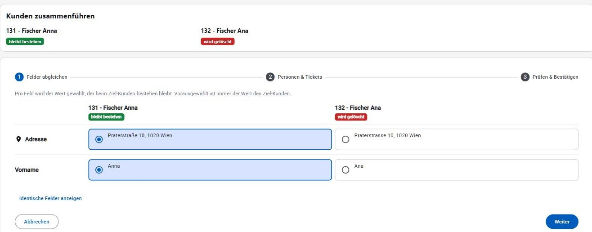

## Kunden über Limit

Unter **Kunden → Kunden über Limit** werden alle Kunden aufgelistet, deren Gesamteinkommen aktuell über dem für ihre Haushaltsgröße gültigen Limit liegt (siehe [Grenzwerte](einstellungen.md#statische-werte-grenzwerte)). Angezeigt werden u. a. das Gesamteinkommen, das gültige Limit und die Differenz ("Über Limit"); über die Lupe in der Aktionen-Spalte gelangt man direkt zur Detailansicht des jeweiligen Kunden.

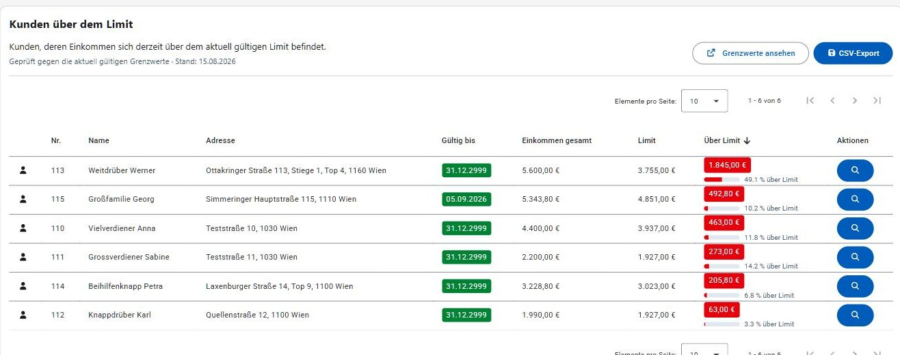

Auf schmalen Bildschirmen wird die Liste als Kartenliste dargestellt (siehe [Darstellung auf schmalen Bildschirmen](README.md#darstellung-auf-schmalen-bildschirmen)).

## Kunden-Übersicht

Unter **Kunden → Kunden-Übersicht** werden die neu angelegten und die verlängerten Kunden eines Ausgabetags aufgelistet, getrennt in die Bereiche "Neu" und "Verlängert". Ein Kunde gilt als "verlängert", sobald sein Gültigkeitsdatum ("Bezug verlängern", siehe [Kunden-Detail](#kapitel-kunden)) während des Ausgabetags erweitert wurde. Über die Auswahlbox **Ausgabe** kann zwischen den bereits abgeschlossenen Ausgabetagen gewechselt werden; ohne Auswahl zeigt die Seite den zuletzt begonnenen (bzw. laufenden) Ausgabetag. Über die Lupe in der Aktionen-Spalte gelangt man direkt zur Detailansicht des jeweiligen Kunden.

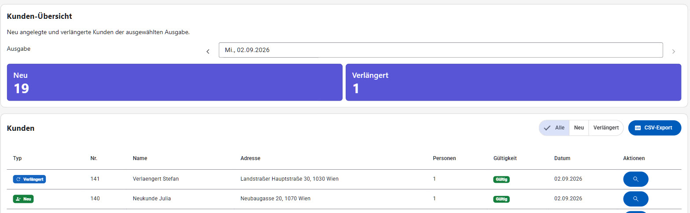

Auf schmalen Bildschirmen werden beide Bereiche ("Neu" und "Verlängert") jeweils als Kartenliste dargestellt (siehe [Darstellung auf schmalen Bildschirmen](README.md#darstellung-auf-schmalen-bildschirmen)).
