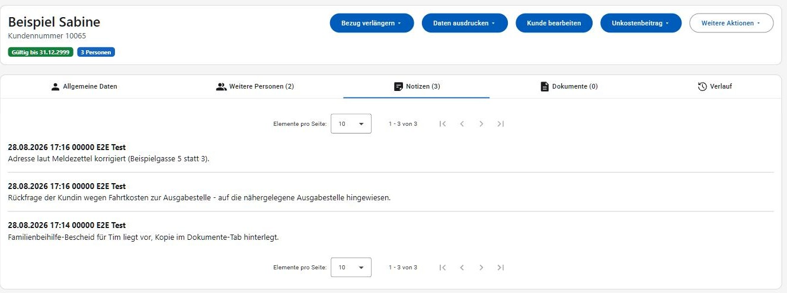
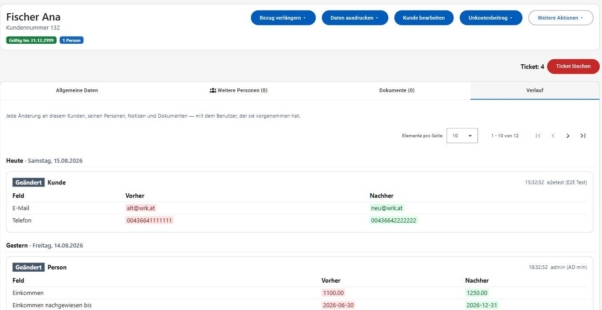
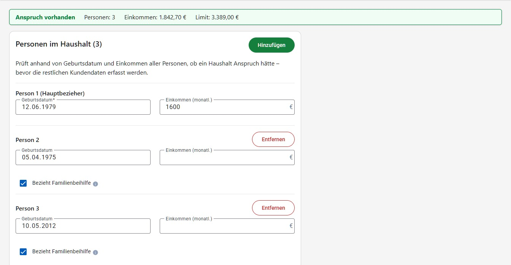
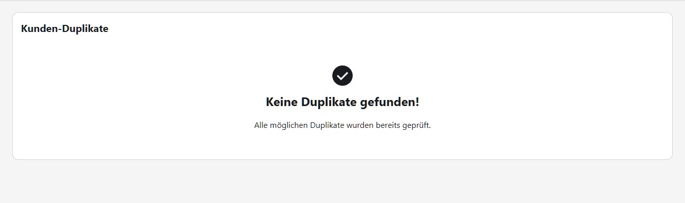
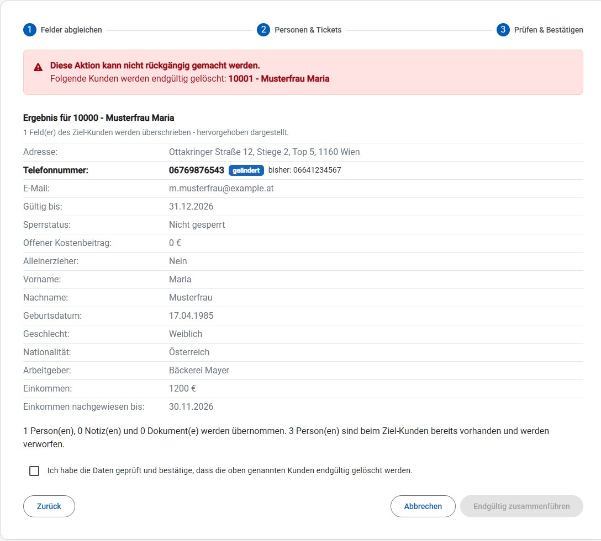

# Kunden

Der Bereich "Kunden" verwaltet die Haushalte (Kunden) der Tafel: Stammdaten, Familienmitglieder, Notizen, Dokumente sowie Sonderfälle wie Duplikate oder Kunden über dem Einkommenslimit.

## Kunden suchen

Unter **Kunden → Kunden suchen** gibt es ein einziges Suchfeld für beides: Eine reine Zahl, die genau einer Kundennummer entspricht, springt direkt zur Detailansicht (wie früher der Button **Anzeigen**). Alles andere - auch eine Zahl, zu der es keinen Treffer gibt - löst die normale Suche aus. Die Suche startet automatisch schon während der Eingabe (nach kurzer Pause, ab zwei Zeichen); der Button **Suchen** funktioniert weiterhin zusätzlich, etwa bei einer nur einstelligen Eingabe.

Das Suchfeld durchsucht alles, woran ein Haushalt erkennbar ist: Kundennummer, die Namen **aller** Personen des Haushalts (nicht nur der Hauptperson), Adresse, Telefonnummer und E-Mail-Adresse. Es genügt ein Teil davon – die Eingabe muss nicht vollständig sein und auch nicht am Wortanfang stehen. Tippfehler werden toleriert: Wird "Mustermsnn" statt "Mustermann" eingegeben, wird der Kunde trotzdem gefunden. Genaue Treffer stehen im Ergebnis immer oben, ähnliche darunter.

Zusätzlich lässt sich über die Filter-Chips "Daten unvollständig", "Unkostenbeitrag offen", "Derzeit bezugsberechtigt", "Gesperrt", "Datenschutzerklärung fehlt" und "Wird in den nächsten 30 Tagen gelöscht" einschränken; die Filter können auch ohne Sucheingabe verwendet werden und wirken sich sofort auf das Ergebnis aus. "Datenschutzerklärung fehlt" zeigt Kunden, bei denen noch keine unterschriebene Datenschutzerklärung im Tab "[Dokumente](#dokumente)" hochgeladen wurde. "Wird in den nächsten 30 Tagen gelöscht" zeigt Kunden, deren Daten wegen Ablaufs der Aufbewahrungsfrist innerhalb der nächsten 30 Tage automatisch gelöscht werden.

Über den Button **Datenschutzerklärung (Vorlage)** rechts oben lässt sich die Datenschutzerklärung ohne Kundenbezug herunterladen und ausdrucken - etwa um sie einer Person schon vor der Kundenanlage zum Unterschreiben mitzugeben. Die unterschriebene Erklärung wird später am neu angelegten Kunden im Tab "[Dokumente](#dokumente)" hochgeladen.

Beim Öffnen der Seite werden bereits die ersten Kunden angezeigt – man muss also nicht erst suchen, um überhaupt etwas zu sehen. Ein Suchbegriff oder ein Filter grenzt diese Liste dann ein. Suchbegriff, Filter und die aktuelle Seite bleiben in der Adresszeile erhalten: Wird ein Kunde aus dem Ergebnis geöffnet und über "Zurück" wieder zur Suche zurückgekehrt, ist dasselbe Ergebnis - inklusive Filter und Seite - sofort wieder da, ohne erneut suchen zu müssen.

Das Suchergebnis zeigt eine Tabelle mit Kundennummer, Name, Geburtsdatum, Adresse, Personenanzahl, Ausstellungs- und Gültigkeitsdatum. Das Gültigkeitsdatum ist wie in der Detailansicht grün (aufrecht) oder rot (abgelaufen) hinterlegt, ein Schloss-Symbol markiert gesperrte Kunden. Die gesamte Zeile ist anklickbar und öffnet die Detailansicht; über den Stift in den Aktionen gelangt man direkt zum Bearbeiten. Bei vielen Treffern kann über die Seitennavigation unterhalb der Ergebnisliste geblättert und die Anzahl der Elemente pro Seite angepasst werden.

Auf schmalen Bildschirmen wird das Suchergebnis statt als Tabelle als Kartenliste dargestellt – eine Karte je Kunde mit denselben Angaben und derselben Aktion (siehe [Darstellung auf schmalen Bildschirmen](README.md#darstellung-auf-schmalen-bildschirmen)):

Findet die Suche keinen Kunden, erscheint statt des Ergebnisses der Hinweis "Keine Kunden gefunden" mit einem Button **Kunden anlegen** - dieser öffnet das Formular für einen neuen Kunden und übernimmt dabei den eingegebenen Suchbegriff bereits als Vor- und Nachname, sofern dieser wie ein Name aussieht (keine reine Zahl).

## Kunden-Detail

Die Detailansicht eines Kunden beginnt mit einem Kopfbereich, der Name und Kundennummer groß darstellt sowie den Status auf einen Blick zeigt: die Gültigkeit als grüne/gelbe/rote Markierung (gelb ab 8 Wochen vor Ablauf), ob der Kunde gesperrt ist, ein offener Unkostenbeitrag samt Betrag, und die Haushaltsgröße. Darunter folgen im Tab "Allgemeine Daten" die Stammdaten des Hauptbeziehers (zweispaltig: links die Identität und Kontaktdaten, rechts Arbeitgeber, Einkommen und Status) sowie darunter die zuletzt erfasste Notiz.

Rechts oben im Kopfbereich stehen die Aktionen zur Verfügung, gereiht nach ihrer Verwendungshäufigkeit (auf schmalen Bildschirmen erscheinen sie stattdessen unterhalb der Daten, siehe [Darstellung auf schmalen Bildschirmen](README.md#darstellung-auf-schmalen-bildschirmen)):

- **Bezug verlängern**: Verlängert die Gültigkeit des Kunden um 1, 2, 3, 6 oder 12 Monate; jeder Menüpunkt zeigt bereits das resultierende Datum an (z. B. "3 Monate → 12.11.2026").
- **Daten ausdrucken**: Druck der Stammdaten, nur des Kundenausweises oder einer Datenschutzerklärung zum Ausdrucken und Unterschreiben durch den Kunden bei der Aufnahme. Während die PDF-Datei erstellt wird, zeigt der Button eine Ladeanimation statt stumm zu warten.
- **Kunde bearbeiten**: Öffnet die Bearbeitung der Stammdaten (siehe unten).
- **Unkostenbeitrag**: Ist noch ein Betrag offen, wird er als roter Hinweis direkt am Button angezeigt; im Menü stehen dann zusätzlich "Alles bezahlt" und "Betrag eintragen" zur Verfügung. Unabhängig davon kann über "Betrag bearbeiten" (unterhalb einer Trennlinie) der Betrag jederzeit manuell korrigiert werden.
- **Weitere Aktionen**: Sammelt die selteneren bzw. sicherheitskritischen Aktionen **Kunde deaktivieren**, **Kunde sperren**/**entsperren**, **Daten exportieren (ZIP)**, **Kunde löschen** und **Einwilligung widerrufen** (jeweils mit Sicherheitsabfrage bzw. Download) in einem Menü. **Daten exportieren (ZIP)** liefert die vollständige Datenauskunft zu einem Kunden für eine DSGVO-Anfrage in einer einzigen ZIP-Datei: die Stammdaten, weiteren Personen, Notizen, Teilnahme-Historie an Ausgabetagen und die Liste der hochgeladenen Dokumente sowohl als PDF-Datei als auch als maschinenlesbare JSON-Datei, sowie alle hochgeladenen Dokumente selbst. Funktioniert unabhängig vom Sperrstatus, da ein gesperrter Kunde dieselben Auskunftsrechte behält. Ist die betroffene Person nicht anhand der Kundennummer bekannt, oder soll sie zugleich als Kunde und als Mitarbeiter:in gesucht werden, bietet sich stattdessen [Datenauskunft](datenauskunft.md) an. **Einwilligung widerrufen** löscht den Kunden wie **Kunde löschen**, vermerkt im Zugriffsprotokoll aber ausdrücklich, dass die Löschung auf einem Widerruf der Einwilligung beruht, statt auf einer gewöhnlichen Löschung.
- Ist gerade ein Ausgabetag aktiv, kann dem Kunden rechts oben eine **Ticketnummer** zugewiesen werden; ist bereits ein Ticket zugewiesen, wird es stattdessen angezeigt und kann über den Papierkorb-Button wieder entfernt werden. Ist der Kunde gesperrt, ist die Zuweisung deaktiviert; ein Tooltip erklärt warum.
- Über den grünen **+**-Button bei "Aktuellste Notiz" (die Kartenüberschrift zeigt zusätzlich die Gesamtanzahl an Notizen) kann eine neue Notiz erfasst werden. Die neueste Notiz zeigt zusätzlich eine relative Zeitangabe ("vor 3 Tagen") mit dem genauen Zeitpunkt als Tooltip. Ist sie selbst verfasst, lässt sie sich direkt hier über den Stift-Button korrigieren oder über den Papierkorb-Button endgültig löschen (siehe auch [Notizen](#notizen)); bei Notizen anderer Mitarbeiter:innen fehlen diese beiden Buttons. **Alle Notizen anzeigen** springt zum Tab "[Notizen](#notizen)" mit der vollständigen Liste.

Telefonnummer und E-Mail-Adresse sind als Links hinterlegt (öffnen die Telefon- bzw. Mail-App); über den Kopieren-Button neben "Adresse" lässt sich die Adresse in die Zwischenablage kopieren, etwa um sie in ein anderes System einzutragen.

Beim **Sperren** eines Kunden muss ein **Sperrgrund** angegeben werden. Ein gesperrter Kunde wird danach mit einem roten Hinweisbanner ("Kunde ist gesperrt!", Zeitpunkt und Benutzer der Sperrung sowie der Sperrgrund) angezeigt, die meisten Aktionen sind deaktiviert (mit erklärendem Tooltip), und der Kopfbereich zeigt zusätzlich einen "Gesperrt"-Hinweis.

Wurde bei einem Kunden zwischenzeitlich von anderer Stelle etwas geändert (z. B. gleichzeitige Bearbeitung durch eine zweite Person), zeigt die Anwendung vor dem Speichern eine Bestätigungsabfrage mit der Konflikt-Meldung an, bevor die eigene Änderung trotzdem übernommen wird.

### Weitere Personen

Der Tab "Weitere Personen" listet alle zusätzlichen Haushaltsmitglieder (z. B. Kinder) mit Geburtsdatum, Nationalität, Arbeitgeber, Einkommen und der Angabe "Bezieht Familienbeihilfe". Personen, die nicht zum Haushalt zählen, sind mit einer Markierung "Nicht im selben Haushalt" gekennzeichnet. Sie bleiben bei der Berechnung vollständig außen vor – weder ihr Einkommen noch ihre Familienbeihilfe zählen mit, und sie erhöhen weder die im Kopfbereich angezeigte Haushaltsgröße noch das Einkommenslimit.

### Notizen

Der Tab "Notizen" (die Beschriftung zeigt zusätzlich die Gesamtanzahl an Notizen) zeigt alle bisherigen Notizen, nicht nur die aktuellste, mit Seitennavigation bei vielen Einträgen. Ein Hinweis beim Erfassen weist darauf hin, nur für die Prüfung des Anspruchs notwendige Angaben festzuhalten – keine Angaben zu Gesundheit, Religion oder ähnlichen besonders schützenswerten Daten. Jede selbst verfasste Notiz lässt sich über den Stift-Button korrigieren oder über den Papierkorb-Button endgültig löschen (jeweils mit Sicherheitsabfrage beim Löschen) – etwa wenn sich eine Angabe im Nachhinein als falsch herausstellt oder doch besonders schützenswerte Daten enthält. Bei Notizen anderer Mitarbeiter:innen fehlen diese beiden Buttons, da eine Notiz nur von der Person korrigiert oder gelöscht werden kann, die sie ursprünglich erfasst hat.

### Dokumente

Der Tab "Dokumente" zeigt alle zum Kunden hochgeladenen Dokumente (z. B. Einkommensnachweise, Ausweiskopien, unterschriebene Datenschutzerklärungen) mit Dateiname, Dokumenttyp, Datum und Ersteller. Dokumente können heruntergeladen oder gelöscht werden (jeweils mit Sicherheitsabfrage).

Der Tab wird nur angezeigt, wenn die Berechtigung **Kunden-Dokumente** vorhanden ist (siehe [Benutzer](benutzer.md)). Sie ist absichtlich von der Kundenverwaltung getrennt, da hochgeladene Ausweise und Einkommensnachweise zu den sensibelsten Daten im System gehören.

Die bei "Daten ausdrucken" heruntergeladene Datenschutzerklärung (siehe oben) wird nach der Unterschrift durch den Kunden hier wieder hochgeladen, mit Dokumenttyp "Datenschutzerklärung (unterschrieben)" – das unterschriebene Blatt ist der einzige Nachweis der Einwilligung, es gibt dafür kein eigenes Datenfeld im System.

Neue Dokumente können über die Quelle-Auswahl auf zwei Arten hochgeladen werden:

- **Datei hochladen**: Datei per Drag & Drop ablegen oder über **Datei auswählen** vom Gerät hochladen.
- **Scanner**: Auswahl einer bereits im Scanner-Ordner abgelegten Datei (z. B. von einem Netzwerkscanner/Multifunktionsgerät). Die Liste der verfügbaren Dateien aktualisiert sich automatisch, sobald neue Dateien im Scanner-Ordner abgelegt werden; über das Vorschau-Symbol (Auge) kann eine Datei vor dem Hochladen angesehen werden.

Der Scanner-Ordner ist optional: Ist er für die aktuelle Installation nicht eingerichtet oder deaktiviert, wird die Quelle-Auswahl gar nicht angezeigt und Dokumente werden ausschließlich vom Gerät hochgeladen. Die Administration kann den Scanner-Ordner auch im laufenden Betrieb ein- oder ausschalten: Die Quelle-Auswahl erscheint bzw. verschwindet dann von selbst, ohne dass die Seite neu geladen werden muss. War gerade **Scanner** ausgewählt, wird automatisch auf **Datei hochladen** zurückgeschaltet.

Eine im Scanner-Ordner abgelegte Datei, die niemand importiert oder löscht, wird nach 7 Tagen automatisch gelöscht (Datum und Uhrzeit der Ablage stehen bei jeder Datei in der Liste). Bevor das passiert, erhalten Personen mit der Berechtigung **Kunden-Dokumente** eine [Push-Benachrichtigung](README.md#benachrichtigungen), damit die Datei rechtzeitig importiert oder bewusst gelöscht werden kann.

Vor dem Hochladen muss der **Dokumenttyp** ausgewählt werden. Ein Hinweis erinnert daran, nur für die Prüfung des Anspruchs notwendige Dokumente hochzuladen – möglichst ohne Angaben zu Gesundheit, Religion oder ähnlichen besonders schützenswerten Daten.

### Verlauf

Der Tab "Verlauf" zeigt jede erfasste Änderung an diesem Kunden, seinen weiteren Personen, seinen Notizen und seinen Dokumenten – jeweils mit Zeitpunkt, dem Benutzer, der sie vorgenommen hat, und den Werten davor und danach. Damit lässt sich nachvollziehen, wer z. B. die Adresse korrigiert, das Einkommen angepasst oder den Kunden gesperrt hat.

Der Tab wird nur angezeigt, wenn die Berechtigung **Zugriffsprotokoll** vorhanden ist. Dieselben Einträge – gemeinsam mit jenen zu Benutzern und Einstellungen – finden sich im [Zugriffsprotokoll](zugriffsprotokoll.md), dort zusätzlich filterbar.

## Anspruch-Schnellcheck

Unter **Kunden → Anspruch-Schnellcheck** lässt sich vorab klären, ob ein Haushalt überhaupt bezugsberechtigt wäre – bevor die restlichen Kundendaten (Namen, Adresse, Kontakt) erfasst werden. Pro Person im Haushalt werden nur Geburtsdatum und monatliches Einkommen eingetragen. Das Formular ist bereits mit drei Personen vorbereitet; über **Hinzufügen** kommen weitere dazu, über **Entfernen** lassen sich Personen wieder entfernen. Zeilen ohne Geburtsdatum bleiben bei der Prüfung einfach unberücksichtigt – bei kleineren Haushalten müssen leere Zeilen also nicht entfernt werden. Bei jeder weiteren Person steht zusätzlich das Kennzeichen **Bezieht Familienbeihilfe** zur Verfügung, das standardmäßig vorausgewählt ist.

Wie beim Anlegen eines Kunden blendet die Anwendung oberhalb der Eingabe eine kompakte Zusammenfassung ein, sobald mindestens ein Geburtsdatum eingetragen ist: Anspruchs-Status, Anzahl der berücksichtigten Personen, Einkommen gesamt, Limit sowie – falls über dem Limit – die Differenz. Sie aktualisiert sich automatisch während der Eingabe (kurz nach der letzten Änderung); Personen ohne Geburtsdatum bleiben dabei unberücksichtigt.

Die Buttons sitzen wie beim Kundenformular in einer Leiste am unteren Bildschirmrand, die auch bei vielen erfassten Personen immer erreichbar bleibt: **Anspruch prüfen** zeigt dasselbe Ergebnis mit derselben vollständigen Berechnung wie der gleichnamige Button beim [Anlegen eines Kunden](#kunden-anlegen--bearbeiten) – inklusive der Meldung "Kein Einkommenslimit für diese Haushaltszusammensetzung konfiguriert", falls für die eingegebene Zusammensetzung kein Grundbetrag hinterlegt ist. **Kunden anlegen** führt direkt weiter zur vollständigen Kundenanlage und nimmt die bereits eingetragenen Personen mit: Geburtsdatum und Einkommen der ersten Person landen beim Hauptbezieher, jede weitere Person wird mit Geburtsdatum, Einkommen und Familienbeihilfe-Kennzeichen als weitere Person übernommen – nur die restlichen Angaben (Namen, Adresse, Kontakt) sind noch zu ergänzen.

## Kunden anlegen / bearbeiten

Beim Anlegen eines neuen Kunden werden die Daten des Hauptbeziehers (Name, Geburtsdatum, Geschlecht, Nationalität, Kontakt, Adresse, Arbeitgeber, Einkommen) sowie optional weitere Personen im Haushalt erfasst. Nachname, Vorname, Telefonnummer, Adresse und Arbeitgeber sind Pflichtfelder; die PLZ muss eine 4-stellige Zahl sein (das Feld weist mit "4-stellig" darauf hin), die Telefonnummer darf nur Ziffern enthalten. Wird beim Einkommen ein Datum "nachgewiesen bis" eingetragen, schlägt das Formular "Gültig bis" automatisch mit diesem Datum zzgl. 2 Monaten vor. Neben dem Datumsfeld "Gültig bis" stehen Schnellauswahl-Buttons (+1/+2/+3/+6/+12 Monate) zur Verfügung, die ausgehend vom aktuell eingetragenen Datum (oder, falls noch keines gesetzt ist, ab heute) weiterrechnen – dieselbe Schnellauswahl wie beim "Bezug verlängern" in der Kunden-Detailansicht.

Die fachlich weniger selbsterklärenden Felder tragen ein Info-Symbol (ⓘ), das ihre Wirkung erklärt (siehe [Kurzhinweise](README.md#tooltips-und-erklaerungen)):

- **Einkommen (monatl.)**: Die Einkommen aller Personen im Haushalt werden zusammengezählt und gegen die Einkommensgrenze geprüft.
- **nachgewiesen bis**: Datum, bis zu dem der vorgelegte Einkommensnachweis gültig ist.
- **Alleinerzieher**: Wird nur für die Statistik erfasst und beeinflusst die Einkommensgrenze nicht.
- **Gültig bis**: Ende der Bezugsberechtigung; danach wird der Kunde bei der Annahme als ungültig angezeigt.
- **Bezieht Familienbeihilfe** (bei weiteren Personen): Familienbeihilfe, Kinderabsetzbetrag und Geschwisterstaffel werden automatisch zum Haushaltseinkommen dazugerechnet.
- **Nicht im selben Haushalt (keine Berechnung)**: Die Person bleibt beim Kunden erfasst, fließt aber in die gesamte Berechnung nicht ein: Weder ihr Einkommen noch ihre Familienbeihilfe und ihr Kinderabsetzbetrag werden mitgezählt, sie zählt nicht für die Geschwisterstaffel und sie erhöht die Einkommensgrenze nicht.

Sobald beim Anlegen eines neuen Kunden Nachname, Vorname und Geburtsdatum des Hauptbeziehers ausgefüllt sind, prüft die Anwendung im Hintergrund, ob bereits ein Kunde mit denselben Angaben existiert, und zeigt gegebenenfalls einen Hinweis "Möglicherweise bereits vorhanden" mit einem Link auf den betroffenen Kunden – noch bevor das restliche Formular ausgefüllt wurde.

Beim **Speichern** (sowohl beim Anlegen als auch beim Bearbeiten) prüft die Anwendung zusätzlich verbindlich, ob Name und Adresse des Hauptbeziehers einem bereits erfassten Kunden ähneln oder ob eine der erfassten Personen (Hauptbezieher oder weitere Person) mit Name und Geburtsdatum bereits in einem anderen Haushalt vorkommt. Trifft das zu, erscheint vor dem eigentlichen Speichern eine Bestätigungsabfrage mit der Meldung "Möglicherweise bereits vorhanden" und der Nummer des betroffenen Kunden; erst ein Klick auf **OK** speichert trotzdem. Dieser frühe Hinweis oberhalb des Formulars ersetzt diese Prüfung beim Speichern nicht, er macht sie nur früher sichtbar.

Die Bearbeitungsmaske eines bestehenden Kunden zeigt zusätzlich die bereits erfassten weiteren Personen. Jede weitere Person wird als aufklappbare Karte mit einer Zusammenfassungszeile (Name, Alter, Einkommen sowie Kennzeichen wie "Familienbeihilfe") dargestellt; ein Klick auf die Kopfzeile öffnet oder schließt die Detailfelder. Eine neu hinzugefügte Person (**Hinzufügen**) öffnet sich automatisch und erhält den Eingabefokus, alle anderen bleiben eingeklappt. Innerhalb der aufgeklappten Karte kann die Person wieder entfernt werden (**Löschen**).

Über den Button **Anspruch prüfen** kann jederzeit, auch ohne zu speichern, geprüft werden, ob der Haushalt mit den aktuell eingegebenen Daten bezugsberechtigt ist. Das Ergebnis ("Anspruch vorhanden" bzw. "Kein Anspruch vorhanden") wird gemeinsam mit der vollständigen Berechnung angezeigt, sodass nachvollziehbar ist, wie die beiden Summen zustande kommen:

- **Einkommen**: das summierte Einkommen der Personen im Haushalt, die Familienbeihilfe, der Kinderabsetzbetrag und die Geschwisterstaffel – darunter das Gesamteinkommen.
- **Limit**: der Grundbetrag für die Haushaltsgröße (z. B. "Grundbetrag (2 Erw., 1 Kind)"), die Zuschläge für jede weitere erwachsene Person bzw. jedes weitere Kind darüber hinaus sowie die Toleranz – darunter das Gesamtlimit. Zuschlagszeilen erscheinen nur dann, wenn es solche weiteren Personen tatsächlich gibt.

Abgeschlossen wird die Aufstellung mit **Einkommen über Limit**: Bei einem bezugsberechtigten Haushalt steht dort 0,00 €, andernfalls die rot hervorgehobene Differenz. Die Sätze, aus denen sich die Berechnung speist, werden unter [Einstellungen → Statische Werte](einstellungen.md) gepflegt.

Gibt es für die Zusammensetzung eines Haushalts keinen hinterlegten Grundbetrag – etwa weil im Haushalt keine erwachsene Person erfasst ist oder ein Wert unter [Einstellungen → Statische Werte](einstellungen.md) fehlt bzw. abgelaufen ist – meldet die Anwendung "Kein Einkommenslimit für diese Haushaltszusammensetzung konfiguriert (Erwachsene: X, Kinder: Y)!", statt mit einer Grenze von 0,00 € zu rechnen. Der Haushalt wird dann weder geprüft noch gespeichert; zuerst ist der fehlende Wert zu ergänzen bzw. die Personenerfassung zu korrigieren.

Damit die Anspruchsfrage nicht erst hinter diesem Button verschwindet, blendet die Anwendung zusätzlich eine kompakte Zusammenfassung oberhalb des Formulars ein, sobald die dafür nötigen Pflichtfelder (Hauptbezieher und Adresse) ausgefüllt sind: Anzahl der berücksichtigten Personen, Einkommen gesamt, Limit sowie – falls über dem Limit – die Differenz. Diese Zusammenfassung aktualisiert sich automatisch während der Eingabe (kurz nach der letzten Änderung) und bleibt beim Scrollen sichtbar; der Button **Anspruch prüfen** öffnet weiterhin die vollständige Aufschlüsselung als Dialog.

Die Buttons **Anspruch prüfen** und **Speichern** sitzen in einer Leiste am unteren Bildschirmrand, die auch bei einem langen Formular immer erreichbar bleibt. Solange das Formular ungespeicherte Änderungen enthält, zeigt diese Leiste zusätzlich den Hinweis "Ungespeicherte Änderungen". Wird versucht, die Seite mit ungespeicherten Änderungen zu verlassen (z. B. über die Navigation), fragt die Anwendung vorher nach, ob die Änderungen verworfen werden sollen.

## Kunden-Duplikate

Unter **Kunden → Kunden-Duplikate** erkennt das System potenzielle doppelt angelegte Kunden (z. B. durch ähnliche Adressen oder Namen) und stellt sie als direkten Vergleich gegenüber: Geburtsdatum, Adresse, Personenanzahl und Gültigkeit stehen zeilenweise nebeneinander, abweichende Werte sind hervorgehoben, übereinstimmende Werte blass dargestellt – auf einen Blick ist so erkennbar, worin sich die beiden Kunden unterscheiden. Die Gesamtzahl der noch zu prüfenden Duplikat-Gruppen steht rechts über der Liste (z. B. "6 mögliche Duplikate").

Für jeden Kandidaten eines Duplikat-Paares stehen folgende Aktionen zur Verfügung:

- **Zusammenführen** (grün hervorgehoben): Öffnet den Datenabgleich zur Zusammenführung für diesen Kunden.
- **Details**: Wechselt zur Detailansicht des jeweiligen Kunden.
- Über die Schaltfläche mit den weiteren Aktionen (▾) stehen zusätzlich zur Verfügung:
  - **Kein Duplikat**: Markiert dieses Paar als geprüft und keine Duplikate – es wird danach nicht mehr in der Liste angezeigt.
  - **Kunde löschen**: Löscht ausschließlich diesen Kunden, der andere bleibt bestehen. Der Bestätigungsdialog nennt dabei ausdrücklich den Namen des zu löschenden Kunden.

Nach dem Löschen oder Markieren als "Kein Duplikat" bleibt die Liste an derselben Position stehen – die geprüfte Gruppe verschwindet einfach aus der Warteschlange. Wurden alle möglichen Duplikate geprüft, erscheint eine positive Bestätigung:

### Kunden zusammenführen

Beim Zusammenführen bleibt der als Ziel gewählte Kunde bestehen, die übrigen werden nach der Zusammenführung gelöscht. Die Zusammenführung führt in drei Schritten durch den Abgleich; über **Abbrechen** kehrt man jederzeit zu der Stelle in der Duplikat-Liste zurück, von der aus die Zusammenführung geöffnet wurde.

**Schritt 1 – Felder abgleichen:** Die beteiligten Kunden stehen nebeneinander, jeder in einer eigenen Spalte – der Ziel-Kunde zuerst und mit **bleibt bestehen** gekennzeichnet, die übrigen mit **wird gelöscht**. Pro Zeile (z. B. Adresse, Telefonnummer) wird der Wert ausgewählt, der beim Ziel-Kunden bestehen bleibt; vorausgewählt ist immer der Wert des Ziel-Kunden. Trägt ein Kunde denselben Wert wie der Ziel-Kunde, ist dieses Feld nicht auswählbar und mit "identisch mit dem Ziel-Kunden" beschriftet. Angezeigt werden nur die abweichenden Felder; über **Identische Felder anzeigen/ausblenden** lassen sich die übereinstimmenden Werte einblenden.

**Schritt 2 – Personen & Tickets:** Hier ist nichts auszuwählen, sondern nur zu prüfen: Je Quell-Kunde ist aufgelistet, welche Personen übernommen werden und welche beim Ziel-Kunden bereits vorhanden sind und deshalb verworfen werden. Haben beide Kunden ein Ticket derselben Ausgabe, steht darunter, welche Ticketnummer erhalten bleibt und welche verworfen wird.

**Schritt 3 – Prüfen & Bestätigen:** Ein rot hinterlegter Hinweis nennt die Kunden, die endgültig gelöscht werden – die Zusammenführung kann nicht rückgängig gemacht werden. Darunter steht der Kunde so, wie er nach der Zusammenführung aussieht: Felder, die durch einen Wert eines anderen Kunden überschrieben werden, sind mit **geändert** hervorgehoben und zeigen zusätzlich den bisherigen Wert; alle übrigen bleiben unverändert und sind blass dargestellt. Ergänzt wird die Aufstellung um die Anzahl der Personen, Notizen und Dokumente, die übernommen werden. Erst wenn das Kontrollkästchen bestätigt wurde, lässt sich **Endgültig zusammenführen** auslösen.

## Kunden über Limit

Unter **Kunden → Kunden über Limit** werden alle Kunden aufgelistet, deren Gesamteinkommen aktuell über dem für ihre Haushaltsgröße gültigen Limit liegt (siehe [Grenzwerte](einstellungen.md#statische-werte-grenzwerte)). Diese Liste ist als Arbeitsliste gedacht: Über die Lupe in der Aktionen-Spalte gelangt man direkt zur Detailansicht, wo die Gültigkeit verkürzt, der Kunde gesperrt oder der Zustand akzeptiert werden kann. Der Link öffnet ein echtes `href`, ein Klick mit der mittleren Maustaste öffnet die Detailansicht daher in einem neuen Tab, ohne die Liste zu verlassen.

Oberhalb der Tabelle steht, gegen welche Grenzwerte aktuell geprüft wird ("Stand: heute") sowie – mit der entsprechenden Berechtigung – ein Link **Grenzwerte ansehen** zu [Einstellungen → Grenzwerte](einstellungen.md#statische-werte-grenzwerte). Sind aktuell keine Kunden über dem Limit, erscheint die Meldung "Aktuell liegt kein Kunde über dem Limit" statt einer leeren Tabelle.

Angezeigt werden u. a. das Gesamteinkommen, das gültige Limit und die Differenz ("Über Limit") samt dem prozentuellen Anteil über dem Limit und einem kompakten Balken, der diesen Anteil visualisiert – 50 € über einem 1.500 €-Limit sind damit auf einen Blick von 50 € über einem 3.900 €-Limit unterscheidbar. Die Spalte **Gültig bis** zeigt die Gültigkeit als grün/rot hervorgehobenen Wert, sodass Fälle, die ohnehin bald ablaufen, sofort erkennbar sind. Standardmäßig ist die Liste nach der größten Überschreitung sortiert; die Spalten Einkommen gesamt, Limit und Über Limit lassen sich zusätzlich durch Klick auf die jeweilige Spaltenüberschrift sortieren.

Über **CSV-Export** lässt sich die aktuelle Liste (in der gerade gewählten Sortierung, vollständig statt nur die angezeigte Seite) als CSV-Datei herunterladen, z. B. um sie in eine Besprechung mitzunehmen.

Auf schmalen Bildschirmen wird die Liste als Kartenliste dargestellt (siehe [Darstellung auf schmalen Bildschirmen](README.md#darstellung-auf-schmalen-bildschirmen)).

## Kunden-Übersicht

Unter **Kunden → Kunden-Übersicht** werden die neu angelegten und die verlängerten Kunden eines Ausgabetags aufgelistet. Ein Kunde gilt als "verlängert", sobald sein Gültigkeitsdatum ("Bezug verlängern", siehe [Kunden-Detail](#kapitel-kunden)) während des Ausgabetags erweitert wurde. Ein Kunde, der im selben Ausgabetag sowohl neu angelegt als auch verlängert wurde, erscheint in beiden Zählungen.

Ganz oben zeigen zwei Kacheln die Anzahl der neuen und der verlängerten Kunden des ausgewählten Ausgabetags auf einen Blick. Über die Auswahlbox **Ausgabe** kann zwischen den bereits abgeschlossenen Ausgabetagen gewechselt werden (mit Wochentag, z. B. "Sa, 08.08.2026"); vorausgewählt ist der zuletzt abgeschlossene Ausgabetag. Die Pfeile links und rechts der Auswahlbox blättern schrittweise zum vorherigen bzw. nächsten Ausgabetag, ohne die Liste jedes Mal neu öffnen zu müssen.

Darunter listet eine einzige Tabelle beide Kundengruppen gemeinsam auf, jede Zeile mit einem Typ-Chip ("Neu" bzw. "Verlängert"), der Personenanzahl des Haushalts und einem Gültigkeits-Chip ("Gültig", "Ungültig" oder "Gesperrt"). Über die Schaltflächen **Alle**/**Neu**/**Verlängert** wird die Liste auf eine der beiden Gruppen eingeschränkt. **CSV-Export** lädt die aktuell angezeigte (ungefilterte) Liste des ausgewählten Ausgabetags als CSV-Datei herunter. Über die Lupe in der Aktionen-Spalte gelangt man direkt zur Detailansicht des jeweiligen Kunden.

Auf schmalen Bildschirmen wird die Liste als Kartenliste dargestellt (siehe [Darstellung auf schmalen Bildschirmen](README.md#darstellung-auf-schmalen-bildschirmen)).
