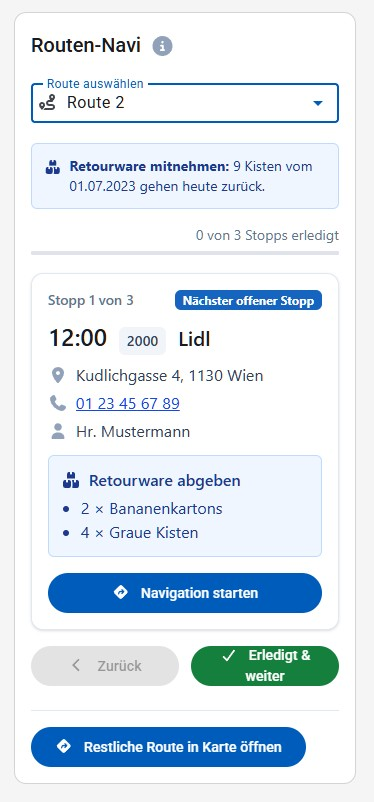
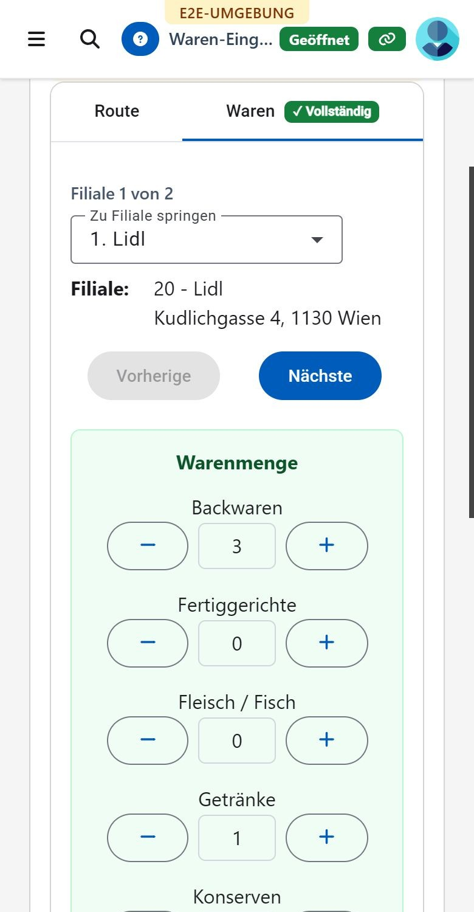
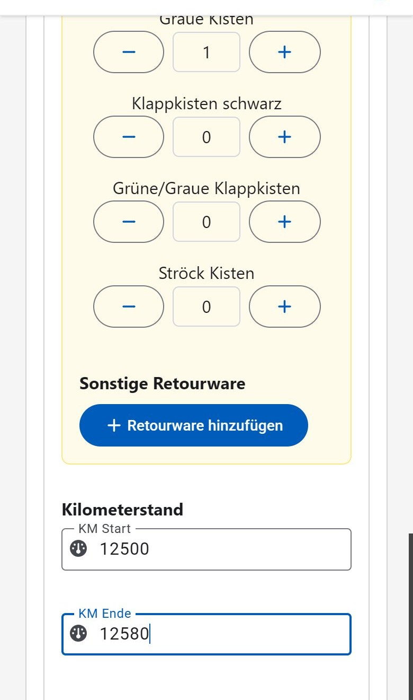

# Logistik

Der Bereich "Logistik" begleitet die Routen-Teams: das **Routen-Navi** unterwegs auf der Route, die **Waren-Eingabe** bei der Erfassung der eingesammelten Warenmengen. Die Waren-Eingabe ist nur aktiv, solange ein Ausgabetag gestartet ist; das Routen-Navi ist jederzeit erreichbar, damit eine Route auch vorab durchgesehen werden kann.

## Routen-Navi

Unter **Logistik → Routen-Navi** wird über das Dropdown **Route auswählen** eine der aktiven Routen aus [Einstellungen → Routen](einstellungen.md#routen) gewählt. Anschließend wird immer **ein Stopp** der Route angezeigt — die Seite wird am Steuer auf dem Handy gelesen, eine lange Liste wäre dort die falsche Darstellung. Die Reihenfolge ist die, in der die Stopps angefahren werden (nach der bei der Route hinterlegten Uhrzeit); beim Öffnen steht die Seite gleich beim ersten noch offenen Stopp. Über dem Stopp steht, der wievielte von wie vielen gerade angezeigt wird.

Bedient wird die Seite mit **zwei Knöpfen**, und genau diese beiden halten auch den Fortschritt fest — es gibt keinen eigenen Knopf zum Abhaken.

Je Stopp werden angezeigt: Uhrzeit, Filialnummer und Name der Filiale, Adresse, Telefonnummer (per Klick direkt wählbar), Ansprechperson sowie eine allfällige Notiz zur Filiale. Stopps ohne Filiale — etwa eine Pause — bleiben erhalten und werden mit ihrer Beschreibung angezeigt. Der erste noch offene Stopp ist mit **Nächster offener Stopp** gekennzeichnet, ein bereits abgehakter mit **Erledigt**. Eine Filiale, die inzwischen auf inaktiv gesetzt wurde, bleibt in der Route und wird mit **Filiale inaktiv** gekennzeichnet. Das **i-Symbol** neben der Überschrift blendet eine Kurzanleitung ein.

Die Abbildung zeigt die Seite so, wie sie unterwegs tatsächlich verwendet wird: am Handy (siehe auch [Darstellung auf schmalen Bildschirmen](README.md#darstellung-auf-schmalen-bildschirmen)). Am Computer ist es dieselbe Seite, nur breiter.

Hat die Route bei ihrer letzten Fahrt Retourware mitgebracht, steht oberhalb des Stopps ein Hinweis, wie viele Kisten heute zurückgehen und von welchem Ausgabetag sie stammen. Beim jeweiligen Stopp ist dann unter **Retourware abgeben** aufgelistet, was bei dieser Filiale abzugeben ist (z. B. "4 × Graue Kisten"). Kisten einer Filiale, die auf der Route inzwischen nicht mehr angefahren wird, werden im Hinweis oben gesondert unter "Ohne Stopp auf dieser Route" angeführt, damit sie nicht übersehen werden. Grundlage ist die zuletzt erfasste Retourware der Route aus der [Waren-Eingabe](#warenerfassung); der laufende Ausgabetag wird dabei nicht herangezogen.

**Erledigt & weiter** hakt den angezeigten Stopp ab und zeigt gleich den nächsten — das ist der Knopf, der unterwegs an jedem Stopp gedrückt wird. Beim letzten Stopp der Route heißt er nur **Erledigt**, weil es nichts mehr weiterzublättern gibt; ist auch dieser abgehakt, ist die Route fertig und der Knopf nicht mehr auswählbar.

**Zurück** zeigt den vorherigen Stopp wieder an und macht das Abhaken dabei rückgängig. Wer also einen Stopp zu früh abgehakt hat, geht einmal zurück und der Stopp ist wieder offen. Neben dem Stopp werden Uhrzeit und Name der Person angezeigt, die ihn abgehakt hat. Der Zähler oben rechts zeigt den Fortschritt ("2 von 7 Stopps erledigt"), darunter derselbe Wert als Fortschrittsbalken.

Sobald alle Stopps bis auf den letzten abgehakt sind, wird automatisch eine [Push-Benachrichtigung](README.md#benachrichtigungen) "Route beim letzten Stopp" verschickt, damit in der Zentrale bekannt ist, dass das Fahrzeug bald zurückkommt. Sie wird je Route einmal pro Tag verschickt.

Der abgehakte Fortschritt ist außerdem auf der [Übersicht](README.md#übersicht-dashboard) unter "Routen unterwegs" sichtbar — allerdings erst, sobald an diesem Tag der erste Stopp abgehakt wurde. Wird das Routen-Navi an einem Tag nicht verwendet, bleibt dieser Bereich der Übersicht ganz aus.

**Navigation starten** öffnet die Navigation zur jeweiligen Filiale in der Karten-App des Geräts (am Handy die installierte Karten-App, am Computer die Karte im Browser). Am Fortschritt ändert das nichts — abgehakt wird ausschließlich über die beiden Knöpfe.

**Restliche Route in Karte öffnen** unterhalb der Stopps übergibt gleich mehrere noch offene Stopps als eine Fahrt an die Karten-App. Bis zu zehn Stopps passen in eine solche Fahrt; sind noch mehr offen, steht darunter, wie viele Stopps danach einzeln zu navigieren sind.

Abgehakte Stopps gelten für den **jeweiligen Tag** und sind auch auf anderen Geräten sichtbar — ein zweites Handy oder die Zentrale sehen denselben Stand. Am nächsten Tag beginnt die Route wieder mit lauter offenen Stopps. Wird eine Route zwischenzeitlich unter [Einstellungen → Routen](einstellungen.md#routen) bearbeitet, geht der Fortschritt des Tages für diese Route verloren, da die Stopps dabei neu angelegt werden.

## Warenerfassung

Unter **Logistik → Waren-Eingabe** wird zunächst über das Dropdown **Route** die betreffende Route ausgewählt; zur Auswahl stehen alle aktiven Routen aus [Einstellungen → Routen](einstellungen.md#routen). Danach stehen zwei Reiter zur Verfügung. Der Button **Speichern** liegt unterhalb der Reiter und speichert immer die Eingaben beider Reiter — unabhängig davon, welcher Reiter gerade geöffnet ist.

### Reiter "Route"

Erfassung der Stammdaten der Route: verwendetes **Fahrzeug (KFZ)** sowie **Fahrer** und **Beifahrer** (Suche über Personalnummer oder Namen). Diese Daten werden üblicherweise bei der Abfahrt erfasst. Alle drei Felder sind Pflichtfelder — solange sie unvollständig sind, werden die Routendaten beim Speichern übersprungen (Hinweis "unvollständig und daher nicht gespeichert"), die übrigen Eingaben aber trotzdem gespeichert. Fahrer und Beifahrer müssen über die Mitarbeiter-Suche tatsächlich ausgewählt werden (freier Text allein genügt nicht, Hinweis "Bitte die Mitarbeiter-Suche starten"); über das X-Symbol kann eine bereits ausgewählte Person wieder entfernt werden. Wird kein passender Mitarbeiter gefunden, kann direkt aus der Suche heraus ein neuer Mitarbeiter angelegt werden. Wird eine bereits gespeicherte Route erneut ausgewählt, werden Fahrer und Beifahrer sofort angezeigt — die Mitarbeiter-Suche wird dafür nicht noch einmal ausgeführt.

### Reiter "Waren"

#### Kilometerstand

Unter der Überschrift **Kilometerstand** wird der Stand bei Start/Ende erfasst — am Desktop am Beginn des Reiters, auf schmalen Bildschirmen ganz am Ende, da dort unterwegs Geschäft für Geschäft erfasst wird und der Kilometerstand erst bei der Rückkehr feststeht. Beide Werte werden erst eingetragen, wenn das Fahrzeug mit der Ware zurück ist — deshalb stehen sie hier und nicht bei den Stammdaten der Route. Die Angabe ist optional, es müssen aber immer beide Werte gemeinsam erfasst werden, und der Kilometerstand bei Ende muss größer sein als der bei Start. Übersteigt die Differenz 350 km, erscheint beim Speichern eine Sicherheitsabfrage ("Routenlänge überschritten... Ist das korrekt?"), die vor dem versehentlichen Erfassen einer falschen Strecke schützt.

#### Warenmenge

Darunter folgt — farblich abgesetzt — der Bereich **Warenmenge**: die tabellarische Erfassung der eingesammelten Menge (Anzahl Kisten/Einheiten) je Geschäft/Station der Route und Warenkategorie (z. B. Backwaren, Fleisch/Fisch, Getränke, Milchprodukte, Obst/Gemüse, Tiefkühlprodukte). Die Warenkategorien und deren Gewicht pro Einheit werden zentral unter [Einstellungen → Lebensmittelkategorien](einstellungen.md#lebensmittelkategorien) gepflegt; die Retourkisten haben eine eigene Liste unter [Retour-Kategorien](einstellungen.md#retourkategorien). Welche Geschäfte in welcher Reihenfolge angezeigt werden, ergibt sich aus den Stopps der Route; ob dort in Kisten oder in Kilogramm gezählt wird, hängt von der Einheit der jeweiligen [Filiale](einstellungen.md#filialen) ab. Zeilen mit einer ungültigen Eingabe werden rot hervorgehoben.

#### Retourware

Darunter folgt — in einem eigenen, andersfarbigen Bereich — die **Retourware** für die Kisten, die an die Filiale zurückgehen. Er besteht aus zwei Teilen:

- die geläufigen Kistenarten (z. B. "Graue Kisten", "Klappkisten schwarz", "Ströck Kisten") als vorgegebene Zähler je Geschäft. Diese Liste wird unter [Einstellungen → Retour-Kategorien](einstellungen.md#retourkategorien) gepflegt
- **Sonstige Retourware** für alles, was in dieser Liste nicht vorkommt: über **Retourware hinzufügen** wird eine Zeile mit frei wählbarer **Beschreibung** (max. 100 Zeichen) und **Menge** angelegt; auf dem Desktop wird zusätzlich das Geschäft ausgewählt. Über das X-Symbol wird eine Zeile wieder entfernt.

Eine Beschreibung, die bereits als Zähler vorhanden ist oder für dasselbe Geschäft schon einmal eingetragen wurde, wird mit dem Hinweis "Beschreibung bereits erfasst" abgelehnt.

Die erfasste Retourware wird beim Beenden des Ausgabetags automatisch per E-Mail als Liste "Retourkisten" je Route und Geschäft versendet (Empfänger siehe [Einstellungen](einstellungen.md#kapitel-einstellungen)).

Mit **Speichern** wird die gesamte Erfassung übernommen. Die Gesamtmenge aller Routen fließt in die Kennzahlen "Erfasste Routen" und "Erfasste Warenmenge" auf der [Übersicht](README.md#übersicht-dashboard) ein.

### Warenerfassung auf schmalen Bildschirmen

Auf schmalen Bildschirmen (Smartphone/Tablet) wird die Warenerfassung nicht als Tabelle über alle Geschäfte dargestellt, sondern als Ablauf Geschäft für Geschäft: Es wird jeweils ein Geschäft/eine Station angezeigt, über **Vorherige**/**Nächste** wird geblättert, wobei automatisch zum nächsten noch nicht vollständig erfassten Geschäft gesprungen wird. Die Warenkategorien werden dabei je Geschäft als Zähler mit **−**/**+** untereinander erfasst.

Jede Eingabe der Warenmenge wird sofort automatisch übernommen (kein separater Speichern-Button je Feld). Ist das Gerät offline, werden Änderungen zwischengespeichert und ein Banner "Offline - X Änderungen ausstehend" angezeigt; sobald die Verbindung wiederhergestellt ist, werden die ausstehenden Änderungen automatisch synchronisiert.

Unterhalb der Warenmenge folgt die Retourware desselben Geschäfts – ebenfalls als Zähler, ohne eigene Geschäfts-Auswahl, da diese sich aus dem gerade angezeigten Geschäft ergibt. Sie wird beim Wechsel des Geschäfts und über **Speichern** übernommen. Ganz am Ende steht der **Kilometerstand**, der erst bei der Rückkehr feststeht.

