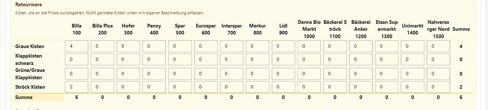

# Logistik

Der Bereich "Logistik" dient der Erfassung der von den Routen-Teams eingesammelten Warenmengen. Der Menüpunkt ist nur aktiv, solange ein Ausgabetag gestartet ist.

## Warenerfassung

Unter **Logistik → Waren-Eingabe** wird zunächst über das Dropdown **Route** die betreffende Route ausgewählt; zur Auswahl stehen alle aktiven Routen aus [Einstellungen → Routen](einstellungen.md#routen). Danach stehen zwei Reiter zur Verfügung. Der Button **Speichern** liegt unterhalb der Reiter und speichert immer die Eingaben beider Reiter — unabhängig davon, welcher Reiter gerade geöffnet ist.

### Reiter "Route"

Erfassung der Stammdaten der Route: verwendetes **Fahrzeug (KFZ)** sowie **Fahrer** und **Beifahrer** (Suche über Personalnummer oder Namen). Diese Daten werden üblicherweise bei der Abfahrt erfasst. Alle drei Felder sind Pflichtfelder — solange sie unvollständig sind, werden die Routendaten beim Speichern übersprungen (Hinweis "unvollständig und daher nicht gespeichert"), die übrigen Eingaben aber trotzdem gespeichert. Fahrer und Beifahrer müssen über die Mitarbeiter-Suche tatsächlich ausgewählt werden (freier Text allein genügt nicht, Hinweis "Bitte die Mitarbeiter-Suche starten"); über das X-Symbol kann eine bereits ausgewählte Person wieder entfernt werden. Wird kein passender Mitarbeiter gefunden, kann direkt aus der Suche heraus ein neuer Mitarbeiter angelegt werden.

### Reiter "Waren"

#### Kilometerstand

Unter der Überschrift **Kilometerstand** wird der Stand bei Start/Ende erfasst — am Desktop am Beginn des Reiters, auf schmalen Bildschirmen ganz am Ende, da dort unterwegs Geschäft für Geschäft erfasst wird und der Kilometerstand erst bei der Rückkehr feststeht. Beide Werte werden erst eingetragen, wenn das Fahrzeug mit der Ware zurück ist — deshalb stehen sie hier und nicht bei den Stammdaten der Route. Die Angabe ist optional, es müssen aber immer beide Werte gemeinsam erfasst werden, und der Kilometerstand bei Ende muss größer sein als der bei Start. Übersteigt die Differenz 350 km, erscheint beim Speichern eine Sicherheitsabfrage ("Routenlänge überschritten... Ist das korrekt?"), die vor dem versehentlichen Erfassen einer falschen Strecke schützt.

#### Warenmenge

Darunter folgt — farblich abgesetzt — der Bereich **Warenmenge**: die tabellarische Erfassung der eingesammelten Menge (Anzahl Kisten/Einheiten) je Geschäft/Station der Route und Warenkategorie (z. B. Backwaren, Fleisch/Fisch, Getränke, Milchprodukte, Obst/Gemüse, Tiefkühlprodukte). Die Warenkategorien und deren Gewicht pro Einheit werden zentral unter [Einstellungen → Lebensmittelkategorien](einstellungen.md#lebensmittelkategorien) gepflegt; die Retourkisten haben eine eigene Liste unter [Retour-Kategorien](einstellungen.md#retourkategorien). Welche Geschäfte in welcher Reihenfolge angezeigt werden, ergibt sich aus den Stopps der Route; ob dort in Kisten oder in Kilogramm gezählt wird, hängt von der Einheit des jeweiligen [Markts](einstellungen.md#maerkte) ab. Zeilen mit einer ungültigen Eingabe werden rot hervorgehoben.

#### Retourware

Darunter folgt — in einem eigenen, andersfarbigen Bereich — die **Retourware** für die Kisten, die an die Filiale zurückgehen. Er besteht aus zwei Teilen:

- die geläufigen Kistenarten (z. B. "Graue Kisten", "Klappkisten schwarz", "Ströck Kisten") als vorgegebene Zähler je Geschäft. Diese Liste wird unter [Einstellungen → Retour-Kategorien](einstellungen.md#retourkategorien) gepflegt
- **Sonstige Retourware** für alles, was in dieser Liste nicht vorkommt: über **Retourware hinzufügen** wird eine Zeile mit frei wählbarer **Beschreibung** (max. 100 Zeichen) und **Menge** angelegt; auf dem Desktop wird zusätzlich das Geschäft ausgewählt. Über das X-Symbol wird eine Zeile wieder entfernt.

Eine Beschreibung, die bereits als Zähler vorhanden ist oder für dasselbe Geschäft schon einmal eingetragen wurde, wird mit dem Hinweis "Beschreibung bereits erfasst" abgelehnt.

Die erfasste Retourware wird beim Beenden des Ausgabetags automatisch per E-Mail als Liste "Retourkisten" je Route und Geschäft versendet (Empfänger siehe [Einstellungen](einstellungen.md#kapitel-einstellungen)).

Mit **Speichern** wird die gesamte Erfassung übernommen. Die Gesamtmenge aller Routen fließt in die Kennzahlen "Erfasste Routen" und "Erfasste Warenmenge" auf der [Übersicht](README.md#übersicht-dashboard) ein.

Auf schmalen Bildschirmen (Smartphone/Tablet) wird die Warenerfassung stattdessen im Wizard-Modus dargestellt: Es wird jeweils ein Geschäft/eine Station angezeigt, über **Vorherige**/**Nächste** wird geblättert, wobei automatisch zum nächsten noch nicht vollständig erfassten Geschäft gesprungen wird. Jede Eingabe der Warenmenge wird sofort automatisch übernommen (kein separater Speichern-Button je Feld). Ist das Gerät offline, werden Änderungen zwischengespeichert und ein Banner "Offline - X Änderungen ausstehend" angezeigt; sobald die Verbindung wiederhergestellt ist, werden die ausstehenden Änderungen automatisch synchronisiert. Die Retourware wird beim Wechsel des Geschäfts und über **Speichern** übernommen.
