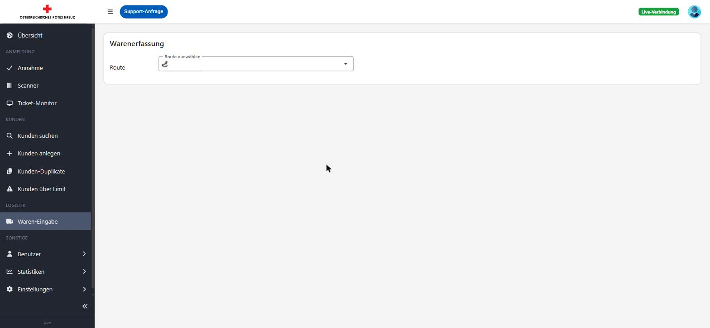
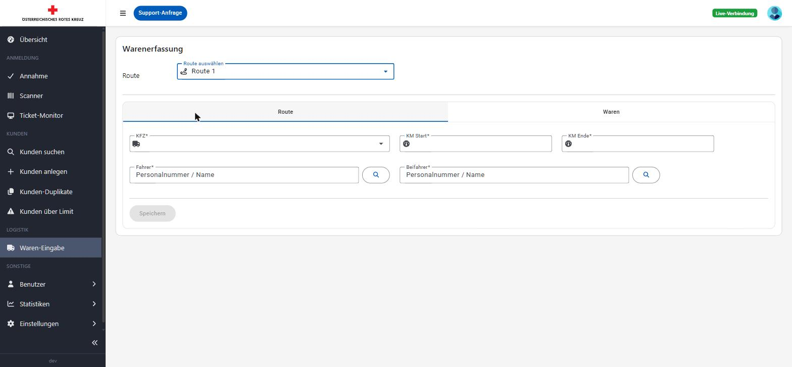
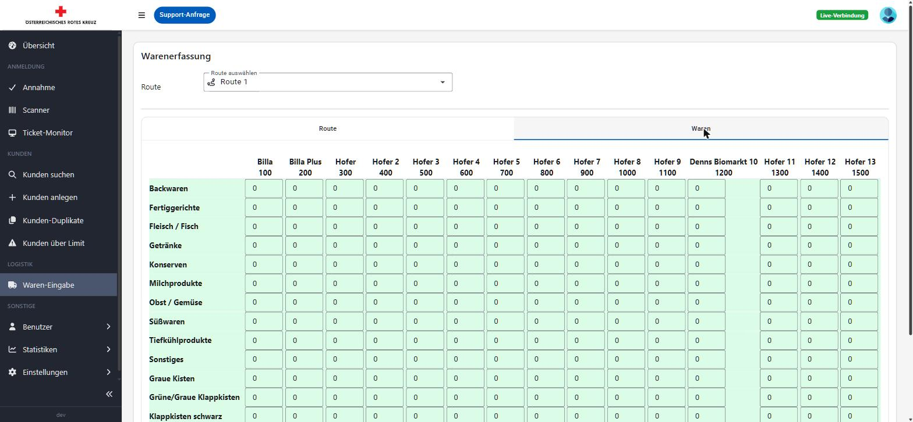

# Logistik

Der Bereich "Logistik" dient der Erfassung der von den Routen-Teams eingesammelten Warenmengen. Der Menüpunkt ist nur aktiv, solange ein Ausgabetag gestartet ist.

## Warenerfassung

Unter **Logistik → Waren-Eingabe** wird zunächst die betreffende **Route** ausgewählt.

Nach der Auswahl stehen zwei Reiter zur Verfügung:

### Reiter "Route"

Erfassung der Stammdaten der Route: verwendetes **Fahrzeug (KFZ)**, **Kilometerstand bei Start/Ende**, sowie **Fahrer** und **Beifahrer** (Suche über Personalnummer oder Namen).

### Reiter "Waren"

Tabellarische Erfassung der eingesammelten Warenmenge (Anzahl Kisten/Einheiten) je Geschäft/Station der Route und Warenkategorie (z. B. Backwaren, Fleisch/Fisch, Getränke, Milchprodukte, Obst/Gemüse, Tiefkühlprodukte, Kisten). Die Warenkategorien und deren Gewicht pro Einheit werden zentral unter [Einstellungen → Lebensmittelkategorien](einstellungen.md#lebensmittelkategorien) gepflegt.

Mit **Speichern** wird die Erfassung übernommen. Die Gesamtmenge aller Routen fließt in die Kennzahlen "Erfasste Routen" und "Erfasste Warenmenge" auf der [Übersicht](README.md#übersicht-dashboard) ein.
