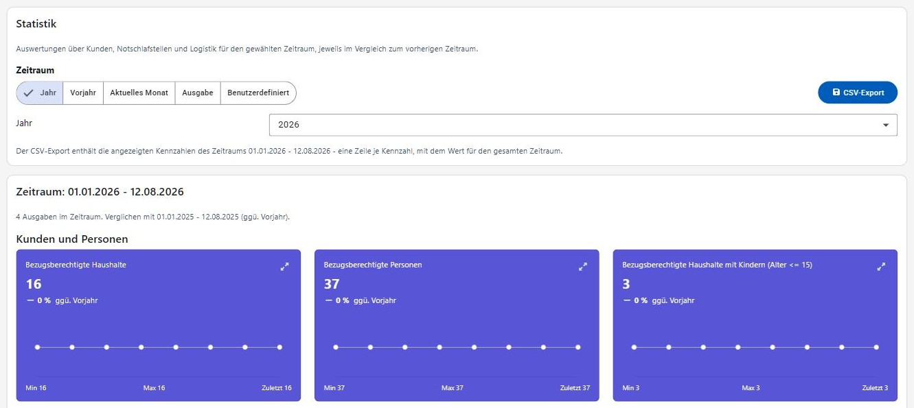
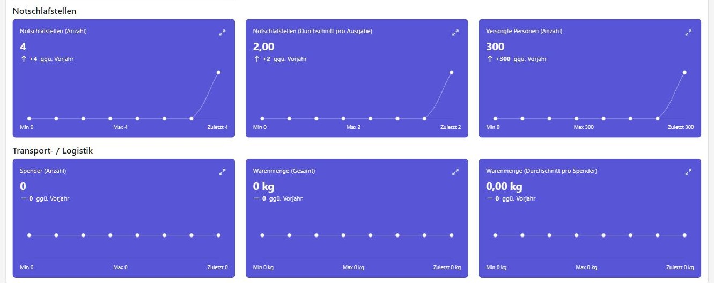
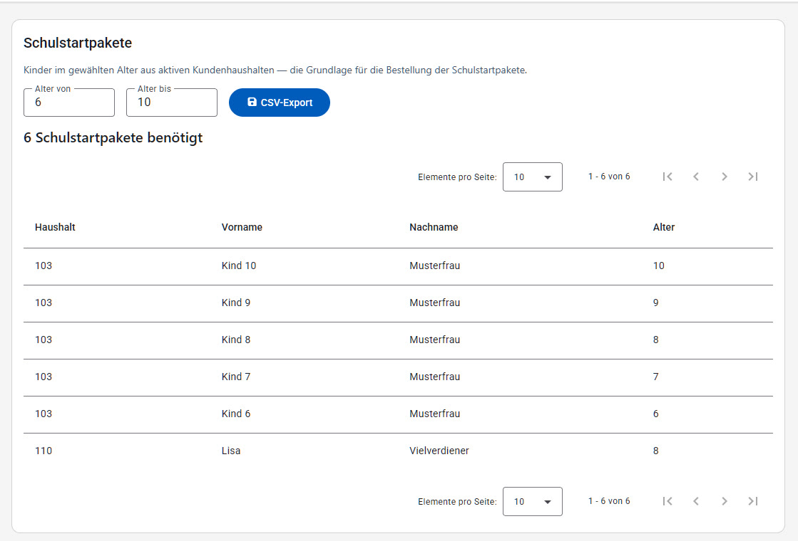
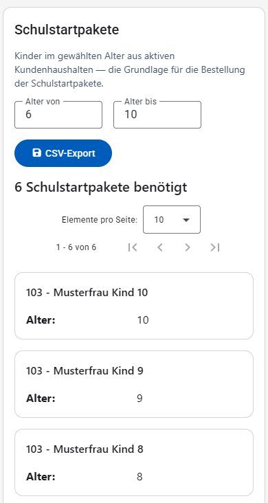

# Statistiken

Der Bereich "Statistiken" liefert Auswertungen über die Kunden und Haushalte. Der Menüpunkt ist nur für Benutzer mit der Berechtigung "Statistiken" sichtbar.

## Allgemeine Statistik

Unter **Statistiken → Allgemein** kann der Auswertungszeitraum über die Buttons **Jahr**, **Aktueller Monat**, **Ausgabe** (Auswahl einer konkreten, bereits erfassten Ausgabe aus einer Liste) oder **Benutzerdefiniert** eingeschränkt werden. Bei "Jahr" kann zusätzlich das gewünschte Jahr gewählt werden. Der tatsächlich zugrunde gelegte Zeitraum wird oberhalb der Kennzahlen als "Zeitraum: TT.MM.JJJJ - TT.MM.JJJJ" angezeigt.

Für den gewählten Zeitraum werden Kennzahlen in drei Gruppen angezeigt, jeweils als Kachel mit aktuellem Wert und einem interaktiven Liniendiagramm des Verlaufs (Werte pro Datenpunkt beim Überfahren mit der Maus):

- **Kunden und Personen**: Bezugsberechtigte Haushalte, Bezugsberechtigte Personen, Bezugsberechtigte Haushalte mit Kindern (Alter ≤ 15), Alleinerzieher (Haushalte).
- **Notschlafstellen**: Notschlafstellen (Anzahl), Notschlafstellen (Durchschnitt pro Ausgabe), Versorgte Personen (Anzahl).
- **Transport- / Logistik**: Spender (Anzahl), Warenmenge (Gesamt), Warenmenge (Durchschnitt pro Spender).

Über **CSV-Export** können die zugrunde liegenden Daten heruntergeladen werden.

## Schulstartpakete

Unter **Statistiken → Schulstartpakete** wird ermittelt, wie viele Kinder in einer wählbaren Altersspanne ("Alter von"/"Alter bis", standardmäßig 6 bis 10 Jahre) aktuell in bezugsberechtigten Haushalten leben, um die benötigte Anzahl an Schulstartpaketen zu planen. Eine Überschrift zeigt die Gesamtanzahl ("`N` Schulstartpakete benötigt"), die Ergebnisliste darunter zeigt Haushalt, Vor- und Nachname sowie Alter des Kindes; bei keinen Treffern erscheint "Keine Einträge gefunden." Bei vielen Treffern kann über die Seitennavigation geblättert werden.

Auf schmalen Bildschirmen wird die Ergebnisliste als Kartenliste dargestellt (siehe [Darstellung auf schmalen Bildschirmen](README.md#darstellung-auf-schmalen-bildschirmen)):

Auch hier steht ein **CSV-Export** der Liste zur Verfügung.
