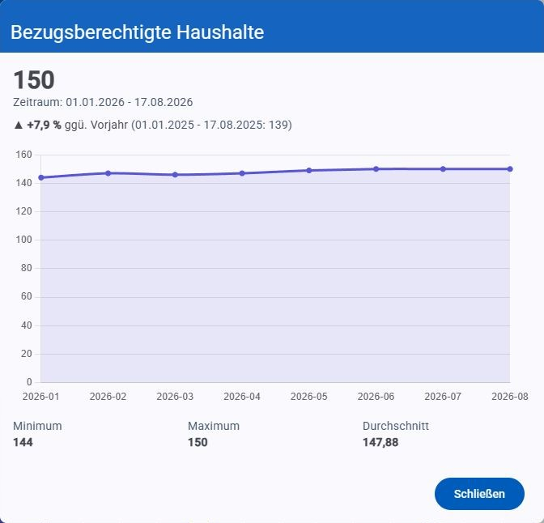
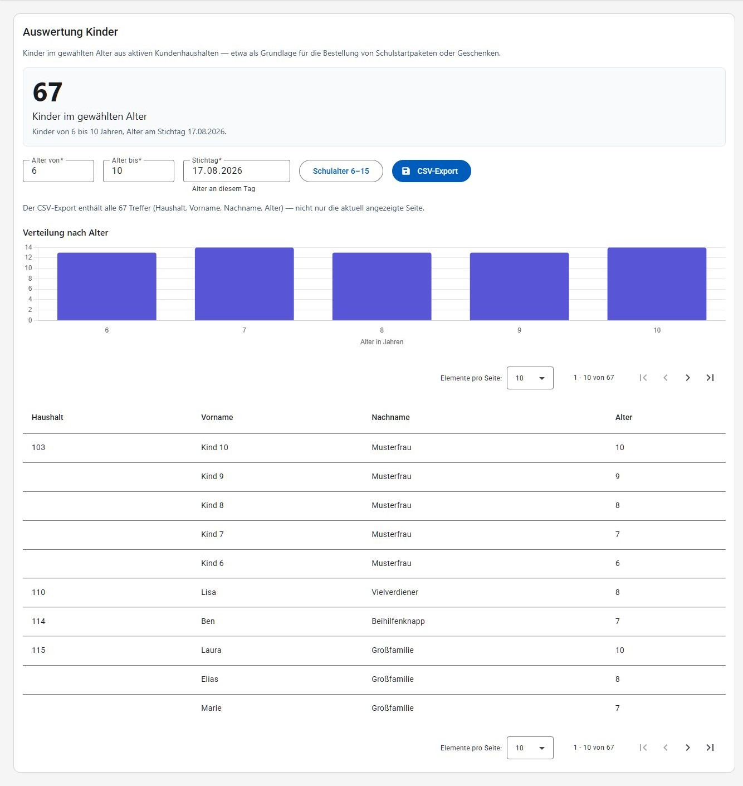
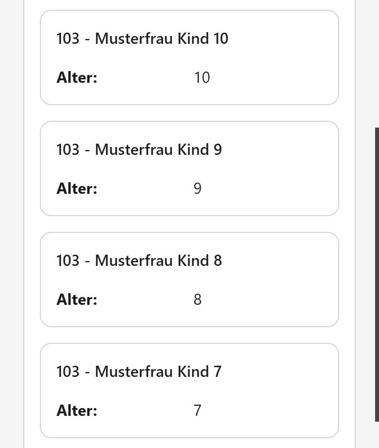

# Statistiken

Der Bereich "Statistiken" liefert Auswertungen über die Kunden und Haushalte. Der Menüpunkt ist nur für Benutzer mit der Berechtigung "Statistiken" sichtbar.

## Allgemeine Statistik

Unter **Statistiken → Allgemein** kann der Auswertungszeitraum über die Buttons **Jahr**, **Vorjahr**, **Aktuelles Monat**, **Ausgabe** (Auswahl einer konkreten, bereits erfassten Ausgabe aus einer Liste — mit Wochentag, damit die Ausgaben leichter auseinanderzuhalten sind) oder **Benutzerdefiniert** eingeschränkt werden. Bei "Jahr" kann zusätzlich das gewünschte Jahr gewählt werden; "Vorjahr" wählt mit einem Klick das gesamte vergangene Jahr. Der tatsächlich zugrunde gelegte Zeitraum wird oberhalb der Kennzahlen als "Zeitraum: TT.MM.JJJJ - TT.MM.JJJJ" angezeigt.

Bei **Benutzerdefiniert** muss "von" vor "bis" liegen. Ist das nicht der Fall oder fehlt ein Datum, erscheint ein Hinweis und die zuletzt gültige Auswertung bleibt stehen.

Unter dem Zeitraum steht, wie viele Ausgaben er umfasst und mit welchem Zeitraum er verglichen wird. Enthält der Zeitraum keine abgeschlossene Ausgabe, wird das ausdrücklich angezeigt: Notschlafstellen und Logistik werden je Ausgabe erfasst und bleiben dann leer, die Kundenzahlen zeigen den Stand am Ende des Zeitraums.

Für den gewählten Zeitraum werden Kennzahlen in drei Gruppen angezeigt, jeweils als Kachel mit aktuellem Wert und einem interaktiven Liniendiagramm des Verlaufs (Werte pro Datenpunkt beim Überfahren mit der Maus):

- **Kunden und Personen**: Bezugsberechtigte Haushalte, Bezugsberechtigte Personen, Bezugsberechtigte Haushalte mit Kindern (Alter ≤ 15), Alleinerzieher (Haushalte).
- **Notschlafstellen**: Notschlafstellen (Anzahl), Notschlafstellen (Durchschnitt pro Ausgabe), Versorgte Personen (Anzahl).
- **Transport- / Logistik**: Spender (Anzahl), Warenmenge (Gesamt), Warenmenge (Durchschnitt pro Spender).

Jede Kachel zeigt zusätzlich:

- die **Veränderung gegenüber dem vorherigen Zeitraum** mit Pfeil und Prozentwert (Jahr → Vorjahr, Aktuelles Monat → Vormonat, Ausgabe → vorige Ausgabe, Benutzerdefiniert → gleich langer Zeitraum davor). Gibt es keinen Vergleichszeitraum — etwa bei der ältesten erfassten Ausgabe — entfällt die Angabe.
- die **Skala des Verlaufs** (Min, Max, Zuletzt) unter dem Diagramm.

Ein Klick auf eine Kachel öffnet das Diagramm vergrößert, mit Achsen, allen Datenpunkten sowie Minimum, Maximum und Durchschnitt des Zeitraums. Per Tastatur ist die vergrößerte Ansicht über die Schaltfläche rechts oben in der Kachel erreichbar.

Über **CSV-Export** werden die angezeigten Kennzahlen des gewählten Zeitraums heruntergeladen (eine Zeile je Kennzahl, mit dem Wert für den gesamten Zeitraum). Die Schaltfläche steht auf breiten Bildschirmen rechts neben der Zeitraumauswahl, auf schmalen Bildschirmen unterhalb davon am Ende des Blocks.

## Auswertung Kinder

Unter **Statistiken → Auswertung Kinder** wird ermittelt, wie viele Kinder in einer wählbaren Altersspanne in bezugsberechtigten Haushalten leben — zum Beispiel als Grundlage für die Bestellung von Schulstartpaketen oder Geschenken. Ganz oben steht daher die Zahl, um die es geht: "`N` Kinder im gewählten Alter", darunter die Angabe, worauf sie sich bezieht (Altersspanne und Stichtag). Sie aktualisiert sich mit jeder Änderung der Eingaben.

Über den Eingaben lässt sich einstellen:

- **Alter von** / **Alter bis** (standardmäßig 6 bis 10 Jahre): die Altersspanne, jeweils einschließlich. Erlaubt sind Werte von 0 bis 120; ist "Alter von" größer als "Alter bis" oder ein Feld leer, erscheint ein Hinweis und die zuletzt gültige Auswertung bleibt stehen.
- **Schulalter 6–15**: setzt die Altersspanne mit einem Klick auf den üblichen Bereich des schulpflichtigen Alters.
- **Stichtag** (standardmäßig heute): der Tag, an dem das Alter gemessen wird. Das ist wichtig, weil eine Bestellung Wochen im Voraus erfolgt — mit Stichtag 1.9. wird ein Kind mitgezählt, das im August sechs Jahre alt wird. Der Stichtag verändert ausschließlich die Altersberechnung: berücksichtigt werden immer die aktuell bezugsberechtigten Haushalte.

Das Balkendiagramm **Verteilung nach Alter** zeigt, wie sich die Treffer auf die einzelnen Altersjahre aufteilen — hilfreich, wenn sich die Inhalte je nach Altersgruppe unterscheiden.

Die Ergebnisliste darunter zeigt Haushalt, Vor- und Nachname sowie Alter des Kindes. Kinder desselben Haushalts stehen untereinander; die Haushaltsnummer wird dabei nur einmal je Haushalt angezeigt und führt (mit der Berechtigung "Kunden") direkt zu den Kundendetails. Bei keinen Treffern erscheint "Keine Einträge gefunden." Bei vielen Treffern kann über die Seitennavigation geblättert werden.

Auf schmalen Bildschirmen wird die Ergebnisliste als Kartenliste dargestellt (siehe [Darstellung auf schmalen Bildschirmen](README.md#darstellung-auf-schmalen-bildschirmen)):

Über **CSV-Export** wird die Liste heruntergeladen. Die Datei enthält immer **alle** Treffer der eingestellten Altersspanne und des Stichtags (Spalten: Haushalt, Vorname, Nachname, Alter) — nicht nur die gerade angezeigte Seite.
