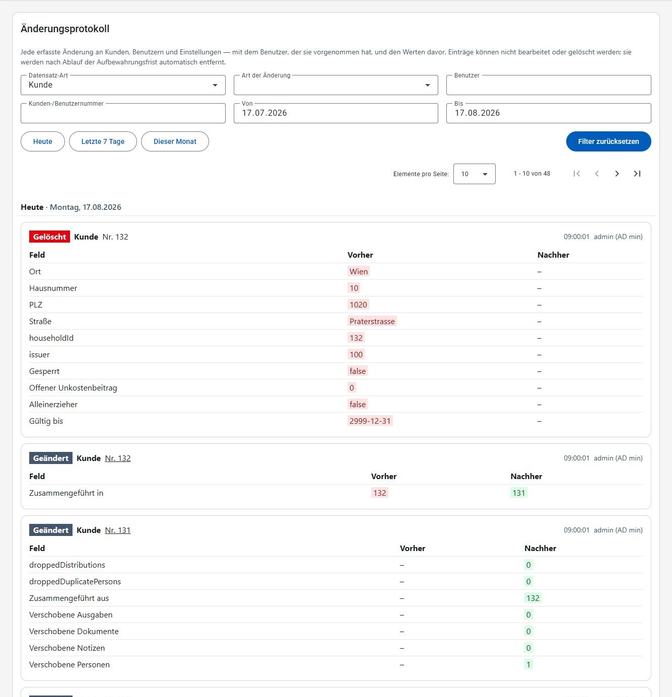

# Zugriffsprotokoll

Das Zugriffsprotokoll hält fest, **wer wann was geändert hat – und wie der Wert davor ausgesehen hat**. Es beantwortet damit Fragen, die sich aus den Daten selbst nicht mehr beantworten lassen: Wer hat die Adresse dieses Kunden korrigiert? Welches Einkommen war vorher eingetragen? Wer hat diesen Kunden gesperrt?

Erfasst werden Änderungen an Kunden (inklusive weiterer Personen, Notizen und Dokumenten), an Benutzern und deren Berechtigungen, an Einstellungen (Grenzwerte, E-Mail-Empfänger) sowie jede erfolgreiche Anmeldung eines Benutzers am System.

Weil sensible Kundendaten nicht nur durch eine Änderung, sondern schon durch das bloße Ansehen offengelegt werden können, hält das Protokoll zusätzlich eine kleine, bewusst eng begrenzte Auswahl an **Zugriffen** fest: das Öffnen der Kunden-Detailseite selbst, den Download eines Kunden-Dokuments, das Ansehen einer noch nicht importierten Scanner-Datei, die Erstellung des Stammdatenblatts oder Ausweises eines Kunden sowie die Erstellung der Kundenliste zu einer Ausgabe. Wird dieselbe Kunden-Detailseite von derselben Person kurz hintereinander mehrmals geöffnet, entsteht dafür nur ein einziger Eintrag statt eines pro Aufruf. Eine reine Suche – etwa in der Kunden-Suche – wird bewusst **nicht** erfasst; das wäre reines Rauschen, ohne den Zweck des Protokolls zu erfüllen.

Bewusst **nicht** erfasst werden die Anmeldungen zu den einzelnen Ausgabetagen: diese sind ohnehin bereits ein Verlauf und stehen in den [Statistiken](statistiken.md) zur Verfügung. Auch die [Anmelde-Versuche](benutzer.md#anmelde-versuche) – die *fehlgeschlagenen* Login-Versuche – haben eine eigene Liste unter [Benutzer](benutzer.md); eine erfolgreiche Anmeldung erscheint dagegen hier im Zugriffsprotokoll.

Das Zugriffsprotokoll ist ein reines Nachschlagewerk: Einträge können weder bearbeitet noch gelöscht werden. Sie entstehen automatisch mit der Änderung bzw. dem Zugriff, den sie beschreiben, und werden nach Ablauf der Aufbewahrungsfrist automatisch entfernt – standardmäßig nach 30 Tagen. Das Protokoll ist damit dazu gedacht, eine kürzlich erfolgte Änderung oder einen kürzlich erfolgten Zugriff nachzuvollziehen, und nicht als Langzeitarchiv: Wer das klären will, sollte das zeitnah tun.

> [!IMPORTANT]
> Für das Zugriffsprotokoll ist die Berechtigung **Zugriffsprotokoll** erforderlich (siehe [Benutzer](benutzer.md)). Sie ist absichtlich von der Kundenverwaltung getrennt: Die aktuellen Daten eines Kunden zu sehen und jede jemals daran vorgenommene Änderung bzw. jeden Zugriff darauf samt Vorgängerwerten zu sehen, sind zwei unterschiedliche Zugriffsstufen.

## Gesamtes Protokoll

Der Menüpunkt **Zugriffsprotokoll** zeigt die erfassten Änderungen und Zugriffe, die neueste zuerst.

Beim Öffnen ist die Ansicht bereits auf die häufigste Frage eingestellt: **Datensatz-Art "Kunde"** und als Zeitraum **das letzte Monat bis heute**. Ohne diese Vorauswahl müsste man sich erst durch Benutzer- und Einstellungs-Einträge blättern, um zu den Kunden zu kommen. Beide Vorgaben sind nur ein Ausgangspunkt und lassen sich jederzeit ändern: Über "Alle" bei der Datensatz-Art bzw. durch Leeren der Datumsfelder sieht man wieder das gesamte Protokoll.

Die Einträge sind nach Tagen gruppiert: Über jedem Tag steht eine Überschrift wie **Heute**, **Gestern**, **vor 3 Tagen** oder – bei länger zurückliegenden Tagen – nur das Datum. Beim Blättern durch eine lange Liste bleibt diese Überschrift am oberen Rand stehen, sodass immer klar ist, welchen Tag man gerade ansieht. Bei den einzelnen Einträgen steht deshalb nur noch die Uhrzeit; das vollständige Datum erscheint, wenn man mit der Maus darüber stehen bleibt.

Jeder Eintrag besteht aus:

- **Art des Zugriffs**: *Angelegt* (grün), *Geändert* (grau), *Gelöscht* (rot), *Angemeldet* (blau) oder *Abgerufen* (orange) – letzteres für die oben beschriebenen Zugriffe
- **Datensatz-Art**: Kunde, Person, Notiz, Dokument, Benutzer, Berechtigung, Grenzwert, E-Mail-Empfänger, Login, Scanner-Datei oder Kundenliste (Ausgabe)
- **Nummer bzw. Benutzername**: bei Kunden, Personen, Notizen und Dokumenten die Kundennummer ("Nr. 1234"), bei Benutzern, Berechtigungen und Logins der Benutzername selbst, ohne "Nr." davor – eine Nummer ist ein Benutzername nicht. Bei einer Scanner-Datei steht dort ihr Dateiname, bei der Kundenliste einer Ausgabe deren Datum – auch hier ohne "Nr." davor. Diese Angabe bleibt auch dann aussagekräftig, wenn der Datensatz selbst nicht mehr existiert – etwa nach einer Löschung oder einer Zusammenführung. Wo der Datensatz noch geöffnet werden kann und die nötige Berechtigung vorhanden ist, führt die Angabe direkt zum Kunden bzw. Benutzer – ein Login-Eintrag verlinkt genauso zum angemeldeten Benutzer. Eine Scanner-Datei und die Kundenliste einer Ausgabe verlinken nirgendwohin, da sie keiner eigenen Detailseite zugeordnet sind.
- **Zeitpunkt und Benutzer**: wann die Änderung bzw. der Zugriff passiert ist und wer sie/ihn vorgenommen hat – der Benutzername und in Klammern der Vor- und Nachname dazu, z. B. `e2etest (E2E Test)`. Bei sehr alten Einträgen steht nur der Benutzername, weil der Name damals noch nicht mitprotokolliert wurde. Steht dort *System*, war kein angemeldeter Benutzer beteiligt (z. B. bei automatischen Abläufen).
- **Feldänderungen**: eine Tabelle mit dem geänderten Feld sowie dem Wert davor und danach. Der bisherige Wert ist rot, der neue grün hinterlegt. Ein Strich (–) bedeutet, dass das Feld leer war. Bei einem *abgerufenen* Eintrag entfällt diese Tabelle: Ein Zugriff verändert keinen Wert, es gibt also nichts, was vorher/nachher gegenübergestellt werden könnte.

Aus Sicherheitsgründen wird das Passwort eines Benutzers zwar als geändert protokolliert, jedoch niemals mit einem Wert – dort steht in beiden Spalten `***`.

## Filtern

Über die Filter oberhalb der Liste lässt sich das Protokoll eingrenzen. Alle Filter lassen sich beliebig kombinieren und wirken **sofort** – es gibt keinen eigenen Suchen-Schritt. Bei den Textfeldern wird kurz abgewartet, bis man zu Ende getippt hat. Mit **Filter zurücksetzen** kehrt man zur oben beschriebenen Vorauswahl (Kunden, letztes Monat) zurück – nicht zu einem leeren Filter.

| Filter | Bedeutung |
| --- | --- |
| Datensatz-Art | Nur Änderungen bzw. Zugriffe an z. B. Kunden oder Benutzern |
| Art des Zugriffs | Nur angelegte, geänderte, gelöschte, angemeldete oder abgerufene Datensätze |
| Benutzer | Nur Änderungen bzw. Zugriffe eines bestimmten Benutzers – zur Auswahl stehen genau jene Benutzer, zu denen das Protokoll auch Einträge enthält |
| Kunden-/Benutzernummer | Alle Änderungen bzw. Zugriffe rund um eine bestimmte Kunden- oder Benutzernummer |
| Von / Bis | Nur Änderungen bzw. Zugriffe in einem Zeitraum (der Bis-Tag ist eingeschlossen) |

Beim Benutzer wird bewusst nur aus der Liste ausgewählt und nicht frei getippt: Der Filter sucht den Benutzernamen exakt, ein Tippfehler würde also eine leere Liste ergeben – und die sähe so aus, als hätte dieser Benutzer nie etwas geändert.

Für die häufigsten Zeiträume gibt es unterhalb der Filter die Schaltflächen **Heute**, **Letzte 7 Tage** und **Dieser Monat**. Die aktuell gewählte ist hervorgehoben; die Felder Von/Bis lassen sich weiterhin frei befüllen.

Die gesetzten Filter stehen in der Adresszeile des Browsers. Ein solcher Link lässt sich daher weitergeben oder als Lesezeichen speichern und öffnet das Protokoll wieder mit genau denselben Filtern.

Findet sich zu den gewählten Filtern nichts, wird "Keine Einträge gefunden." angezeigt.

## Verlauf eines Kunden

Für einen einzelnen Kunden gibt es denselben Verlauf direkt auf der Kunden-Detailseite im Reiter **Verlauf** (siehe [Kunden](kunden.md)). Dort erscheinen alle Änderungen an diesem Kunden, seinen weiteren Personen, seinen Notizen und seinen Dokumenten – ohne dass man vorher nach der Kundennummer filtern muss. Das schließt die oben beschriebenen Zugriffe auf diesen Kunden mit ein: das Öffnen seiner Detailseite ebenso wie einen Dokument-Download oder die Erstellung seines Stammdatenblatts oder Ausweises.

Der Reiter wird nur angezeigt, wenn die Berechtigung **Zugriffsprotokoll** vorhanden ist.

## Zusammengeführte Kunden

Beim [Zusammenführen von Kunden](kunden.md) werden Personen, Notizen, Dokumente und Ausgabe-Teilnahmen auf den Ziel-Kunden umgehängt und die Quell-Kunden anschließend gelöscht. Damit dieser Vorgang nachvollziehbar bleibt, entstehen dabei mehrere Einträge:

- beim **Ziel-Kunden** ein Eintrag, der festhält, aus welchen Kundennummern zusammengeführt wurde und wie viele Personen, Notizen, Dokumente und Ausgaben übernommen wurden,
- je **verschobener Person** ein Eintrag, von welchem zum welchem Kunden sie gewechselt ist,
- bei jedem **Quell-Kunden** ein Eintrag, in welchen Kunden er zusammengeführt wurde – zusätzlich zu seinem Lösch-Eintrag, der seine letzten bekannten Werte enthält.

So lässt sich auch nach dem Zusammenführen noch feststellen, welche Daten ein gelöschter Kunde zuletzt hatte.
